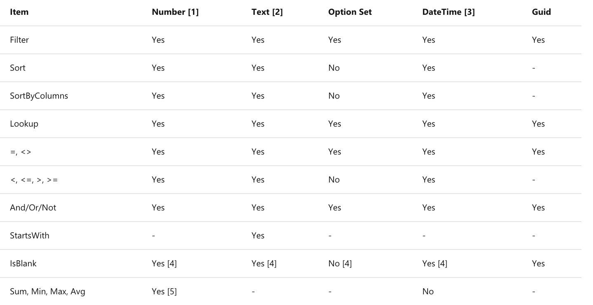

Figuring out when delegation applies depends on various factors, starting with the data source itself. Take a look at this table for Microsoft Dataverse functions and their delegation support:

- **Yes**: Data source handles processing across all records.

- **No**: Data source sends only the initial 500 records (default) to Power Apps, which then processes the function locally.

>

1. Numbers with arithmetic expressions like `Filter(table, field + 10 > 100)` aren't delegable. Language and TimeZone aren't delegable.

1. Doesn't support Trim[Ends] or Len. Supports other functions such as Left, Mid, Right, Upper, Lower, Replace, and Substitute.

1. DateTime can be delegated except for DateTime functions Now() and Today().

1. Supports comparisons. For example, Filter(TableName, MyCol = Blank()).

1. The aggregate functions are limited to a collection of 50,000 records. If needed, use the Filter function to select 50,000 records from a larger set before using the aggregate function.

[Dataverse](/connectors/commondataserviceforapps/?azure-portal=true) has more info about using the Dataverse as a data source, and about its delegable functions.

This table is only for supported delegable functions if you use the Dataverse as a data source. But what if you use a different data source, like SharePoint or SQL?

## Other data sources: SharePoint and SQL

When working with SharePoint or SQL as your data source, it's crucial to check their supported delegable functions by referring to their associated documentation. As mentioned earlier, each data source has its own set of delegable and non-delegable functions.

Before diving into app creation, we highly recommend exploring these differences among data sources. This helps in understanding their capabilities and limitations upfront. Every Power Apps project comes with unique business needs, so ensuring that your chosen data source supports those needs and the required functions for your data volume is key.

Additionally, if you use the Filter or LookUp function, then you also use a predicate. The predicate is what allows you to evaluate the formula. The function `FirstName = "Rob"` uses the = predicate. Some data sources don't support certain predicates. For example, Salesforce doesn't support the IsBlank predicate. So, although the formula `Filter(SalesforceCustomers, Name = "Contoso")` is delegable, the formula `Filter(SalesforceCustomers, IsBlank(Name))` isn't delegable.

## The Column type can also factor in

Column types wield a surprising influence on delegation possibilities. Take complex columns, such as SharePoint lookup columns—they're not delegation-friendly. Their intricate logic means Power Apps can only process them locally.

The silver lining? Power Apps has your back! It offers visual warnings for these issues. Imagine a blue underline highlighting a formula in your app—this is your cue! It signals a delegation hiccup that could mean not fetching all your records. Correcting it ensures your app performs seamlessly.

In the next section you'll learn more about delegation warnings, limits, and how to work around them if you ever run into a delegation issue.
