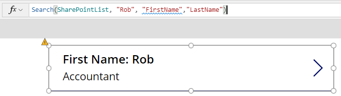
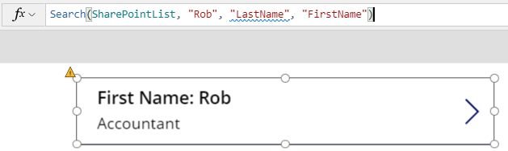
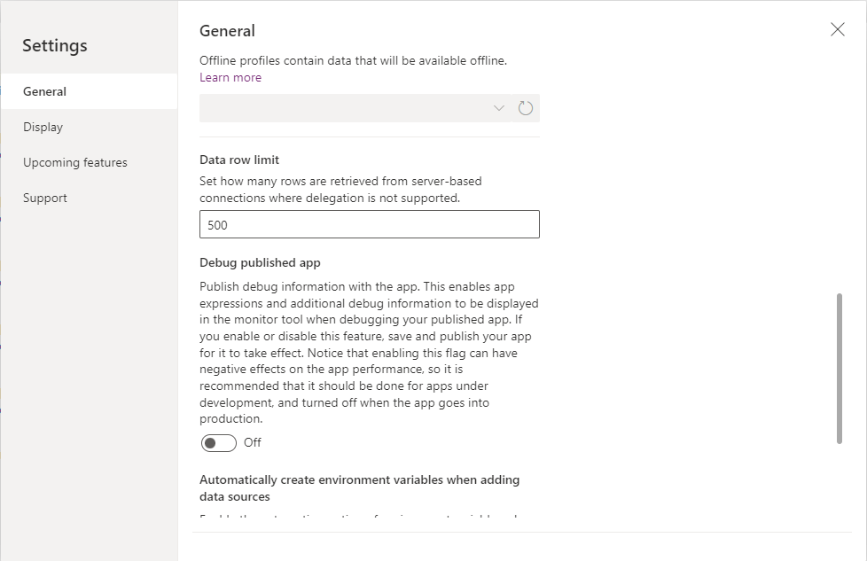

Power Apps uses visuals to help you, the app maker, understand when
delegation is occurring. The maker portal also has one setting you can
adjust to increase the amount of data returned when delegation isn't
possible.

## Delegation warnings

Anytime you use a non-delegable function, Power Apps underlines it with a
blue line and displays a yellow warning triangle as shown below.



This gives you a clear visual indicator that delegation isn't
happening, which means you might not see all of your data. It's
important to understand a couple of things about this visual indicator.

- Power Apps provides this warning whatever the size of your
    data source. Even if your data source only has a few items
    and delegation isn't technically causing you a problem, the
    warning still shows. Remember the first 500 items are returned by
    default and processed locally. The warning appears anytime that your
    formula isn't delegated.

- The warning indicator only processes through the first thing that causes delegation. Notice in the above screenshot that only the underlined field "FirstName" is in blue. That is because it was the first item that caused delegation. "LastName" would also cause delegation in this scenario. This can be confusing because people try to troubleshoot what is the difference between FirstName and LastName instead of the real issue, which is the Search function. If you come across this confusion, rearrange your formula. This validates and whichever field is first shows the issue.

    

- This visual indicator is only present when you are in the maker
    portal, building the app. When a user is running the app, they don't
    receive any notification that delegation isn't occurring and
    that they might only be seeing partial results. Keep this in mind when
    designing your app and build accordingly.

## Change the number of records returned when delegation isn't available

When a formula can't delegate to the data source for any
reason, then by default Power Apps retrieves the first 500 records from
that data source and then processes the formula locally. Power Apps does
support adjusting this limit from 1 to 2000. You can adjust this limit in
the Advanced settings.

1. From the Maker portal, select **File** in the upper-left corner.

1. In the left-most menu, select **Settings**.

1. Under **App settings**, select **Advanced settings**

1. Set the Data row limit for non-delegable queries for any value
    between 1 to 2000.

1. After you set the limit, select the **arrow** in the upper left to
    save your change and return to the Maker portal.



There are two primary reasons that you might want to adjust this limit.

- To increase the limit if you're working with data where 500
    records aren't enough, but less than 2000 is. For example, if you
    have a customer list and you know you'll never have more than 1000
    customers, then you could design your app to ignore delegation and
    always return all 1000 records.

- To lower the limit to 1 or 10 to help with testing. If you
    run into scenarios where you aren't sure if a non-delegable
    function is causing problems with your app, you can lower the limit
    and then test. If you set the limit to 1 and your gallery is
    only presenting one record, you know that you had a non-delegable
    function. This setting speeds up your troubleshooting process.

## Non-delegable functions

In the previous unit, you learned about the functions that are delegable and how they relate to the various data sources. These other functions, not covered in that unit, aren't delegable. The following are notable functions that don't support delegation.

- First, FirstN, Last, LastN

- Choices

- Concat

- Collect, ClearCollect (Neither of these functions return a delegation warning, but they aren't delegable)

- CountIf, RemoveIf, UpdateIf

- GroupBy, Ungroup

All of these functions aren't delegable. So by adding them to a formula you might take a previously delegable function and make it not delegable, as seen in the previous example.

## Partially supported delegable functions

The Table shaping functions below are considered to be partially delegable. This means, formulas in their arguments can be delegated. However, the output of these functions is subject to the non-delegation record limit.

- AddColumns

- DropColumns

- ShowColumns

- RenameColumns

A common pattern is to use AddColumns and LookUp to merge information
from one table into another, commonly referred to as a Join in database
parlance. For example:

```powerappsfl
AddColumns( Products, "Supplier Name", LookUp( Suppliers,
Suppliers.ID = Product.SupplierID ).Name )
```

Although Products and Suppliers are potentially delegable data sources, and LookUp function falls within the delegable category, the AddColumns function possesses partial delegability. So, the outcome of the entire formula remains constrained to the initial segment of the Products data source.

While the LookUp function and its associated data source allow for delegation, facilitating the discovery of Suppliers across a vast dataset, it comes with a caveat. LookUp necessitates separate queries to the data source for each of the initial records in Products, resulting in increased network activity. However, if the Suppliers dataset is relatively small and remains stable, an alternative approach involves caching the data source within the app. Employing a Collect call during app initialization (using OnVisible on the opening screen) allows subsequent LookUp operations directly within the cached data source, mitigating network chatter.
