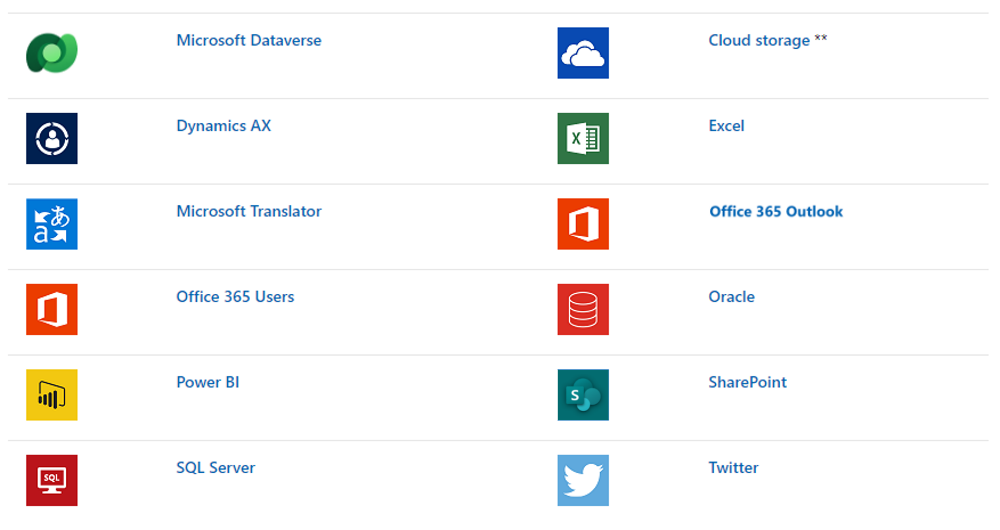

Data, the lifeblood of your apps, resides within a *data source* standing by for your commands. By establishing a *connection*, you seamlessly bridge the gap between your app and the data that brings it to life. Each connection employs a specific *connector*, acting as a conduit that opens the gateway to your desired data. Power Apps boasts an extensive array of connectors, including renowned powerhouses like SharePoint, SQL Server, Salesforce, and even Twitter—allowing you to tap into a vast array of both online and on-premises data sources.

Prepare to be amazed, for connectors are more than mere gatekeepers; they hold the key to a treasure trove of possibilities. Some connectors present you with **tables**, brimming with tabular data, while others unlock the power of **actions**, granting you the ability to interact with data in unique and exciting ways. What's more, some connectors go above and beyond, offering a delightful combination of both tables and actions. You can even dive deeper into the realm of customization by creating your own connectors tailored to your specific needs—an endeavor that brings an extra touch of technical prowess to your app-building journey.

## Tables

*Tables*, those magnificent vessels of tabular wisdom, are the backbone of connectors that provide tabular data. Within your app, you have the power to display, interact with, and manipulate complete tables, filtered tables, individual records, or even specific fields within those records. The possibilities are endless, and all the data within the table is at your fingertips. Once you establish a connection to a data source, you can seamlessly bring in one or more tables, selecting precisely what you need to fuel your app's functionality.

## Actions

*Actions*, on the other hand, open a portal to an exhilarating world of dynamic data retrieval. Connectors offering actions operate similarly to their table-based counterparts during the initial connection phase. However, instead of selecting specific tables, you wield the power to call upon actions, requesting data based on the specific action you invoke within the formula of a particular control. It's a manual dance, choreographed by you, allowing you to meticulously curate the data that flows into your app. Marvel at the possibilities as you explore action connectors like Yammer and Office 365 Outlook, where every interaction becomes an opportunity to shape your app's destiny.

## Popular connectors

Now, let us introduce you to a glimpse of some of the most popular connectors that await your creative touch. The graphic showcases just a few of them. But remember, this is merely a taste of what's available. For a complete (and ever growing) list of connectors that can amplify your app's potential, you can further explore the multiple [options for accessing data](/power-apps/maker/canvas-apps/connections-list/?azure-portal=true).

> [!div class="mx-imgBorder"]
> 

** Applies to Azure Blob, Box, Dropbox, Google Drive, OneDrive, and OneDrive for Business

## Standard and custom connectors

Power Apps unlocks a world of connectivity with its arsenal of dynamic connectors tailored to meet your needs. Embracing the diverse array of *standard* connectors, Power Apps seamlessly integrates with an array of commonly used data sources, allowing you to harness their full potential. However, if you find yourself craving the power to tap into untapped data sources, fear not, for Power Apps presents a solution: the *custom* connector. Although it may require a touch more technical finesse, this unique feature empowers you to forge connections with data sources beyond the ordinary. If you're ready to embark on a journey of customization and endless possibilities, delve into the realm of [custom connectors for canvas apps](/power-apps/maker/canvas-apps/register-custom-api/?azure-portal=true) and unlock your application's true potential.

## What's ahead of you

As our learning journey continues, we introduce the art of *adding data sources*, enlightening you with the prospect of displaying data in stunning *galleries*. Prepare to witness the fusion of aesthetics and functionality as your app comes to life.

But wait, there's more! Brace yourself for the remarkable realm of *collections*, where the magic of internal data sources takes center stage. These collections, like versatile actors on a grand stage, assume a tabular form, existing solely within the confines of your app while it dances to the tune of the current user, responding dynamically to user input and creating an unparalleled user experience.

Last but not least, we unravel the secrets of efficient data handling, empowering you to conquer vast and intricate datasets with ease. Delve into the art of *delegation* and witness the harmonious balance between power and performance as your app efficiently processes and manipulates large volumes of data.

So, my fellow adventurer, are you ready to embrace the immersive realm of Power Apps' data-centric universe? Prepare to be captivated, inspired, and empowered as we dive headfirst into the thrilling depths of data connections. The next chapter beckons.
