In Power Apps, there are multiple ways to add a data source. For example, when you add a gallery or a form to the screen, you can use that interface to choose an existing data source or add a new one. Sometimes you must add a data source for a control to complete an action. For example, adding a data source to a button to send an email.

## Add tabular data to your app

Adding tables of data to your app is easy. Let's look at an example where we add a SharePoint Online list as a data source to your app. If you're just learning how to use Power Apps, SharePoint is a great data source since it's included in most Office 365 subscriptions, without paying extra costs.

1. Go to your [Power Apps Studio](https://make.powerapps.com/?azure-portal=true) and create a new blank app.

1. From your view of **Screen1**, there are several ways we can add data. The most obvious one is to select **Add data** from the command ribbon at the top of the screen.

   > [!div class="mx-imgBorder"]
   > [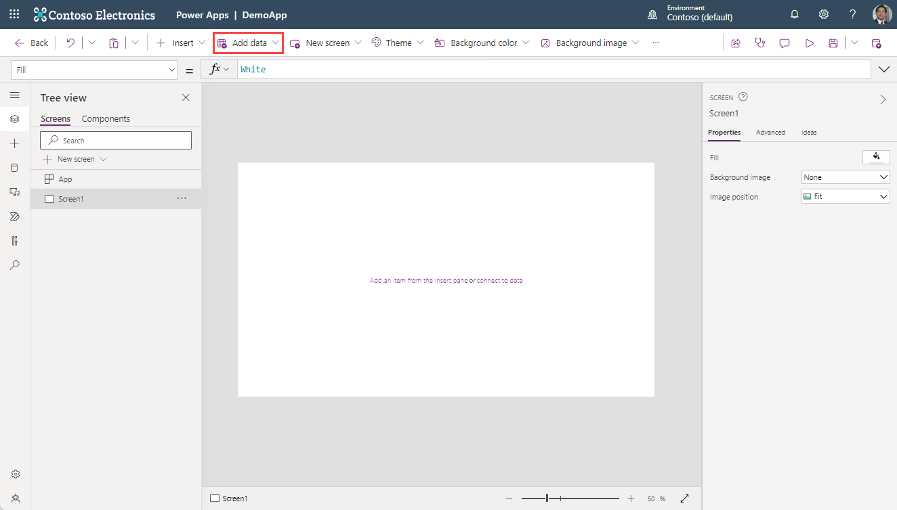](../media/add-data-button.png#lightbox)

1. In the search entry field, type SharePoint and find/select the **SharePoint** connector.

   > [!div class="mx-imgBorder"]
   > 

1. In the dialog box that appears after selecting **SharePoint**, select the username of your connection to continue.

1. A pane opens on the right side of the screen titled **Connect to a SharePoint site**. You can either enter the SharePoint URL for the location of your list or search your **Recent sites** for the specific site you want to use for your connection. One or more sites may already appear under the search field; select one that you know already has a list in it.

   > [!div class="mx-imgBorder"]
   > 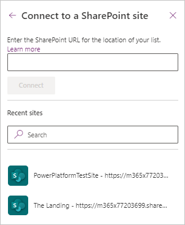

1. In the **Choose a list** pane that appears on the right side of the screen, select any of your lists (or available Document libraries) and then select **Connect**. It's possible to choose more than one list to add with this action.

   > [!div class="mx-imgBorder"]
   > 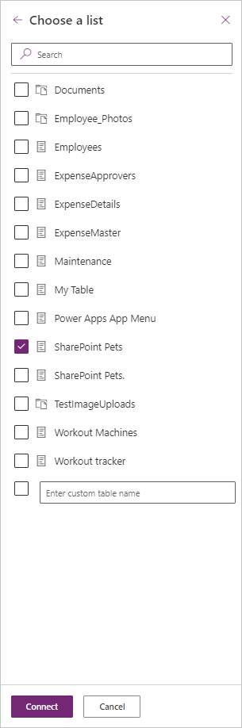

1. You can quickly confirm that this list has been added as a data source by selecting the **Data** button in the side-rail menu on the left of the screen:

   > [!div class="mx-imgBorder"]
   > 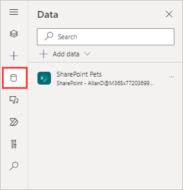

1. To view your newly connected data, you can insert a gallery. From the command bar ribbon at the top, select the **Insert** button and search for and select **Vertical gallery**.

   > [!div class="mx-imgBorder"]
   > 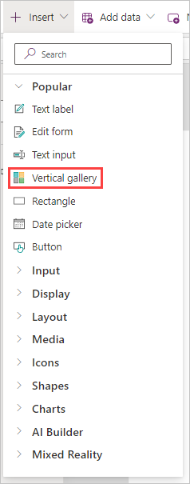

1. In the **Select a data source** dialog pane for the vertical gallery you inserted, you can either enter the table name in the search window or select your table from the drop-down menu for **In your app**. Alternatively, you can select the **Data source** dropdown in the **Properties** pane of your gallery.

   > [!div class="mx-imgBorder"]
   > [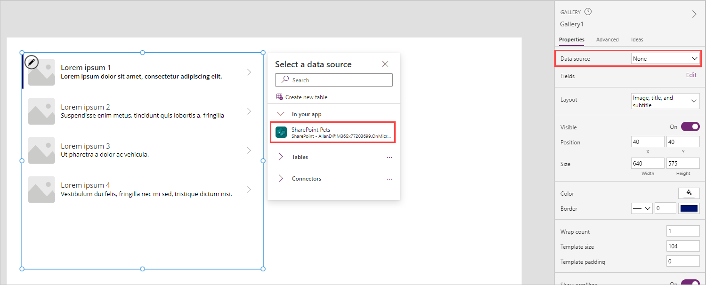](../media/gallery-data-selection.png#lightbox)

1. The resulting gallery displays a view of your data that you can then modify by selecting your **Fields** and **Layout** options from the **Properties** menu.

   > [!div class="mx-imgBorder"]
   > 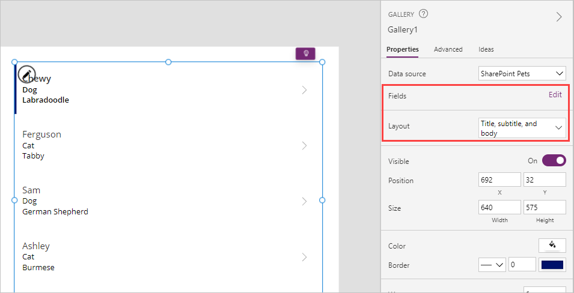

Now you should have a gallery displaying a **table** of data from your SharePoint list. Let's take a look at adding **action** data to your app.

## Add action data to your app

You can use this method to add any data source available to Power Apps. After it’s added, it will be available throughout your app. Let's connect Office 365 Outlook so we can see how to incorporate some *action data*.

1. In Power Apps Studio, select the **Add data** button again from the command ribbon (or the left-side rail data tab).

1. In the search field, begin typing **Office 365 Outlook**, and select it from the filtered list. (Alternatively, you can expand **Connectors** and scroll down to find the **Office 365 Outlook** connector.)

   > [!div class="mx-imgBorder"]
   > 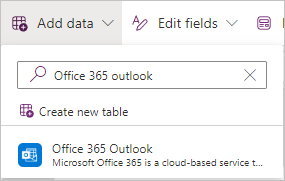

1. Under **Add a connection** select your connection. After a moment, you can check your **Data** from the side-rail and ensure that your **Office365Outlook** connection is listed in your **Data**.

   > [!div class="mx-imgBorder"]
   > 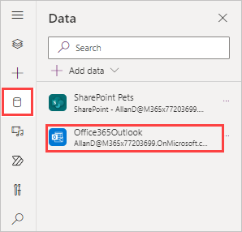

Now the Office 365 Outlook data source is available for use in your app.

To send an email using Office 365 Outlook, you can add a button control to your app, and set its **OnSelect** property to this:

```powerappsfl
   Office365Outlook.SendEmailV2(User().Email, "Subject of the email", "Body of the email")
```

> [!div class="mx-imgBorder"]
> [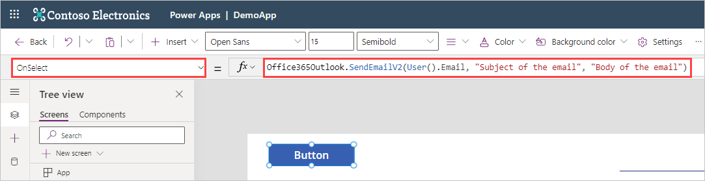](../media/office365-outlook-formula.png#lightbox)

This formula performs the *action* you defined in the OnSelect formula for your button to **SendEmailV2** from the **Office365Outlook** data connector. The **SendEmailV2** action requires only three inputs:

| Formula argument | Formula input  | Notes     |
| ---------------- | -------------  | ----------|
| To               | User().Email          | The current user is the person to whom the email will be sent. |
| Subject          | "Subject of the email"| Text            |
| Body             | "Body of the email"   | Text            |

You can modify this formula by changing the inputs. As long as all of the inputs are of type *text*, and the 'To' is to a valid email address, this function causes the action to send the email on behalf of your app. Power apps don't care how you get the information into this formula, as long as you provide the correct syntax. In our **SendEmailV2** example, if we add a comma after our *body* input, we can add other optional information inside of curly braces. The autosuggest functionality even provides an alphabetically arranged, selectable field that prompt and even populate your formula if you select them.

> [!div class="mx-imgBorder"]
> [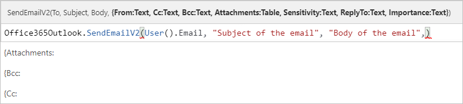](../media/action-formula-prompts.png#lightbox)

You can add other actions into your app via functions such as **OnSelect**. Once you add that action to your formula, Power Apps will autosuggest input, and syntax, as you type. If you wanted to add a *"cc"* address, for example, you could add something like this into your formula after the body and inside of the parenthesis (where you would insert a valid email address in the quotes).

   >{Cc: "ValidEmailAddressHere"}

An important concept to understand about data sources is that some data sources, such as SQL Server, use stored credentials that are shared by all users of the connector. Others, such as Microsoft Dataverse, SharePoint, and other Office 365 connectors, require the user's credentials. For example, every user who works with an app based on data in a list in SharePoint needs the appropriate permissions in SharePoint to interact with that data.

In the next unit of this module, you'll learn how to add another popular action data source to your app.
