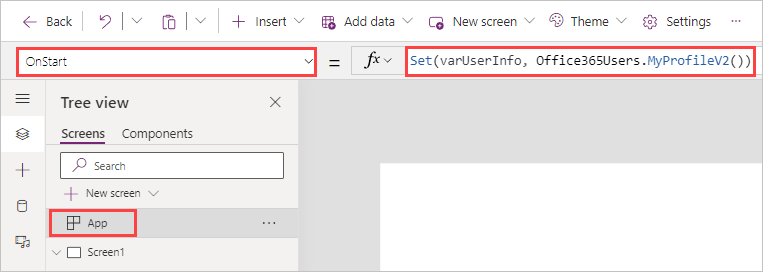
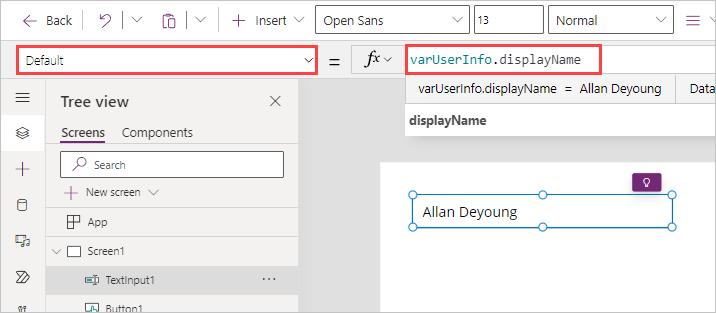
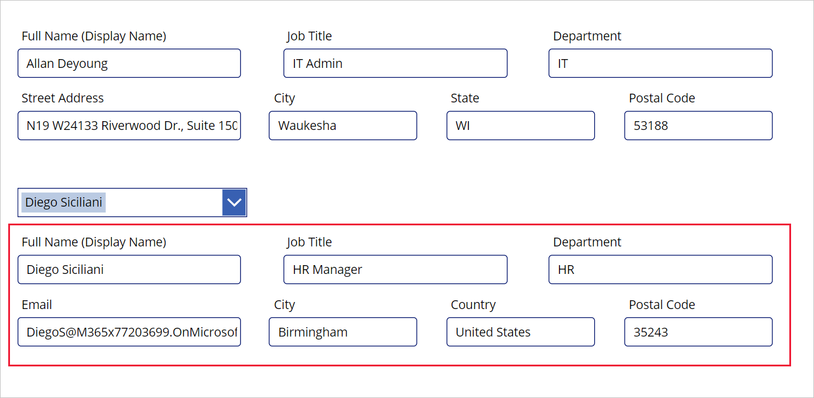

The Office 365 Users connection for Power Apps lets you access user profiles in your organization using your Office 365 account. You can perform various actions such as get your profile, get a user's profile, get a user's manager, or get direct reports.

You can display this information via labels in your app. You can display one function, multiple functions, or even combine different functions. For example, you can use this function to make the app sound more personal by greeting the current user with their display name; or by automatically populating certain data fields with their name and phone number.

## Add a connection

The **Office 365 Users** data source is a Standard connector that can be used in Power Apps. To add this connector, select **Add data** from the command ribbon and enter 'Office 365 Users' in the search field. Select **Office 365 Users** from the list, and, in the dialog box that appears with your connection, select your **Office 365 Users** connection.

> [!div class="mx-imgBorder"]
> [](../media/add-office-365-users.png#lightbox)
> [!div class="mx-imgBorder"]
> 

You may see a similar dialog box to the one below, if this is the first time you're adding this connector in this environment. Select Connect to add this connection.

> [!div class="mx-imgBorder"]
> 

## User profile information

The user profile information is called through the Office 365 Users **MyProfile** action. Likewise, we can get information about other users by calling the **SearchUser** action. You have a few options to get user information in the canvas app. To get information about the user who is using the app, you can either use the function at the **App OnStart** or **OnSelect** of a button.

### Store user profile information using App OnStart

Here we get the record containing user information we're looking for and save it as a global variable, making it easy to reuse it throughout the app. Since this is a record of information, we have access to any of the information existing in your Office 365 profile.

Select **App**, select the **OnStart** property and add the following formula.

```powerappsfl
Set(varUserInfo, Office365Users.MyProfileV2())
```

> [!div class="mx-imgBorder"]
> [](../media/my-profiler-app-onstart.png#lightbox)

To populate our variable, select the ellipsis next to **App** and select **Run OnStart.**

> [!div class="mx-imgBorder"]
> 

With the global record variable **varUserInfo** now populated, you can call that information anywhere in the app. For example, in the **Default** property of a Text input control, you can add `varUserInfo.displayName`.

> [!div class="mx-imgBorder"]
> [](../media/text-default-display-name.png#lightbox)

The image below shows attributes that can be automatically populated in your app, saving the user time versus inputting them manually.

> [!div class="mx-imgBorder"]
> [](../media/user-profile-information.png#lightbox)

The data gathered from the **MyProfileV2** action includes the following information from the user's Office 365 User Profile: id, displayName, givenName, surname, mail, mailNickname, accountEnabled, userPrincipalName, department, jobTitle, mobilePhone, businessPhones, city, companyName, country, officeLocation, and postalCode.

### Control OnSelect

If you need to gather data about another user (someone other than the current user), you use the **SearchUser** action. Let's practice this by adding a **ComboBox** control under the 'Street Address' text input field.

Set the properties of your combo box as follows:

| Property | Value |
|----------|-------|
| **DefaultSelectedItems** | `Office365Users.SearchUser({searchTerm:varUserInfo.displayName})` |
| **DisplayFields** | `["DisplayName"]` |
| **IsSearchable** | `true` |
| **Items** | `Office365Users.SearchUser()` |
| **SelectMultiple** | `false` |
| **OnChange** | `Set(varSearchUserInfo, Office365Users.UserProfile(Self.Selected.Id))` |

The **SearchUser** action gathers similar data as the **MyProfile** action, but the data is slightly different. The **SearchUser** action (by default) returns the following information about the user:

- City
- CompanyName
- Country
- Department
- DisplayName
- GivenName
- ID
- JobTitle
- Mail
- MailNickname
- mobilePhone
- OfficeLocation
- PostalCode
- Surname
- TelephoneNumber
- UserPrincipalName
- AccountEnabled
- BusinessPhones

> [!NOTE]
> You will only be able to see data if it has been entered in for that employee. For example, if there is no mobile phone input for that person's record, this action will not return any data.

Next, copy the controls you made for the **MyProfile** action and paste them below the combo box. Change the labels and **Default** settings of the pasted text input fields as follows:

| Label | Text Input Default |
|-------|--------------------|
| Full Name (Display Name) | varSearchUserInfo.DisplayName |
| Job Title | varSearchUserInfo.JobTitle |
| Department | varSearchUserInfo.Department |
| Email | varSearchUserInfo.Mail |
| City | varSearchUserInfo.City |
| Country | varSearchUserInfo.Country |
| Postal Code | varSearchUserInfo.PostalCode |

Notice that we don't have a 'Street Address' or 'State' available in **SearchUser** data. Also notice that the data fields all start with an upper case letter with **SearchUser** data (instead of a lower case letter).

Press and hold the **Alt** key and select your combo box control, and you notice that it shows you the Display Names of available users as well as a search field. Go ahead and select a user and make sure that the text input fields below populate. Yours should look similar to this.

> [!div class="mx-imgBorder"]
> [](../media/test-search-user.png#lightbox)
> [!div class="mx-imgBorder"]
> [](../media/test-search-user-2.png#lightbox)

You can put your app into 'Play' mode and try searching for different users. Now that you've seen how we can get information for other users, let's look at some other action data available with the Office 365 Users connector.

## Manager information

In addition to getting user information, you can get the user's **Manager** information.

With the **ComboBox** control you created, modify the **OnChange** property to: `Set(varSearchUserInfo, Office365Users.Manager(ComboBox1.Selected.Id))`.

> [!div class="mx-imgBorder"]
> [](../media/manager-information.png#lightbox)
> [!NOTE]
> If you select a user that has no manager, you will notice that your text input fields may show errors when your app is in edit mode. This is because Power Apps is returning **Error** data that no manager exists for this user. You can then use that information to display notifications to your users such as: 'This person does not have a manager'. The [Errors function](/power-platform/power-fx/reference/function-errors/?azure-portal=true) returns information about your error, without disrupting the user experience.

You can confirm this is the correct manager in the [Microsoft 365 admin center](https://admin.microsoft.com/Adminportal/Home#/users/?azure-portal=true) under **Active users**. Selecting the user's **Display name** opens a pane on the right side of the screen where you can view this information.

> [!div class="mx-imgBorder"]
> [](../media/verified-manager.png#lightbox)

## View all direct reports

Similar to finding **Manager** information, your Office 365 Users connector also lets you find all the users who directly report to a single manager.

We use a combination of a **Collection** and **Gallery** to present a list of **Direct Reports**. A **Collection** is a data variable that can store a list of data, or a table that is usable throughout your app. A **Gallery** control shows a table of records, and each record can contain multiple types of data. In this scenario, we establish a **Collection** as our data source.  Begin by creating a new screen.

Add a **ComboBox** control and set the Items property to `Office365Users.SearchUser()`. Next, set the SelectMultiple property to `false`, the DisplayFields property `["DisplayName"]`, and the OnChange property to `ClearCollect(colDirectReports, Office365Users.DirectReportsV2(Self.Selected.Id).value)`.

Now let's present two pieces of information; one is to see how many users directly report to a manager, and the other is a list of their names.

To get a count of how many users report to a selected manager, add a **Label** control and set its **Text** property to `CountRows(colDirectReports)`. This formula counts how many rows are in our collection of direct reports for the selected person. If you see a zero, then this person has no direct reports.

> [!div class="mx-imgBorder"]
> [](../media/label-county-direct-reports.png#lightbox)

To display the other piece of information, a list all the direct reports, insert a **Vertical gallery** and set the data source (or **Items** property) to **colDirectReports**.  Change the **Layout** to **Title** and the **Fields** (or the **Text** property of the **Title** label in your gallery) to show **displayName**. When complete, your screen should look similar to this:

> [!div class="mx-imgBorder"]
> [](../media/list-direct-users-names.png#lightbox)

We've now experienced how to call **action data** via the Office 365 Users Connection.  We've used this data to populate Text Input fields and populate another form of data called a **Collection** and show that information in a **Gallery**. In the next unit, let's explore further how to display and interact with data in a gallery.

For more information on the Office 365 Users connection, see [Office 365 Users Connector reference](/connectors/office365users/?azure-portal=true).
