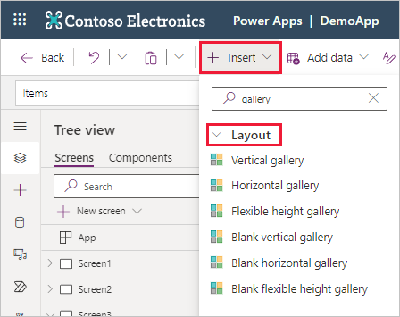
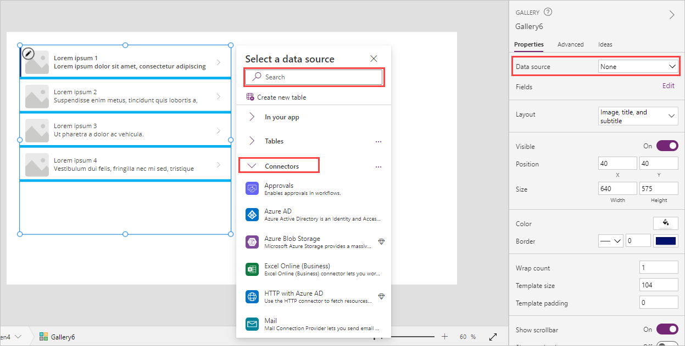
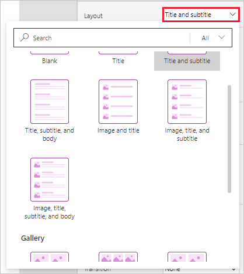
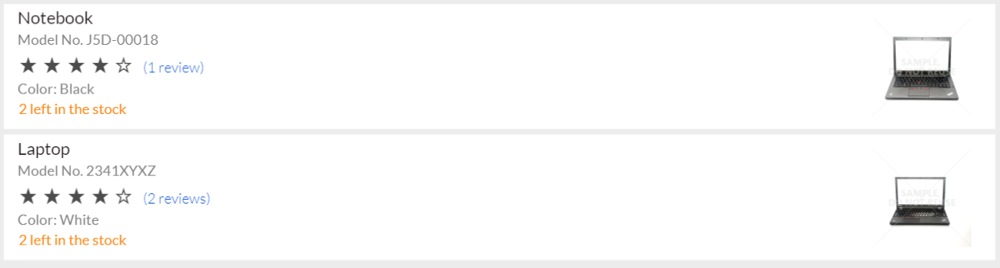
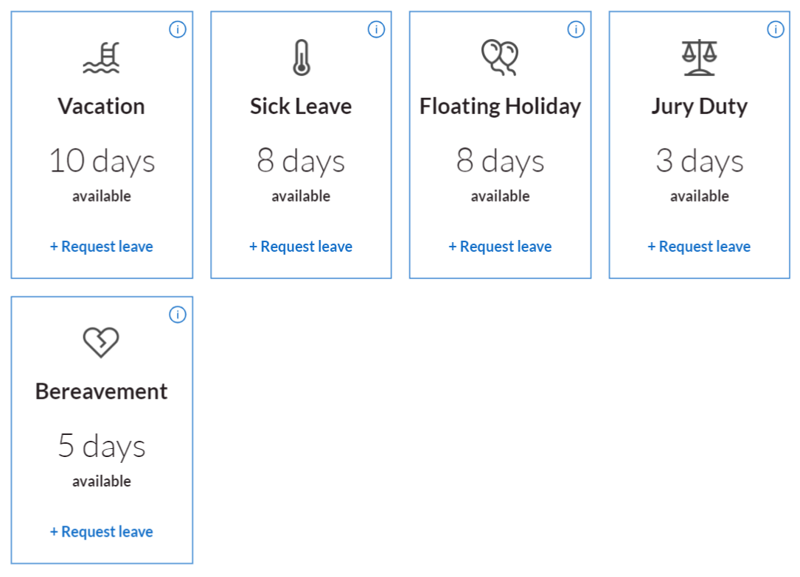

We introduced the gallery control earlier in this module, and now we do some deeper exploration since galleries are one of the most useful controls for displaying tables of data. Galleries not only display the contents of a table in a data source or a collection for your user, but they allow users to interact with them. You can configure the gallery template to display the information the way you want, and the Gallery will repeat that template layout for each row in the table.

You can add a gallery to your canvas app by opening the Power Apps Studio, selecting the **Insert** button on the command bar and by searching (or scrolling) for the gallery you want, and then selecting it. You find several different types under the expendable **Layout** section within the **Insert** list.

> [!div class="mx-imgBorder"]
> 

Notice you can choose **Vertical**, **Horizontal**, and **Flexible height** options that contain preconfigured controls to help you get started. The **Blank** options provide the same orientations/behaviors, just without adding preconfigured controls. The remainder of this example uses a **Vertical gallery**.

When you insert a gallery, it's added to your canvas, and it immediately shows sample data and a dialog box giving you the option to **Select a data source**. By default, within this dialog box the **In your app** data sources will be expanded, but you can either search for one via the search field or expand the **Tables** or **Connectors** dropdowns and scroll through the list. Alternatively, in your Gallery's **Properties** menu on the right side of the screen you can use the dropdown next to **Data source** which displays the same **Select a data source** dialog.

> [!div class="mx-imgBorder"]
> 

The data source that you select is reflected in the **Items** property of the gallery control. You can modify that property by typing or pasting a formula into the formula bar. **Filter**, **Search**, and **Sort** functions can manipulate what data the gallery shows. If your gallery displays a list of requests, you might filter the list to show only the requests for the user who's signed in. The next unit covers this concept in more detail.

If you select the **Layout** dropdown in the **Properties** for your gallery, you can select from several types of **List** views or **Gallery** views of your data. Notice that you can either search or scroll through the options to find the one that you want.

> [!div class="mx-imgBorder"]
> 

Each view sets a default layout of your data and the available controls. But you can still manually modify the gallery template to add controls and build a design to meet your business needs.

After you configure the gallery in the **Select a data source** pane, you can close it, and then edit and design the gallery template the same way you would any other part of your app. You can also select a different data source by selecting **Data source** in the **Properties** pane for your gallery.

The sample canvas apps show how much you can customize a gallery. For example, the Asset Checkout app template contains this vertical list.

> [!div class="mx-imgBorder"]
> 

The Leave Request app contains this horizontal gallery with four columns.

> [!div class="mx-imgBorder"]
> 

The point of these examples is to show you how you can make your gallery visually appealing as well as informational. A gallery provides a template for arranging and portraying the information in a table.  Now that you've seen how we can insert and connect a gallery, let's go to the next unit and see how we can use **Collect** to move data between collections and data sources.
