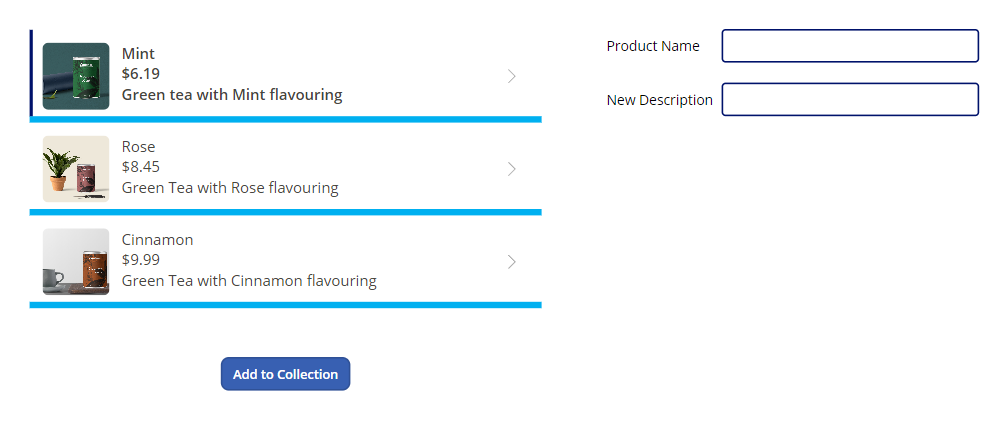

In this exercise, you work with external data in your canvas app, by adding a data source to your app, creating/modifying data by using collections, and modifying data via the **Patch** function.

You need to download the [spreadsheet](https://github.com/MicrosoftDocs/mslearn-developer-tools-power-platform/blob/master/power-apps/shape-data/shape-data-learn.zip) to complete this exercise. Select download once the link opens. Extract the Excel spreadsheet and upload the spreadsheet to your own OneDrive.

## Add a data source

1. Sign into [Power Apps](https://powerapps.microsoft.com/?azure-portal=true).

1. Create a new Power Apps Canvas app from blank and call it *ExternalData.* Select the **Tablet** format.

1. Make sure that you’ve added the Excel sheet (link above) to your OneDrive.

1. From the **Insert** button in the header ribbon, select **Vertical gallery**.

1. In the **Select a data source** pane at your gallery, type "OneDrive" in the search field, then select **OneDrive for Business** from the list. Alternatively, you could also expand Connectors and scroll through the available connectors until you find **OneDrive for Business**.

   > [!div class="mx-imgBorder"]
   > 

1. Under **Add a connection**, select the connection you wish to use for **OneDrive for Business** (it has an email address listed under it).

   > [!div class="mx-imgBorder"]
   > 

1. At the bottom of **OneDrive for Business**, select **Connect**.

1. When prompted to **Choose an Excel file,** search for or scroll to the Excel file you downloaded in Step 3 and select it.

1. Check the **Items** table and then select **Connect**.

   > [!div class="mx-imgBorder"]
   > 

Your gallery is now connected to your **Excel** table in **OneDrive for Business**, and you can display the data in the gallery control.

## Display and interact with your data in a gallery

1. Select the gallery you’ve added.

1. In the properties pane on the right, select the drop-down menu for the **Layout** property.

1. Select the **Image, title, subtitle, and body** layout.

1. In the properties pane on the right, select the Edit button for the **Fields** property and set the fields as follows (note that the controls have numbers behind them so, for example Body will be "Body1", see image below for reference):

    - **Body**: Description

    - **Image**: Image

    - **Subtitle**: UnitPrice

    - **Title**: Name

   > [!div class="mx-imgBorder"]
   > 

1. Close the **Data** dialog box (select the **X** at the top right).

1. In the gallery, select the price in the first row.

1. In the formula bar, make sure the **Text** property is selected and type the following:

    `"$" & ThisItem.UnitPrice`

   > [!div class="mx-imgBorder"]
   > 

1. In the gallery, select the image in the first row.

1. In the properties pane on the right, select the drop-down menu for the **Image Position** property.

1. Change the property from **Fit** to **Fill** and you see that the picture expands to fill the dimensions of the image control.

You’ve now added, customized and configured data in your gallery.

## Moving data between collections and data sources

1. Select **Screen1** (anywhere outside of the gallery).

1. Let's add a button by selecting the **Insert** button in the app ribbon. Select **Button** and position the new button control underneath your gallery.

1. Change the *Text* on the button to **Add to Collection**, and adjust *Font size* from 15 to 12 so that the text fits the button in a single line.

1. Select the button, and in the formula bar, replace OnSelect value of **false** with this expression:

   ```powerappsfl
    Collect(colItemsCollection, Items)`
   ```

    **colItemsCollection**: Refers to the Collection name

    **Items**: Refers to the Data Source name

    **Collect**: Will copy all records from the **Items** into the **colItemsCollection** collection

   > [!div class="mx-imgBorder"]
   > 

1. Select the **Preview** button in the top right of the Power Apps editor (or press F5) to enter preview mode. Select the **Add to Collection** button, and exit preview mode. Alternatively, press and hold **Alt** and select the **Add to collection** button.

1. In the left-side rail select the **Variables** button, expand the **Collections** option, and select the ellipsis next to **colItemsCollection** that you created. Select the **View Table** option.

   > [!div class="mx-imgBorder"]
   > 

1. You should now see a pop-up window showing the table stored in your collection.
Notice that the three records from the **Items** data source have been added to the **colItemsCollection** collection. You can view any of your app's collections and other variables using this technique.

   > [!div class="mx-imgBorder"]
   > 

1. Select **Cancel** to close the pop-up view and return to your app canvas.

## Explore other functions that can be used with Collections

1. From the **Tree view**, select **New Screen** > **Blank**.

1. Select the **Insert** button and search for **Data** and select **Data table**.

   > [!div class="mx-imgBorder"]
   >

1. In the **Select a data source** dialog pane for your new data table, select **colItemsCollection**.

   > [!div class="mx-imgBorder"]
   > [](../media/data-table-data.png#lightbox)

    We've now made our collection **colItemsCollection** as the data source for this control and not the **Items** table in the Excel sheet. The next step is to define the fields we want to display.

1. In the properties pane on the right, select the **Edit fields** button for the **Fields** property.

1. Select **Add field**.

1. Select all available fields and then select **Add**.

   > [!div class="mx-imgBorder"]
   > 

1. Close the **Data** pane (select the X towards the right of **Data**).

1. Insert a button by selecting **Insert** from the ribbon, select **Button** and position your button underneath your table. Add three more buttons from left to right under the data table control on your screen.

1. Change the text on all four buttons to **Add Column, Drop Column, Show Column, Rename Column** respectively. You can do this simply by double-clicking on each button and typing the new name. Adjust the font size of the *Rename Column* button to 12, so that it fits in a single line.

1. Select the **Add Column** button and update the **OnSelect** property to this expression:

   ```powerappsfl
   Collect(colAddCollection, AddColumns(colItemsCollection, "Revenue", UnitPrice * UnitsSold))
   ```

    Selecting this button creates a new collection called *colAddCollection*, taking the data from the *colItemsCollection* collection and, by using the *AddColumns* function, adds a new column called **Revenue**, which is calculated as UnitPrice * UnitsSold.

1. Select the **Drop Column** button on the canvas, and update the **OnSelect** property to this expression:

   ```powerappsfl
   Collect(colDropCollection, DropColumns(colItemsCollection, "UnitPrice"))
   ```

    Selecting this button creates a new collection called *colDropCollection*, which copies all data from the *colItemsCollection* collection, but by using the *DropColumns* function it removes the UnitPrice Column.

1. Select the **Show Column** button and update the **OnSelect** property to this expression:

   ```powerappsfl
   Collect(colShowCollection, ShowColumns(colItemsCollection, "Name"))
   ```

    Selecting this button creates a new collection called *colShowCollection, which includes all data from the *colItemsCollection* collection, but it uses the *ShowColumns* function to only show the *Name* column.

1. Select the **Rename Column** button and update the **OnSelect** property to this expression:

   ```powerappsfl
   Collect(colRenameCollection, RenameColumns(colItemsCollection, "Name", "Product"))
   ```

    Selecting this button creates a new collection called *colRenameCollection*, which includes all data from the *colItemsCollection* collection, but by using the *RenameColumns* function changes the *Name* column to *Product*.

    When completed your buttons should look like this:

   > [!div class="mx-imgBorder"]
   > 

1. Select the **Preview** (or *Play*) button in the top right of the Power Apps editor to enter preview mode. Select all four buttons. Then exit preview mode. What we just did was to create four additional collections.

1. Let's take a look at the four new collections we created. Select **Variables>Collections**, then select the ellipsis next to **colAddCollection**, and then **View Table**. Notice how your **Variables** pop-up window has a menu on the left side showing all four of the new collections we created, along with the original collection. You can select through each of them to see the effect on the original collection that was displayed in our data table.

    > **colAddCollection**
    > [!div class="mx-imgBorder"]
   >    
    > **colDropCollection**
    > [!div class="mx-imgBorder"]
   > 
    > **colShowCollection**
    > [!div class="mx-imgBorder"]
   > 
    > **colRenameCollection**
    > [!div class="mx-imgBorder"]
   > 

   Close the **Variables** pop-up window after you've taken a look. Remember that collections are tables of temporary data only available while using the app and only available to the current user. So, once you close the app they're gone.

## Work with the Patch function

1. Return to **Screen 1** in your app.

1. Add a **Text label** control (select the **Insert** button and select **Text label**). Rename the **Text** property to *Product Name*. You can do this by double clicking the label and typing directly in the control. Then position the label next to the gallery.

    >[!TIP]
    >An easy technique to copy and paste a control quickly is to select the control, press and hold the **Ctrl** key and press **C**; then (while holding the **Ctrl** key) press **V**. You'll see your item paste slightly below and to the right of the control you just copied.

1. With the label selected, copy it, and make the **Text** of the copied label *New Description*.

1. Use the **Insert** button again to insert a **Text input** control. Clear the default property to make it blank. Then copy this control and position both text inputs next to the labels you made in the steps above. Your screen should now look similar to this:

   > [!div class="mx-imgBorder"]
   > 

1. Next insert a **Button** control and position it beneath your Labels. Change the **Text** property to *Update*.

1. Select the text input to the right of the *Product Name* label.

1. In the formula bar, make sure you have the **Default** property selected and then change the expression to the following (keep in mind your gallery control might have a different name than *Gallery1*; change the formula accordingly):

   ```powerappsfl
   Gallery1.Selected.Name
   ```

    This label will now display the **Name** of the selected record from the gallery. You can test this by putting the app in **Preview** mode (alternatively, press and hold the **Alt** key) and selecting different items from the gallery. Notice how the displayed *Product Name* changes as you select different gallery items.

1. Repeat this process for the text input control to the right of the *New Description* label. Make the **Default** formula as below:

   ```powerappsfl
   Gallery1.Selected.Description
   ```

   Another thing to note is the dark vertical bar that displays on the left side of the gallery item that is selected.

1. Select the **Update** button.

1. Change the **OnSelect** property of the button to this expression:

   ```powerappsfl
   Patch(Items,LookUp(Items, Name = TextInput1.Text), { Description: TextInput1_1.Text })
   ```

    > [!NOTE]
    > Your text input controls may have different names than this example. Adjust your formula accordingly.

Let's recap what we've done. We've created a way to update our product description.

- **Patch** - Provides the means to *modify* or create a record in your data source, in this case we're modifying a record.

- **LookUp** - Uses our product name to find the record we want to modify. It returns the first record that matches our condition: *Name = TextInput1.Text*.

- Once Power Apps finds the matching record (via **LookUp**), it updates the **Description** of the item in the data source based on what you have typed in the *New Description* text input.

Test this by previewing your app. Select the Cinnamon item in the gallery and then replace the current description with "Cinnamon flavored Green Tea", then select **Update**. The description in the gallery changes to the new description.

   > [!div class="mx-imgBorder"]
   > 

Congratulations! You've learned a technique to update your data source.
