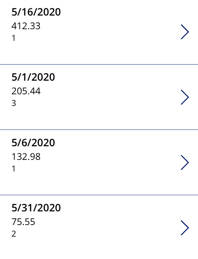
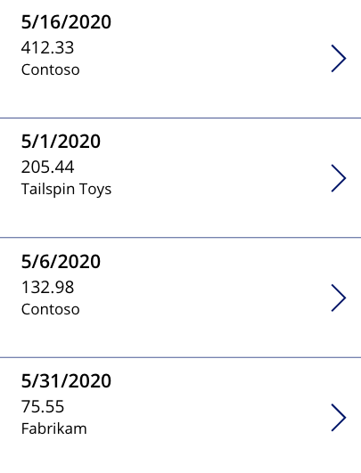

Power Apps indeed offers a rich set of functions and controls tailor-made for establishing and utilizing relationships within your apps. Relationships typically find two primary applications in most apps.

Firstly, as discussed earlier, it involves storing data across multiple tables and then utilizing relationships to seamlessly connect this data. This unit guides you through connecting tables, such as customers and invoices, demonstrating how to forge meaningful associations between them.

Secondly, relationships are often employed to fetch information from the parent record when directly accessing the child record. In this case, you learn how to retrieve the customer name while working within the context of an invoice record. This functionality allows you to efficiently access and display relevant information from related records, enhancing the usability and comprehensibility of your app.

## Connecting a parent and child table in Power Apps

In this example, we walk through how to reference a parent and
child relationship using the Power Apps filter and a LookUp function.

The Customer table is the parent in this relationship, meaning one customer can have many invoices. Notice there's no reference in the
Customer table to the Invoice table. For this example, the data source
name for this table is CustomerTable. The table looks like the
following.

| ID | CustomerName   | CustomerPhoneNumber |
|--- |----------------|---------------------|
| 1  | Contoso       | 513-555-1212         |
| 2  | Fabrikam      | 206-555-1313         |
| 3  | Tailspin Toys | 404-555-1414         |

The Invoice table is the child in this relationship. For this example,
the data source name for this table is InvoiceTable. The table looks
like the following.

| ID | InvoiceDate | InvoiceDescription| InvoiceAmount | CustomerID |
|----|-------------|-------------------|---------------|------------|
| 1  | 5/16/2020   | Parts             | 412.33        | 1          |
| 2  | 5/1/2020    | Service           | 205.44        | 3          |
| 3  | 5/6/2020    | Travel            | 132.98        | 1          |
| 4  | 5/31/2020   | Parts             | 75.55         | 2          |

In Power Apps, if you have these tables built as data sources, you could use a Gallery control to display the contents of the Customer table. You would use the Gallery control with the following steps:

1. Insert a **Gallery** control onto your canvas.

1. Set the **Items** property to your **CustomerTable**.

The Gallery displays a list of all of the customer records in the
table. This is **Gallery1**.

To display the full contents of the InvoiceTable, use the following
steps:

1. Insert a **Gallery** control onto your canvas.

1. You can set the **Items** property to your **InvoiceTable**.

This Gallery displays a list of all of the invoice records in the
table. This is **Gallery2**.

Now to display only the invoices for the customer selected in Gallery1, you would need to modify the items property of Gallery2 with something like this:

    Filter(InvoiceTable, CustomerID = Gallery1.Selected.ID)

The formula does the following.

  | **Formula Argument** | **Formula Input**                 | **Notes** |
  |----------------------|-----------------------------------|-----------|
  | source               | InvoiceTable                      |  |
  | logical_test        | CustomerID = Gallery1.Selected.ID | CustomerID is the column name from the InvoiceTable. Gallery1.Selected. The ID is the value of the ID column for the selected record in the gallery. |

The formula causes Gallery2 to display the invoice records for the selected
customer in Gallery1.

## Looking up information stored in the parent from the child

Sometimes the need arises to navigate upwards or "bottom-up" from a child record to its associated parent record. In the scenario where you're examining the details of an invoice record, say with an ID of 2, and you're aware of its association with the customer having an ID of 3, you might want to extract more details from the parent table.

In this case, you can use the relationship between the tables to retrieve information related to the customer, such as their name or phone number, by referencing the associated records in the parent table. This technique allows you to gather pertinent details from linked records in the parent table based on the information available in the child record, providing a comprehensive view and facilitating cross-referencing between related data. In
Power Apps, you can use the **LookUp** function to do just that!

The **LookUp** function allows you to query a data source for a single
record that meets the evaluation criteria. In the following example, we use
the same tables as the previous one, but we start with a blank
screen to avoid confusion.

To display the full contents of the InvoiceTable, you would use the following
steps:

1. Insert a **Gallery** control onto your canvas.

1. Set the **Items** property to **InvoiceTable**.

1. Set the **Layout** to Title, Subtitle, and body.

1. In the **Data** pane set **Title** to **InvoiceDate**, **Subtitle** to **InvoiceAmount**, and **Body** to **CustomerID**.

This Gallery displays a list of all of the invoice records in the
table. If you want your date fields to look like the image below, you would modify your **Title** field to read: Text(ThisItem.InvoiceDate,DateTimeFormat.ShortDate) This is **Gallery3**.

Showing the ID value for each customer doesn't provide much information for the app user. So, to display the customer name, instead of the ID, we can do the following:

In **Gallery3**, select the label for **Body** and set the **Text** property to:

    LookUp(CustomerTable, ID = ThisItem.CustomerID, CustomerName)

The formula does the following:

| **Formula argument**  | **Formula input**        | **Notes** |
| :---------------------| :------------------------| :----------------------------------------------------------------------------------------------------------------------------------------------------|
| source                | CustomerTable            |  |
| logical_test         | ID = ThisItem.CustomerID | The ID is the column name from the CustomerTable. ThisItem.CustomerID is the value of the CustomerID column for the current record in the gallery.|
| result                | CustomerName             | This is the column that is returned for the records that matched the logical_test.|

After making that change, Gallery3 now provides the vendor name.

## Performance Notes

Performing lookups from a child record to its parent within a Gallery can have significant performance implications. In the demonstrated scenario, utilizing the LookUp function within a Gallery would trigger data source queries multiple times—once for each record in the InvoiceTable.

Consider this: if your InvoiceTable contains hundreds of records, the LookUp function would execute just as many times. This means that potentially hundreds of separate data source calls would occur. As a result, this could lead to increased network traffic and longer processing times, ultimately impacting the performance of your app.

Before implementing data source calls, especially within a Gallery where multiple records are processed, it's crucial to weigh the performance trade-offs. Optimizing these queries, perhaps by caching data or restructuring the logic to minimize repetitive calls, is essential for maintaining optimal app performance. Always consider the scale of your data and the potential impact on performance when implementing such operations within a Gallery context.

A better option to consider for this scenario is using a collection or
other means to query and store all of the customer records and then
do your lookup against the collection. For more information about data performance, see the blog post on [Performance considerations with Power Apps](https://powerapps.microsoft.com/blog/performance-considerations-with-powerapps/?azure-portal=true).

In the next unit, you'll learn how Microsoft Dataverse removes all of the
issues associated with related data by automatically drilling down for you.
