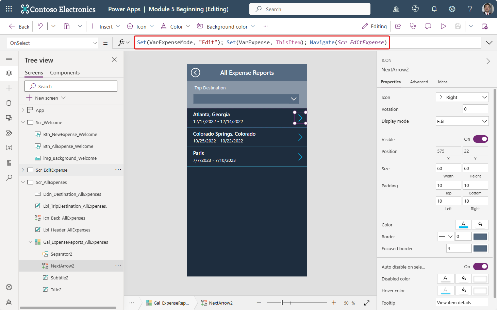
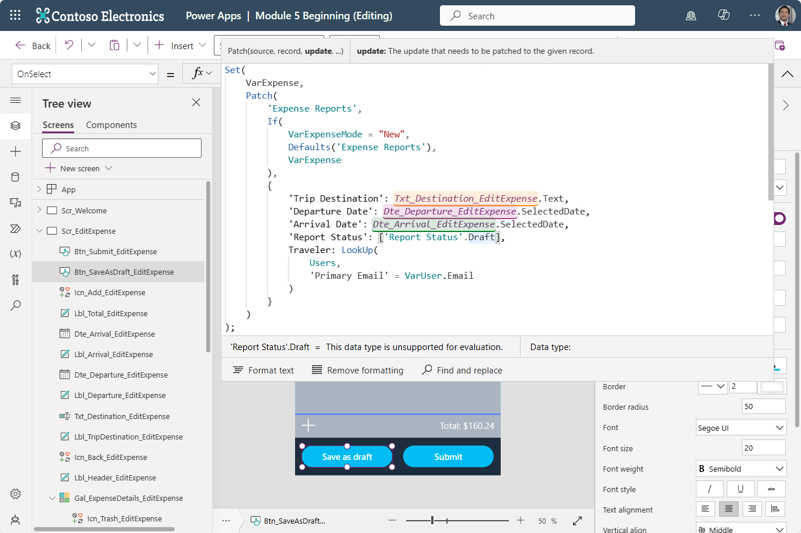

Now that your data is set up, you need to be able to write to two data tables. You'll write data to the parent table first: the **Expense Report** table. Additionally, your app doesn't only need to write new records, it needs to edit existing drafts and show information for expense reports that have already been submitted. As a result, you need to tell the fields which record is being edited or displayed. Also, you need to tell it whether to create a new record. To complete these tasks, you'll need a couple of variables.

## Use variables to control data flow

To use variables to control data flow, follow these steps:

1. From the **Tree view**, select **Scr_Welcome**.

1. Select the **Btn_NewExpense_Welcome** button and add to the existing **OnSelect** property code. To make sure that functions run concurrently, you need to separate them by a semicolon, so after the **Navigate()** function, add **`; Set(VarExpenseMode, "New")`**.

   The **OnSelect** property should now read: `Navigate(Scr_EditExpense); Set(VarExpenseMode, "New")`

   In addition to navigating screens as before, you’re now creating a variable to indicate that a new record needs to be added. 

   Next, we'll do something similar on **Scr_AllExpenses**.

1. Go to your **Scr_AllExpenses** screen, select the **NextArrow** control in **Gal_ExpenseReports_AllExpenses**.

1. Update the **OnSelect** property with the following code: `Set(VarExpenseMode, "Edit"); Set(VarExpense, ThisItem); Navigate(Scr_EditExpense)`

   The **OnSelect** property should resemble the following screenshot.

   > [!div class="mx-imgBorder"]
   > [](../media/next.svg#lightbox)

   This time, you're setting a variable to tell you to edit an existing record. You're also setting a variable to tell you which record needs to be edited. Then, you'll navigate to the Scr_EditExpense.

1. Let's go to the **Scr_EditExpense** screen to observe these variables in action. From the Tree view panel, select **Scr_EditExpense**.

1. Set the **OnVisible** property of **Scr_EditExpense** to **`If(VarExpenseMode="New", Set(VarExpense, Blank()))`**.
   
   This setting ensures that the fields don't hold data from a previous record. You could also use the button on your welcome screen, but the point of learning is to discover different methods. You might notice that the **If** statement only has a true value. In a case like this, if we only define a true value and the condition is false, then nothing happens.

   With the variables in place, you can reference existing data and then clear it out.

1. Select the input field under **Trip Destination**. This should be your **Txt_Destination_EditExpense** text input field. Set the **Default** property to **`VarExpense.'Trip Destination'`**.

   Let's test out this variable. Return to the **Scr_AllExpenses** screen.

1. From the **Scr_AllExpenses** screen, put the app in preview mode and select the **next** arrow for an existing record. A destination should display on the **Scr_EditExpense** as you navigated from the **Scr_AllExpenses** screen.

1. On the **Scr_EditExpense** screen, select the date picker field to the right of "Departure Date". Modify the **DefaultDate** property for **Dte_Departure_EditExpense** to: `VarExpense.'Departure Date'`.

1. Select the date picker for your arrival date. Modify the **DefaultDate** property for **Dte_Arrival_EditExpense** to: `VarExpense.'Arrival Date'`.

Remember, if you're having difficulty finding a property for a control, you can always find all properties on the toolbar within the **Properties** dropdown menu, or in the **Properties** pane on the right side of the screen.

After you have set those properties, the dates should behave exactly as the destination field. Return to your **Scr_AllExpenses** screen and put the app in preview mode to test the functionality so far.

Now that your app is functioning well, it's time to start setting up the app logic for writing data from the app back to your tables.

## Configure app logic

In this scenario, and in many real-world scenarios, users will need the functionality to add new items and edit existing items. Additionally, you'll want to include the functionality for users to save as draft. This functionality allows them to work on an item over multiple days or sessions before they submit for approval.

On the **Scr_EditExpense** screen, select **Btn_SaveAsDraft_EditExpense** and then change the **OnSelect** property as follows:

   ```powerappsfl
   Set(
   VarExpense,
   Patch(
      'Expense Reports',
      If(
         VarExpenseMode = "New",
         Defaults('Expense Reports'),
         VarExpense
      ),
      {
         'Trip Destination': Txt_Destination_EditExpense.Text,
         'Departure Date': Dte_Departure_EditExpense.SelectedDate,
         'Arrival Date': Dte_Arrival_EditExpense.SelectedDate,
         'Report Status': ['Report Status'.Draft],
         Traveler: LookUp(
               Users,
               'Primary Email' = VarUser.Email
         )
      }
   )
   )
   ```

### Patch explanation

This code is the most complex piece that you've done so far in this learning path. To help you better understand what this code is doing, let's break it down.

The first task that you're doing is using the **Set()** function. This function sets **VarExpense** to include any changes that you make, including the new unique identifier if a new item is being created.

The **Patch()** function allows you to write to a data source by defining:

- **The source** - 'Expense Reports'
- **The record to be altered** - `If(VarExpenseMode="New",Defaults('Expense Reports'),VarExpense)`
- **What needs to be written** - `{'Trip Destination':Txt_Destination_EditExpense.Text,'Departure Date':Dte_Departure_EditExpense.SelectedDate,'Arrival Date':Dte_Arrival_EditExpense.SelectedDate,'Report Status':['Report Status'.Draft],Traveler:LookUp(Users,'Primary Email'=VarUser.Email)}`

The record to be written is wrapped in an **If()** statement that looks at the **VarExpenseMode** variable. If the item is **New**, you would use **`Defaults('Expense Reports')`**. However, if the record already exists in your table, you can use **VarExpense** to update the existing item, because it holds all information that Microsoft Dataverse needs to understand which record is being edited or updated.

The item information can be difficult, but it's a significant reason for changing your control names to something that makes logical sense. The text and date fields, such as **Trip Destination** and **Departure Date**, are reasonably simple to write. You would reference the control in which the information is entered, and then explore further in that control to find the exact information, such as **'Text'** for a text input or **'SelectedDate'** for a date picker.

The last two fields are more complicated. **Report Status** is a choice field and **Traveler** is a lookup to the User table. We'll cover them in a little more detail below.

### Choice field Patch explanation

Choice fields in Dataverse require a table or option set of data, which simply means that you need to add brackets **[ ]** around the values. Inside the brackets, you input the field name again, followed by a period, to fetch the possible choices.

To see what we mean, go to the **OnSelect** property for your **Btn_SaveAsDraft_EditExpense** button.

Where your code patches to 'Report Status': [Draft], select inside of these square brackets. Notice how the code expands to show: "['Report Status'.Draft]".

Now delete "Draft" from the code. Power Apps shows errors in your formula, because it's expecting a select value, instead of the entire set/table of values. So, we need to give it a specific value from the available options.

With your code showing `['Report Status'.]` you should see some suggestions below the ***fx*** formula input field for some possible selections including:

- 'Awaiting Approval'

- 'Awaiting Reimbursement'

- Complete

- Draft

These are the available choices for this field. So, by adding a period and "Draft" to the code, you tell Power Apps precisely which value to input into the Dataverse field. Specifically, *Draft* becomes the input as the value for the 'Report Status'.

### LookUp field explanation

For the **Traveler** field, you're finding the signed-in user in the Users table by using a **LookUp()** function. The **LookUp()** function uses the data source *Users* to find the first record in that table that fits the **`'Primary Email' = VarUser.Email`** condition. For this reason, it's important to use a field that will be unique, such as email.

As you continue through this module, take your time. If needed, try breaking down the code into smaller pieces. This approach will help with learning, ultimately helping you become a better Power Apps developer.

   > [!div class="mx-imgBorder"]
   > [](../media/save-draft.svg#lightbox)

Congratulations, the **Save as Draft** functionality is complete.
