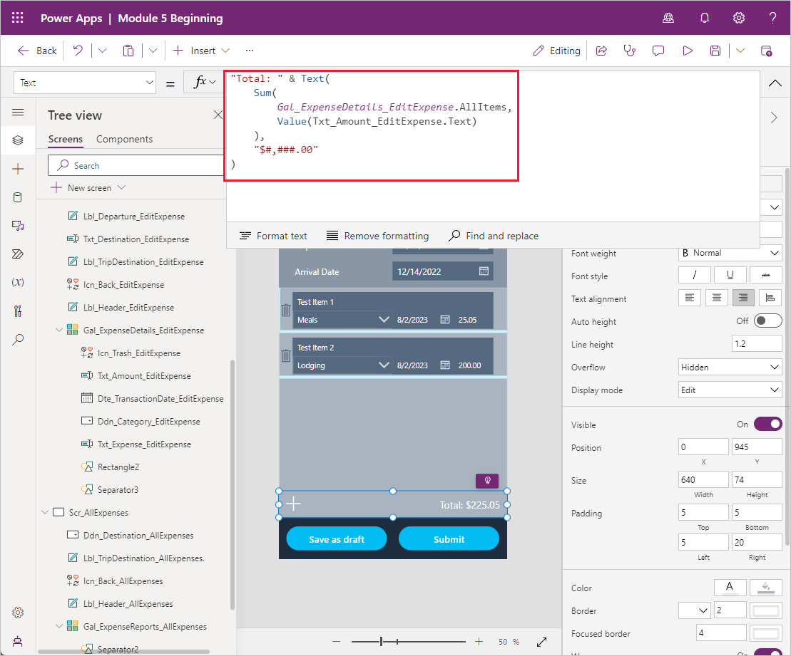
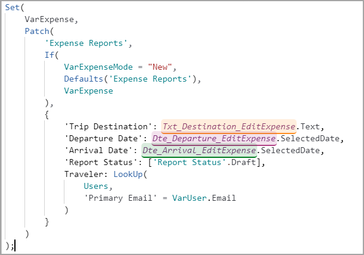
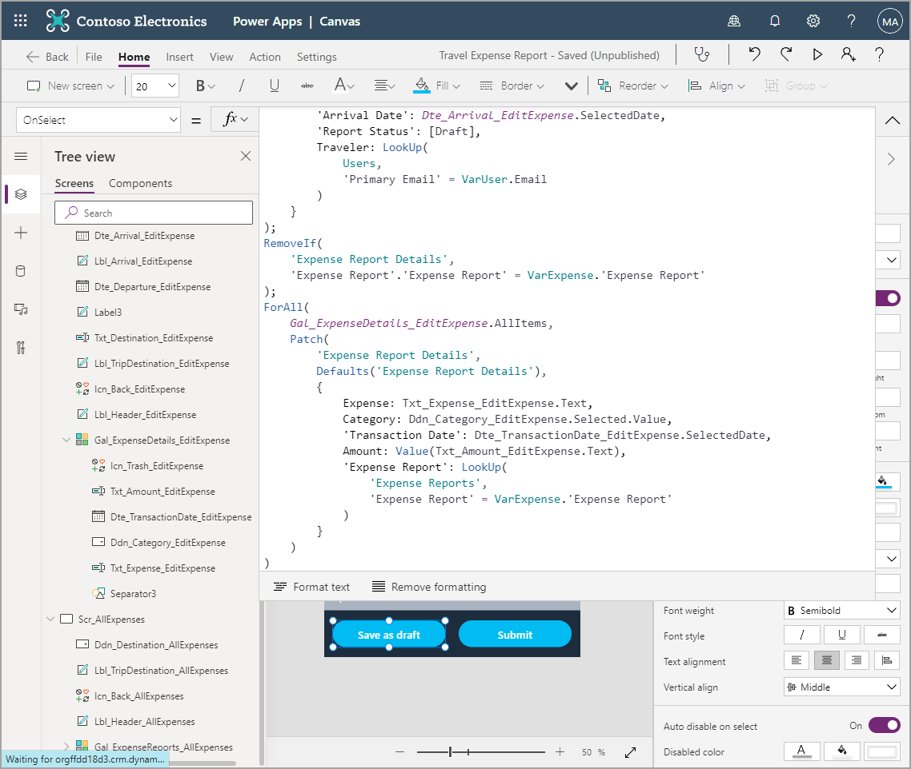

Adding expense details, or the individual transactions that add to the expense report, is more complex because you're writing many different lines at once. 

Instead of connecting directly to the data source, as you would with **Gal_ExpenseReports_AllExpenses**, you'll store the information in a collection. A collection is a special type of variable that stores a table of data instead of a single record or value. It stores this table for later use in the app. 

To implement this functionality, follow these steps:

1. From the **Tree view**, go to the **Scr_EditExpense** screen and select the **OnVisible** property.

1. Add the following code to the existing code:

    ```powerappsfl
    ; ClearCollect(
        ColExpenseDetails,
        Filter(
            'Expense Report Details',
            'Expense Report'.'Expense Report' = VarExpense.'Expense Report'
        )
    )
    ```

   **ClearCollect()** is a function to clear out previous records and begin a new collection. This function is important so that you don't add new expense details from other expense reports.

   **ColExpenseDetails** is the name of your collection. As with variables, this name can be anything that you choose. However, it's a good idea to have a pattern and name it something that you can easily recall.

   The last portion shows what is being collected, a filtered version of **Expense Report Details**. The filter logic uses the **Expense Report** lookup field in the details table and explores further the globally unique identifier (GUID), which is also called **Expense Report**.

   The **Expense Report** lookup field is being compared against the expense report that is held in the **VarExpense** variable, which you can use to uncover the GUID or the **Expense Report** field. The fact that the GUID has the same name as the table in Dataverse can get confusing. When in doubt, look at your columns in Dataverse.

   Your completed OnVisible code should look like the following image.

   > [!div class="mx-imgBorder"]
   > [](../media/expense-variable.png#lightbox)

   You can use this new collection that you've created to populate your **Gal_ExpenseDetails_EditExpense** gallery.

1. Change the **Items** property of **Gal_ExpenseDetails_EditExpense** to `ColExpenseDetails`.

   > [!div class="mx-imgBorder"]
   > [](../media/items.png#lightbox)

   Though you don't have details yet, you can add them with **Icn_Add_EditExpense**.

1. Set the **OnSelect** property for the **Add** icon to **`Collect(ColExpenseDetails, {})`**.

   As previously mentioned, **Collect()** adds on to an existing collection, so this setting will add a new line. The braces **{}** denote a blank item.

   > [!div class="mx-imgBorder"]
   > [](../media/icon.png#lightbox)

1. Hold down the **Alt** key or open the app in **Play** mode to add a couple of blank lines to your collection.

   Now, you need to point to the correct fields in the gallery, as you did in the gallery in the **All Expenses** screen.

1. Start with **Txt_Expense_EditExpense** and change the **Default** property to **`ThisItem.Expense`**.

1. Update the **Items** property of **Ddn_Category_EditExpense** to **`["Meals","Lodging","Transportation","Other"]`**.

   As mentioned in the previous unit, brackets **[]** define a table. This approach allows you to hard code choices, another way to handle options in a canvas app with Dataverse as the database. This field was defined as text and not a choice field, so you'll write the selected value from the dropdown list.

1. Update the **Default** property of **Ddn_Category_EditExpense** to **`ThisItem.Category`**.

1. Update the **DefaultDate** property of **Dte_TransactionDate_EditExpense** to **`ThisItem.'Transaction Date'`**.

1. Update the **Default** property of **Txt_Amount_EditExpense** to **`ThisItem.Amount`**.

1. Change the **OnSelect** property of **Icn_Trash_EditExpense** to **`Remove(ColExpenseDetails, ThisItem)`**.

   The **Remove()** function can remove items from collections or data sources. Make sure that you specify the correct record if you're using **Remove()** with a data source.

   After you've finished the logic for the gallery, take a few minutes to test the functionality by adding, deleting, and editing the lines in your gallery.

   After you've completed testing the latest updates and functionality, you need to complete a couple more tasks before rolling out this app to your users.

   Next, you'll explore and set up the **Total** field. 

1. On **Lbl_Total_EditExpense**, add onto the **Text** property so that it reads: `"Total: " & Text(Sum(Gal_ExpenseDetails_EditExpense.AllItems, Value(Txt_Amount_EditExpense.Text)), "$#,###.00")`

   > [!div class="mx-imgBorder"]
   > [](../media/total.png#lightbox)

   Notice how **Text()** is used again to format your field the way that you wanted it to display. The new function that you would use is **Sum()**.

   The **Sum()** function captures several numbers (or a table of data) and a specific field in that table and then sums (or adds) each line of the field together. **Sum()** will only accept a number, so you'll need to wrap the text field in the **Value()** function, which will convert a text format to a number value.

   As long as your collection isn't empty, a new **Total** value should display in the **Lbl_Total_EditExpense** label. When you add, edit, or remove items from the collection, the **Total** value will recalculate in real time.

   Your next task is to write to the data source. You can begin with your **Save as draft** button.

1. On the **Btn_SaveAsDraft_EditExpense** button, add the following code to the **OnSelect** property (after existing code):

    ```powerappsfl
    ; RemoveIf(
        'Expense Report Details',
        'Expense Report'.'Expense Report' = VarExpense.'Expense Report'
    );
    ForAll(
        Gal_ExpenseDetails_EditExpense.AllItems,
        Patch(
            'Expense Report Details',
            Defaults('Expense Report Details'),
            {
                Expense: Txt_Expense_EditExpense.Text,
                Category: Ddn_Category_EditExpense.Selected.Value,
                'Transaction Date': Dte_TransactionDate_EditExpense.SelectedDate,
                Amount: Value(Txt_Amount_EditExpense.Text),
                'Expense Report': LookUp(
                    'Expense Reports',
                    'Expense Report' = VarExpense.'Expense Report'
                )
            }
        )
    )
    ```

The following screenshots show the entire formula bar code. Take a moment to review and confirm that your code matches.

   > [!div class="mx-imgBorder"]
   > [](../media/formula-2.png#lightbox)

   > [!div class="mx-imgBorder"]
   > [](../media/formula-3.png#lightbox)

The new **RemoveIf()** function is similar to the **Remove()** function, except that it deletes all records that follow a condition rather than a single record.

Make sure that you specify a condition or you might unintentionally delete all of your records from a table. In this scenario, you're deleting and recreating all the expense details, so you don't need to add logic about lines that are edits versus lines that are new. You might notice this condition is similar to the filter that you used to create the expense details collection.

The **ForAll()** function loops through a table of data, in this case **`Gal_ExpenseDetails_EditExpense.AllItems`**, and runs code on each line in the table. The code that's being run for this table is the **Patch()** statement.

The following example shows the **Patch()** statement isolated from the rest of the code:

```powerappsfl
Patch(
        'Expense Report Details',
        Defaults('Expense Report Details'),
        {
            Expense: Txt_Expense_EditExpense.Text,
            Category: Ddn_Category_EditExpense.Selected.Value,
            'Transaction Date': Dte_TransactionDate_EditExpense.SelectedDate,
            Amount: Value(Txt_Amount_EditExpense.Text),
            'Expense Report': LookUp(
                'Expense Reports',
                'Expense Report' = VarExpense.'Expense Report'
            )
        }
    )
```

The **Patch()** function writes directly to a data source. Therefore, the first entity that you need to define is the data source that you want to edit, which in this case is '**Expense Report Details**'.

The next line defines the specific record in the data source that you're editing. If you're creating a new line, which is what you're doing in this exercise, you'll use the **Defaults()** function and the name of the data source.

Everything within the braces **{}** specifies which fields that you're editing and what you're writing to those fields. The following example shows that the field that's being edited is **Expense** and you're writing **`Txt_Expense_EditExpense.Text`**, that is, the text from the text input named **Txt_Expense_EditExpense**.

`Expense: Txt_Expense_EditExpense.Text`

The scenario is the same on the next three lines, with minor changes depending on the control that's referenced. On the **Amount** line, the text is wrapped in a **Value()** function that converts the text to a number for Dataverse.

The final field that is being written to is '**Expense Report**'. This field is a lookup to maintain the relationship between the **Expense Report** and **Expense Report Details** tables. As with the Users table, you need to find the correct record in the parent table (Expense Reports). To complete this task, use the **LookUp()** function.

   > [!div class="mx-imgBorder"]
   > [](../media/save-draft-complete.png#lightbox)

Now that we've created the ability to save as draft, we'll work on our **Submit** button in the next unit.
