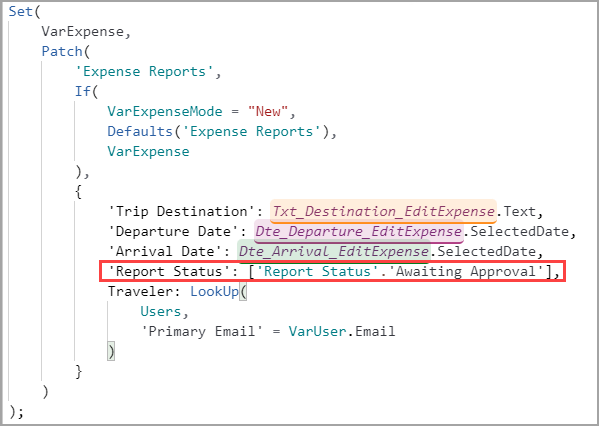
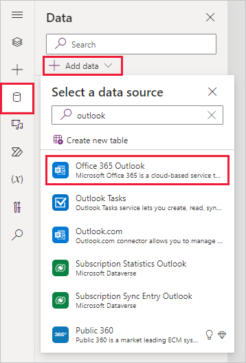

> [!VIDEO https://www.microsoft.com/videoplayer/embed/RWQjJY]

Your next challenge is to set up the **Submit** button and its functionality. Fortunately, only a few minor differences exist between the **Save as draft** button logic and the **Submit** logic.

1. Copy the **Patch()** statement from the **OnSelect** property of **Btn_SaveAsDraft_EditExpense**.

1. Select **Btn_Submit_EditExpense** and paste the copied code in the **OnSelect** property.

1. Update the `'Report Status':['Report Status'.Draft]` portion of code to be `'Report Status':['Report Status'.'Awaiting Approval']`.

    See the following image for clarity.

   > [!div class="mx-imgBorder"]
   > [](../media/updated.png#lightbox)

   The remaining code is still valid and doesn't need to be modified.

   The only other action that you need to take is to notify the supervisor (or whomever you choose). To add the extra functionality for notifying someone when an expense report is submitted, you'll add the Office 365 Outlook data source and a few more lines of code.

1. On the left side navigation rail, select the **Data** tab and then select **Add data**. (If you already have the **Office 365 Outlook** connector as a data source, then skip to step 6.)

1. Search for "**Outlook**" and then select **Office 365 Outlook**.

   > [!div class="mx-imgBorder"]
   > [](../media/add-data.png#lightbox)

   The system will ask you to choose a connection or add a new one. This action will sign in to your account. If you've already created a connection, use that one. Many new developers make a new connection for every app, which can be confusing.

   Now that you've added Outlook as a data source, return to your **Tree view**.

1. Add the following code to the end of your **OnSelect** property for **Btn_Submit_EditExpense**:

    ```powerappsfl
    ; Office365Outlook.SendEmailV2(
        VarUser.Email,
        "An Expense Report is Ready for Review",
        VarUser.FullName & " has submitted a new expense report for your review. Please visit the expense report app to see the details."
    )
    ```

    > [!NOTE]
    > Make sure that you add the semicolon at the beginning before starting your new function.

The function that you're using in this exercise is calling Outlook as a data source. Outlook is a function-based data source, meaning that you use it to call functions instead of returning tabular data as you would with Dataverse.

This function allows you to send an email from Power Apps by selecting a button. The information that this function needs includes:

- **Who is receiving the email** - `VarUser.Email`
- **The subject line** - `"An Expense Report is Ready for Review"`
- **The body of the email** - `VarUser.FullName & " has submitted a new expense report for your review. Please visit the expense report app to see the details."`

The body of the email combines text, as you did for the dates on the **All Expenses** screen. You might also notice that the recipient for this email is the signed-in user, which is common for testing.

In production, you would need a way to discern who is the supervisor of the signed-in user. If your company keeps this information in your Microsoft Entra ID, you can connect it as a data source and find the supervisor. Otherwise, you might need a table to look up a user's manager or send all approvals to one person.

You can expand this email to include considerably more information. As a practice, try referencing some other fields to add more detail to your email.

Now that we've completed our **Submit** button you can test out the functionality of your app and try submitting an expense report for approval.
