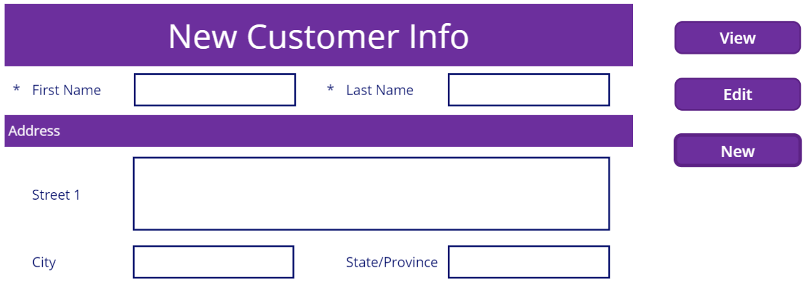

The **Edit Form** control has three different display modes: **View**, **Edit**, and **New**. Each mode has some difference in the options available and affects the form's behavior.

- **View mode** - In this mode, the form presents the information for the record, but the columns won't be editable. The controls on the cards present themselves with their view behavior. For example, the **Input** control presents without a border around the text.

- **Edit mode** - In this mode, the form presents the information for the record, and all the editable columns are editable. Remember, a form can have a mixture of editable and noneditable columns. The controls on the cards present themselves with their edit behavior. For example, the **Input** control presents with a    border around the text. This gives the user a visual clue they can edit the data. The **Default** property of the **Input** control determines the data shown in the control.

- **New mode** - In this mode, the form presents all of the columns for a record, but the columns are blank. The user enters new data and creates a new record. The controls on the cards present themselves with their edit behavior. For example, the **Input** control presents with a border around the text, giving the user a visual clue that they can input data.

## Controlling form modes

A **Form** control has a default mode. You set the default mode using the **Edit** panel. The form mode can also be changed dynamically using a series of Power Apps functions. Each function is responsible for setting
the mode to a specific value.

- ViewForm(YourFormName) - Puts the form in **view** mode.

- EditForm(YourFormName) - Puts the form in **edit** mode.

- NewForm(YourFormName) - Puts the form in **new** mode.

Use these functions to have a single form used for displaying, editing, and creating records. The way the user would toggle the modes is through a group of button controls placed on the screen.

The three different modes allow you to use the same form for different purposes, without adding additional form controls to your app. They allow the user to stay on the same screen but interact with the data differently based on their needs. SharePoint list forms work exactly this way, providing one form for all user activities. To take the scenario one step further, you could incorporate conditional logic. One button could toggle through the different modes, but that is beyond the scope of this lesson.
