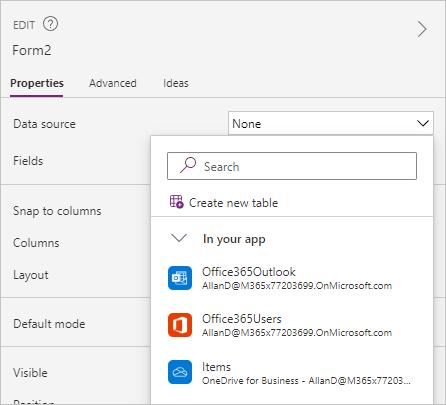
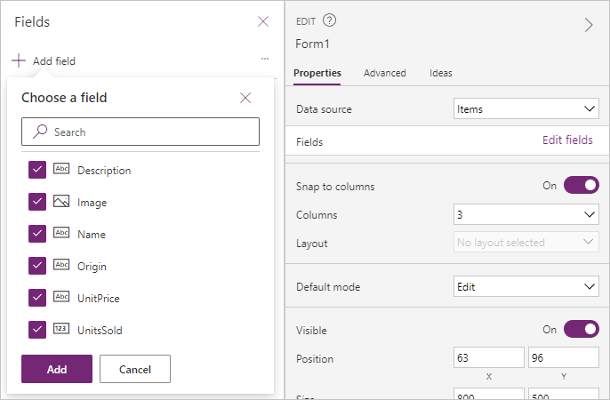
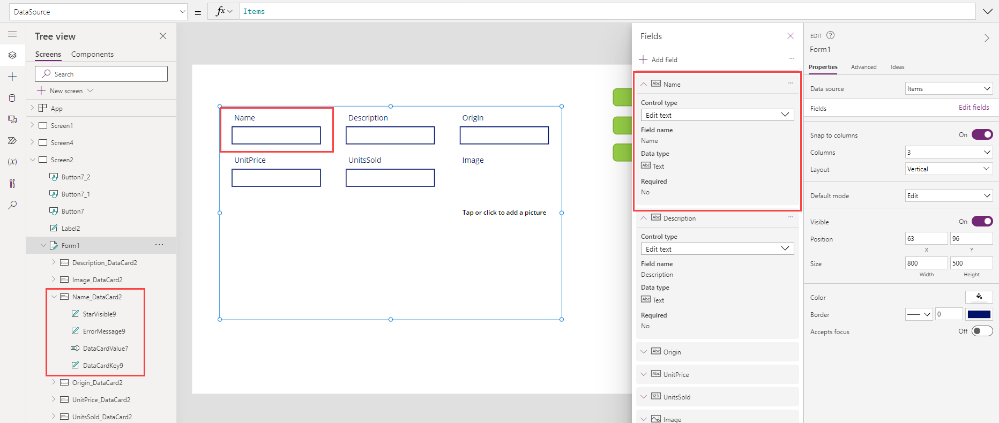
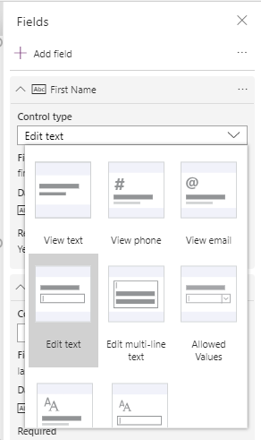
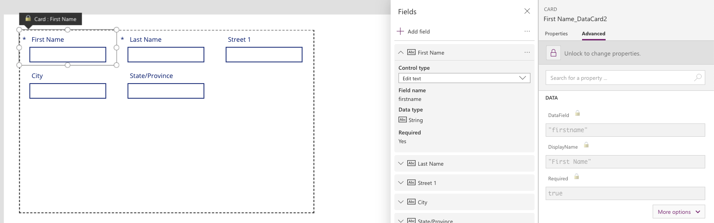
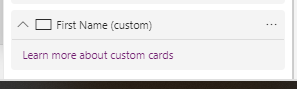
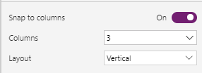
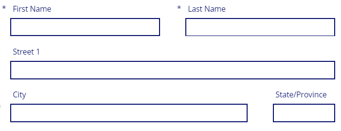
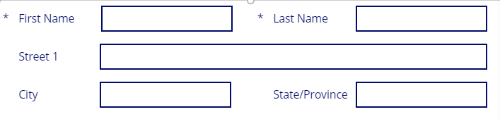
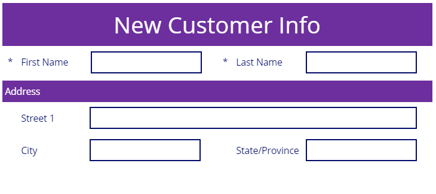

To get started with the **Edit form** control, from the **Insert** menu select **Edit form**. Though there's also a **Display form** available to insert, it's only good for displaying information and can't be toggled into other modes (for data entry). In nearly all cases, an **Edit form** is what you want to use in an app. The **Edit form** allows you to do everything that a **Display form** allows plus the form can also be used to edit existing records and to create new records. Additionally, it's fully customizable giving the app maker the ability to build your
solution. When in doubt, choose an **Edit form**.

After you add an **Edit form** control to the canvas, you can configure the properties via the **Properties** panel on the right side of the screen or from the **Properties** drop down on the top left of the screen. The first step is to choose a data source. In the drop-down menu labeled **None**, you can choose from a data source already in your app, connect to a Dataverse table, connect to a new data source, or create a new table.

## Adding fields

When you choose a data source, you can select **Edit fields** and **Add field** to select which columns you would like to display on the form. 

Clicking on the **Add** button makes each item appear on the form as a card control. These cards are known as **Predefined cards**, which Power Apps makes to match your data source. Within the **Fields** menu, you can customize what type of control you would like to use for data entry, and you can drag and drop each field to change their order on the form.  Each card includes a label to display the column name, an input control for working with the data, and other controls for handling error messages and required columns (a '*' appears next to any required data). The following is an example of a form showing added fields notice in the **Tree view** the items showing under the *Name_DataCard*.

The **Form** control will automatically select the input control based on your column type. For many columns, there are multiple options available. You can change the **Control type** by clicking the drop-down menu for the column's
card and selecting one of the other options.

When changing control types, another configuration may be required. For example, if you change a **Text** column from the **Edit text** control type to **Allowed Values** you might need to configure the values in the drop-down list. Before you can customize the drop-down control inside the card, you need to unlock the card.

## Customizing a card

To unlock a card, select the card in the form and then from the **Card** pane select **Advanced**. Select the **lock** icon. The card is now a custom card, which allows you to modify all of the settings.

If after working with the custom card you decide that you want to return to the original settings, you can delete the custom card and add the column back to your form again. To do this, select your form,select **Properties** on the **Edit** pane, select **Edit columns**, and find your custom card.

Select the ellipses **(...)** to the right and select **Remove**. Now you can select **Add field** at the top and select the original field to add into the form.

## Designing the Form control

When designing a form, the first decision should be your form layout.

From the **Edit** pane you have three primary design controls: **Snap to Columns**, **Columns**, and **Layout**.

**Snap to columns** allows you to control if the cards on the form have the width locked to the columns available in your form. For example, if you choose a four-column layout, then your field cards snap to fit into four columns, and your cards will all be the same width.

Alternatively, you can turn off Snap to columns, and then set the width of each card to any size you would like, simply by stretching/dragging the right side of the card. The following is an example of using manual card widths within a four-column layout. The First and Last name cards have been stretched to cover two columns, the Street has been expanded to all four columns, etc.

With a few clicks of the mouse, you can lay out your forms in a logical manner. Using the 6 or 12 column layout gives you the most sizing flexibility and is preferred over setting **Snap to columns** to **Off**.

>[!Caution]
>The instant you select **Snap to columns** after making any width changes, your cards will resize, one card to one column width. This can cause frustration. Remember, when you begin manually adjusting column size, leave the **Snap to columns** off. Power Apps is friendly to warn you with a pop-up dialog box to confirm you want to reset your columns.

The **Layout** option is set to **Horizontal** or **Vertical**. This changes
the default placement of the label, from above to the left side, respectively. The following is an example of the previous form with its Layout changed to horizontal, city and state/province set to two columns, and some column resizing.

Other customization options to consider that are outside the scope of
this module include:

- Increasing or decreasing the vertical height of any card. Changing the height on one card affects the whole row.

- Adding a custom card to the form, allowing you to create blank space, other visual elements, or other controls such as buttons

Don't be afraid to try out different visual customizations to meet your business needs. The following is an example of the previous form with some of the design concepts applied.

## Displaying a specific record in the form

Once you have configured your form to use a data source, you need to configure the form to display the specific record that you want to view or edit. To do this, you need to populate the **Item** property of the form.

The two most common ways of returning a record are by connecting the **Form** control to a **Gallery** control's selected property or by using a **LookUp** function.

To use a **Gallery** control to specify the record, you need to set the **Gallery** control to use the same data source as the **Form** control. You can confirm this by checking that the **Items** property of the **Gallery** control is the same as the **DataSource** property of the **Form** control. Then, in the **Item** property of the **Form** control you set the value to be `GalleryName.Selected` (replace "GalleryName" with the name of your gallery). Power Apps will display the selected record from the **Gallery** control in the **Form** control if the **Form** control is in **View** or **Edit** mode.

If you aren't using a **Gallery** control to display all of the records, then you can use the **LookUp** function to query for the record that you want to present in the form. An example of this is if you've stored the record's ID in a variable named varID. Then in the **Item** property, you would use a function such as: `LookUp (CustomerList, ID = varID)`. This example assumes your data source is named CustomerList and CustomerList is specified in the **DataSource** property of the **Form** control, and the **Form** control is in **View** or **Edit** mode.

Now that we've discussed how to insert and customize a form we learn how to submit data using your form.
