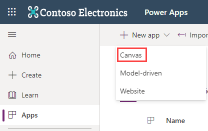
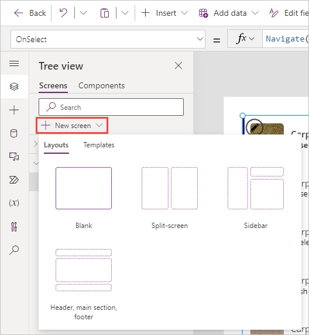
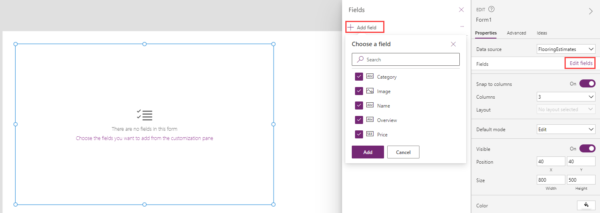

This hands-on lab shows you how to work with Forms to show and edit data.

1. Start by downloading the [Flooring Estimates workbook](https://az787822.vo.msecnd.net/documentation/get-started-from-data/FlooringEstimates.xlsx) and save it to OneDrive for Business.

1. Go to [https://make.powerapps.com](https://make.powerapps.com/?azure-portal=true) and sign in with your organizational account.

1. From the Home screen select **Apps** (from the left side menu), **+ New app** (from the command bar), **Canvas** .

    

1. Name your app **New App**, format **Tablet** and select **Create**.

1. Select **Add Data** from the command bar, search for **OneDrive** and select **OneDrive for Business**. If prompted, add a connection to OneDrive for Business and sign in using your organizational credentials, or select an already existing connection to OneDrive for Business.

1. In the **Choose an Excel file** right-side menu, find and select the file *FlooringEstimates.xlsx*. The menu changes to **Choose a table**, there should only be one table called *FlooringEstimates*, select it and then **Connect**. The Excel table is now a data source for your app.

1. **Insert** a **Vertical gallery**, set its data source (or **Items** property) to **FlooringEstimates**. Your gallery will now begin displaying the list.

1. Set the **OnSelect** property of your new gallery to the following:

    ```powerappsfl
    Navigate(Screen2)
    ```

    We create Screen2 in the next step so you can ignore the formula error at the moment.

1. Select **New Screen** and pick the **Blank** one. The action takes you to *Screen2*.

    >

1. From *Screen2* Select **Insert** > **Edit form**. Set the **DataSource** property to **FlooringEstimates** and the **Item** property to **Gallery1.Selected**.

1. From the properties panel on the right, select **Edit fields** > **+ Add field**, and select all of the available fields (Category, Image, Name, Overview and Price). Then select **Add**.

    >[](../media/edit-fields.png#lightbox)

1. You should now see your form with the five fields displayed. Change the **OnSuccess** property of the form to the following:

    ```powerappsfl
    Navigate(Screen1, ScreenTransition.Cover); Notify("You have successfully submitted a record for " & Self.LastSubmit.Name)
    ```

1. Change the **OnFailure** property of the form to the following:

    ```powerappsfl
    Notify("Your data was not saved. Please try again or contact an administrator.", NotificationType.Error)
    ```

1. Select the **Insert** tab and add 2 buttons. Change the text of one to **New Form** and the other to **Submit Form**.

1. Change the **OnSelect** property of the **New Form** button to the following:

    ```powerappsfl
    NewForm(Form1)
    ```

1. Change the **OnSelect** property of the **Submit Form** button to the following:

    ```powerappsfl
    SubmitForm(Form1)
    ```

1. Now go back to the first page, put the app in preview mode, and select the second item in the gallery: "Caserta Sky Grey" carpet. Selecting this record should navigate you to the form screen (Screen2) showing the details for "Caserta Sky Grey" carpet.

1. Change the price from "8.1" to "8.25" and select your button **Submit Form**. After a moment, your app should navigate back to the home screen and display the message at the top that you have successfully submitted a record.

1. Select the same item to return to the form screen and notice the "Price" is now "8.25".

1. Select the **New Form** button and enter the following information (don't worry about adding a picture):

	|      Field      |      Input     |
	|-----------------|----------------|
	|     Category    |     Carpet     |
	|     Name        |     A new test |
	|     Overview    |     Testing    |
	|     Price       |     1.75       |

1. Select **Submit Form**. Once you return to the home screen, scroll to the bottom of your gallery and find **A new test**.

Congratulations! You have successfully created a basic app utilizing the principles taught in this module.
