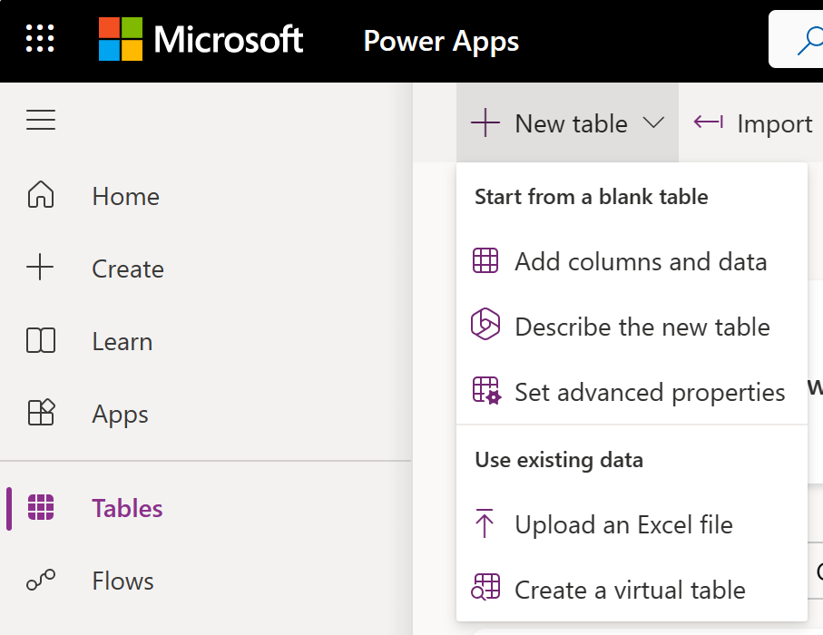
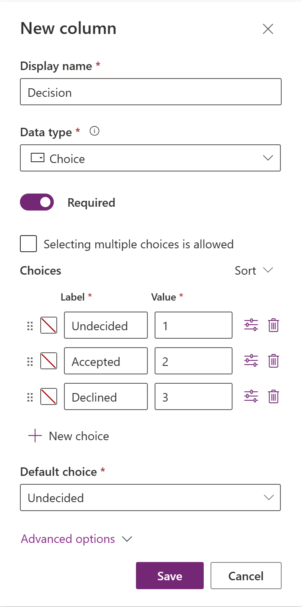
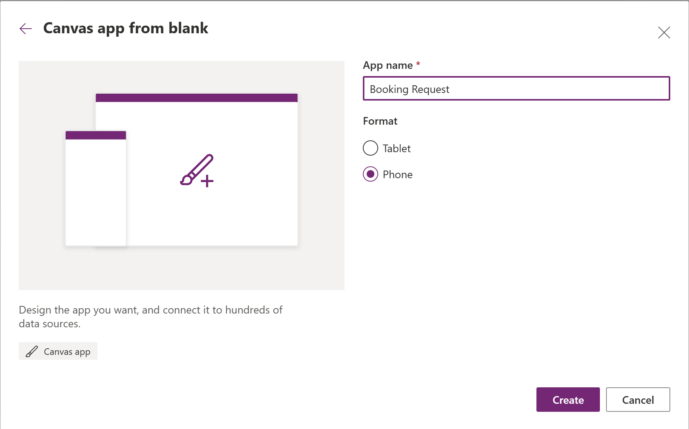
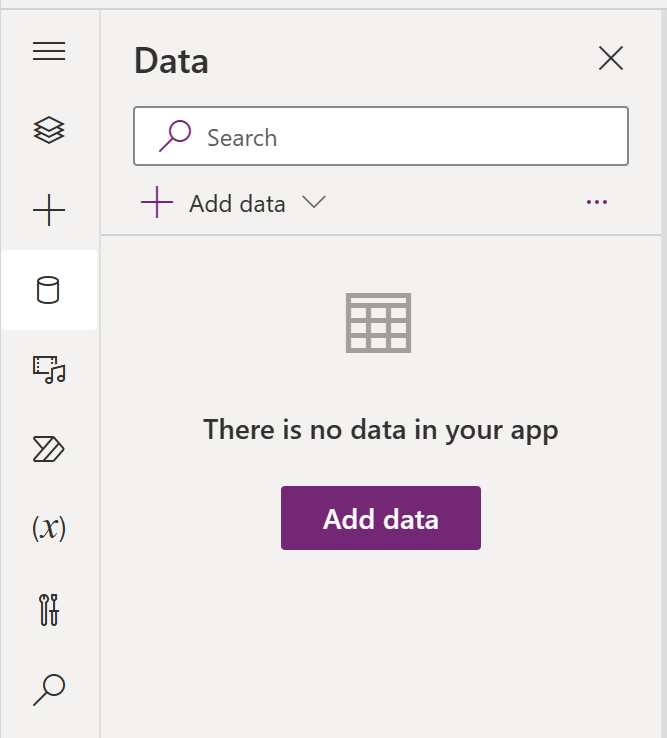
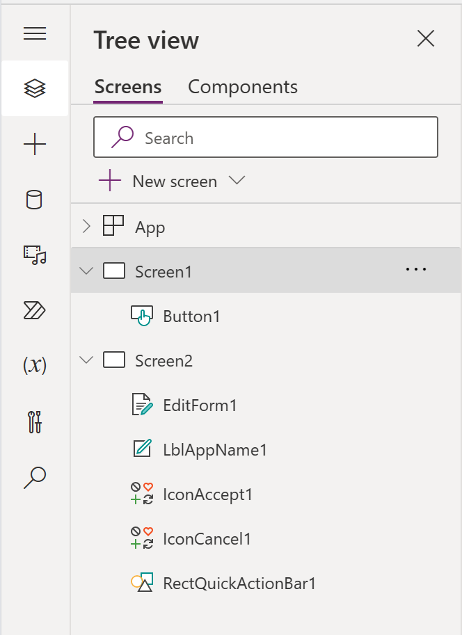
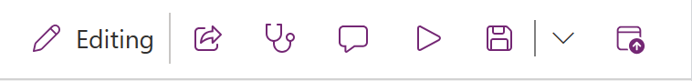

In this unit, you learn how to:

* Create a custom table in Dataverse
* Build a canvas app using the custom table in Dataverse as a data source

 Here, you'll create the table and columns needed to store the booking request information and build a canvas app for customers to use. You validate your app against requirements to check your work. 
 ## Create a custom table
Follow these steps to create a new custom table.

1. Sign in to the link text [Power Apps maker portal](https://make.powerapps.com/).

2. In the left navigation pane, select **Tables**, select **New table**, and then select **Add columns and data**.

    

3. Rename the table Booking Request.
4. Add a column in the columns and data pane; select the **+ (New column)** button to add a new column.
5. In the New column pane, enter the following values, and then select **Save**: 
   - **Display name**: Pet Name
   - **Data type**: Single line of text (this value is the default)
   - **Required**: Yes
6. Repeat steps 4 and 5 for the following display names and data types:
   - **Display name**: Owner's Name
   - **Data type**: Single line of text 
   - **Required**: Yes
   - **Display name**: Owner's Email
   - **Data type**: Single line of text 
   - **Require**: Yes
   - **Display name**: Start Date
   - **Data type**: Date and time
   - **Required**: Yes
   - **Display name**: End Date
   - **Data type**: Date and time
   - **Required**: Yes
   - **Display name**: Notes
   - **Data type**: Multiple lines of text - Plain text
   - **Required**: No
7. Add a column in the columns and data pane; select the **+ (New column)** button to add a new column.
8. In the New column pane, enter the following values:
   - **Display name**: Decision
   - **Data type**: Choice
   - **Required**: Yes
9. Create the choice values: 
   - Under **Choices** you see two entry fields titled **Label** and **Value**. Enter Undecided under the label. Power Apps assigns a value automatically, but you can change it.
   - Select **+ New choice** and make Accepted the new entry for Label and 2 for Value.
   - Select **+ New choice** and make Declined the new entry for Label and 3 for Value.
   - Designate Undecided as the **Default choice**.
   - Select Save.

     

10. At the bottom of the pane, select **Create**.
## Create a canvas app
1. In the left navigation pane, select **Create** then **Blank app**.
2. From the available options, select **Create** under **Blank canvas app**.
3. Enter Booking Request as the **App name** and select Phone as the **Format**.
4. Select **Create**.
    Once created, the app opens in Power Apps Studio for you to start building the app.
    
    

5. In the middle of the screen, select **connect to data**.
6. In the app authoring menu, select **Data**. 
7. Select **Add data**, then select the Booking Requests Dataverse table.

   
   
8. On the command bar, select **New screen** > **Templates** tab > **Form**.
9. Select EditForm1 under the newly added Form screen.
10. Set the form's **DataSource** property to Booking Requests.
11. On the **Properties** tab of the right-hand pane, select **Edit Fields** to open the **Fields** pane.
12. Select **Add field**, and then select the check boxes for these fields: 
    - Pet Name
    - Owner's Name
    - Owner's Email
    - Start Date
    - End Date
    - Notes
13. Select **Add**.
14. Set the title bar's **Text** property to show New Booking Request.
15. Select Screen 1.
16. On the command bar, select **Insert** > **Button**.

    
    
17. Set the button's Text property to New Booking Request and its OnSelect property to this formula:
NewForm(EditForm1); Navigate(Screen 2)
18. On the command bar, **Save** and **Preview the app**.

    

## Check your work
To validate that you completed the work to the requirements, test your app behavior out by following these steps.

1. Run your app. Create a new booking request with the Start Date, Pet Name, Owner Name, and Email populated, leaving the End Date blank. Submit the request to verify that the user can't submit a request without the End Date populated.
2. Run your app. Create a new booking with the Start Date, End Date, Pet Name, Owner Name, and Email populated. Submit the request to verify that the user can submit a request when all the required information is provided.
3. View the Booking Request that you created. Verify that the Decision column is set to Undecided. Update the column to Accepted.
