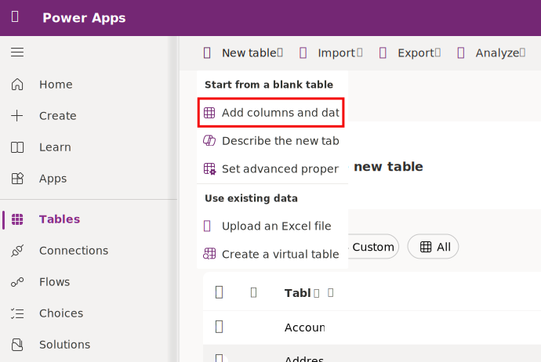
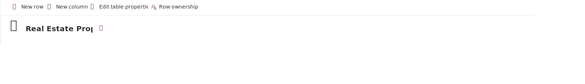
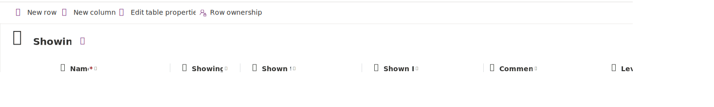

Contoso Real Estate wants to track two key elements:

-   Real estate property listings

-   Who is scheduled for showings of real estate properties

Follow these steps to create the Real Estate Properties and Showings
tables.

## Real Estate Properties table

1.  Sign into the link text [Power Apps maker
    portal](https://make.powerapps.com/).

2.  In the left navigation pane, select **Tables**, select **New table**, and then select **Add columns and data**.

    

3.  Rename the table from **New Table** to **Real Estate Property**.

4.  Change the name of the column called **New Column** to **Property Name**.

5.  Add a column in the columns and data pane; select the **+ (New column)**
    button to add a new column.

6.  In the New column pane, enter the following values, and then select
    **Save**:

    -   **Display name**: Asking Price

    -   **Data type**: Currency

7.  Let's add another column in the columns and data pane; again, select the **+
    (New column)** button to add a new column.

8.  In the New column pane, enter the following values, and then select
    **Save**:

    -   **Display name**: Street

    -   **Data type**: Single line of text (this value is the default)

9.  Add a column in the columns and data pane; select the **+ (New column)**
    button to add a new column.

10. In the New column pane, enter the following values, and then select
    **Save**:

    -   **Display name**: City

    -   **Data type**: Single line of text (this value is the default)

11. Add a column in the columns and data pane; select the **+ (New column)**
    button to add a new column.

12. In the New column pane, enter the following values, and then select
    **Save**:

    -   **Display name**: Bedrooms

    -   **Data type**: Choice

13. Create the choice values:

    -   Under **Choices** you see two entry fields titled **Label** and
        **Value**. Enter **1** under the label. Power Apps assigns a value
        automatically but can change the value to **1**.

    -   Select **+ New choice** and make **2** the new entry for Label and **2**
        for Value.

    -   Select **+ New choice** and make **3** the new entry for Label and **3**
        for Value.

    -   Select **+ New choice** and make 4 the new entry for Label and **4** for
        Value.

    -   Select **+ New choice** and make 5 the new entry for Label and **5** for
        Value.

    -   Select **Save**.

        

14. Add another column by selecting the **+** button again in the columns and
    data pane.

15. Add a column in the columns and data pane; select the **+ (New column)**
    button to add a new column.

16. In the New column pane, enter the following values, and then select
    **Save**:

    -   **Display name**: Bathrooms

    -   **Data type**: Choice

17. Create the choice values:

    -   Under **Choices** you see two entry fields titled **Label** and
        **Value**. Enter **1** under the label. Power Apps assigns a value
        automatically but can change it to **1**.

    -   Select **+ New choice** and make **2** the new entry for Label and **2**
        for Value.

    -   Select **+ New choice** and make **3** the new entry for Label and **3**
        for Value.

    -   Select **+ New choice** and make **4** the new entry for Label and **4**
        for Value.

    -   Select **+ New choice** and make **5** the new entry for Label and **5**
        for Value.

    -   Select **Save**.

18. Add another column by selecting the **+** button again in the columns and
    data pane.

19. In the New column pane, enter the following values, and then select
    **Save**:

    -   **Display name**: Client

    -   **Data type**: Lookup

    -   **Related Table**: Contact

20. Your completed table should resemble this screenshot:

    

21. At the bottom of the pane, select **Create**.

## Showings table

1.  In the left navigation pane, select **Tables**, select **New table**, and
    then select **Add columns and data**.

2.  Rename the table **Showing**.

3.  Change the name of the column called **New Column** to **Name**.

4.  Add a column in the columns and data pane; select the **+ (New column)**
    button to add a new column.

5.  In the New column pane, enter the following values, and then select
    **Save**:

    -   **Display name**: Showing Date

    -   **Data type**: Date and Time – Date Only

6.  Let's add another column in the columns and data pane; again, select the **+
    (New column)** button to add a new column.

7.  In the New column pane, enter the following values, and then select
    **Save**:

    -   **Display name**: Shown to

    -   **Data type**: Lookup

    -   **Related Table**: Contact

8.  Select the **+ (New column)** button to add a new column.

9.  In the New column pane, enter the following values, and then select
    **Save**:

    -   **Display name**: Shown by

    -   **Data type**: Lookup

    -   **Related Table**: User

10. Select the **+ (New column)** button to add a new column.

11. In the New column pane, enter the following values, and then select
    **Save**:

    -   **Display name**: Property Shown

    -   **Data type**: Lookup

    -   **Related Table**: Real Estate Property

12. Select the **+ (New column)** button to add a new column.

13. In the New column pane, enter the following values, and then select
    **Save**:

    -   **Display name**: Comments

    -   **Data type**: Multiple lines of text

14. In the New column pane, enter the following values, and then select
    **Save**:

    -   **Display name**: Level of Interest

    -   **Data type**: Choice

15. Create the choice values:

    -   Under **Choices** you see two entry fields titled **Label** and
        **Value**. Enter **Very High** under the label. Power Apps assigns a
        value automatically but can change it to 1.

    -   Select **+ New choice** and make **High** the new entry for Label and 2
        for Value.

    -   Select **+ New choice** and make **Medium** the new entry for Label and
        3 for Value.

    -   Select **+ New choice** and make **Low** the new entry for Label and 4
        for Value.

    -   Select **+ New choice** and make **None** the new entry for Label and 5
        for Value.

    -   Select **Save**.

    

16. Your showing table should resemble this screenshot:

    

17. Select the **Create** button to create the table.

Great! You now have the two tables needed for Contoso Real Estate's model-driven app.