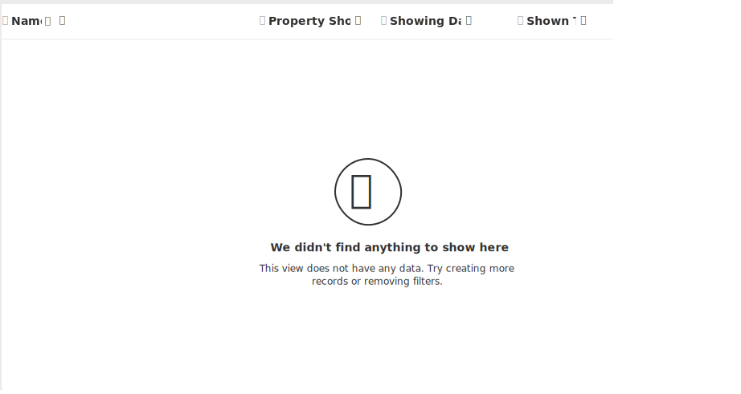

Follow these steps to modify existing forms and views associated with the
Showing and Real Estate Property tables.

### Modify the Showing table’s views

1.  If necessary, sign into the link text [Power Apps maker
    portal](https://make.powerapps.com/).

2.  In the left navigation pane, select **Tables**, and open the **Showing**
    table you created earlier.

3.  Under **Data experiences**, select **Views**.

4.  Edit the **Active Showings** view.

5.  Remove the **Created On** field and add the **Client** field.

6.  If they are not already present in the view, add the following columns:

    -   Name

    -   Property Shown

    -   Showing Date

    -   Shown to

    -   Level of Interest

7.  Your **View** should resemble the Image below:

    

8.  **Save and Publish** the view.

### Modify the Showing table’s Information form

1.  In the left navigation pane, select **Tables**, and open the **Showings**
    table you created earlier.

2.  Under **Data experiences**, select **Forms**.

3.  Edit the **Information** form that has a form type of **Main**.

4.  Select **Form properties** and rename the form to **Showing Details**.

5.  Add the following fields to the form:

    -   Property Shown

    -   Showing Date

    -   Shown to

    -   Shown by

    -   Level of Interest

    -   Comments

6.  Your completed form should resemble the image below:

    

7.  **Save and Publish** the form and use the **Back** button to return to the
    **Forms** list.

### Modify the Real Estate table’s views

1.  If necessary, sign into the link text [Power Apps maker
    portal](https://make.powerapps.com/).

2.  In the left navigation pane, select **Tables**, and open the **Real Estate
    Properties** table you created earlier.

3.  Under **Data experiences**, select **Views**.

4.  Edit the **Active Real Estate Properties** view.

5.  Remove the **Created On** and **Street** fields.

6.  If they are not already present in the view, add the following columns:

    -   Asking Price

    -   City

    -   Bedrooms

    -   Bathrooms

    -   Level of Interest

7.  Add the **Client** field.

8.  Your completed view will resemble the image below:

    

9.  **Save and Publish** the view.

### Modify the Real Estate Property table’s Information form

1.  In the left navigation pane, select **Tables**, and open the **Real Estate
    Properties** table you created earlier.

2.  Under **Data experiences**, select **Forms**.

3.  Edit the **Information** form with a form type of **Main**.

4.  Select **Form properties** and rename the form **Property Information**.

5.  Add a new 1-column section called **Address Information**.

6.  Move the **Street** and **City** fields to the **Address Information**
    section.

7.  Rename the **Owner** field to **Listing Agent** and move it under the
    **Bathrooms** field.

8.  Add the **Client** field above the **Listing Agent** field.

9.  Add a new 1 column section called **Showings** under the **Address
    Information** section.

10. Add a **Sub-grid** to the section that points to the **Showings** table and
    uses the **Active Showings** view and **shows only related records**.

11. Your completed **Real Estate Properties** form will resemble the image below:

    

12. **Save and Publish** the form and use the **Back** button to return to the
    **Forms** list.

Great! You now have the views and forms needed for Contoso Real Estate's model-driven app. 