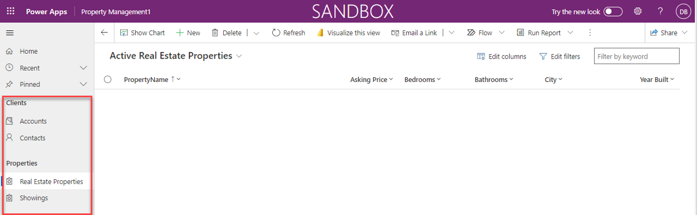

  
Follow these steps to pull together the tables, forms and views you created into Contoso Real Estate's property management model-driven app.

## Build the Property Management model-driven application

1.  If necessary, sign into the link text [Power Apps maker
    portal](https://make.powerapps.com/).

2.  In the left navigation pane, select **Create**, and create a blank app based
    on Dataverse called **Property Management**.

3.  Add the following **Dataverse table pages** to your app:

    -   Account

    -   Contact

    -   Real Estate Properties

    -   Showings

4.  Change the **New Group** name to **Clients**.

5.  Right-click the navigation to add another **new group** called
    **Properties**.

6.  Move **Real Estate Properties** and **Showings** under the **Properties**
    group.

7.  Your completed **Property Management** app will resemble this screenshot:

    

8.  **Save** and **Publish** the app.

## Test the Property Management model-driven app

1.  With the **Property Management** app designer open, select the **Play**
    button.

2.  Navigate to **Contacts** and create a new contact record.

3.  Navigate to **Real Estate Properties** and create a new **Real Estate
    Property**.

4.  Save the property and leave the record open.

5.  On the **Showings** sub-grid, create a new showing record that indicates the
    property was shown to **the contact you added** earlier, the showing was
    **today**, and their level of interest was **Very High**.

6.  **Save and Close** the showing. (*The showing will be displayed in the*
    **Showings** *section of the real estate property.)*

Congratulations! You have a working model-driven app for managing real estate property listings.