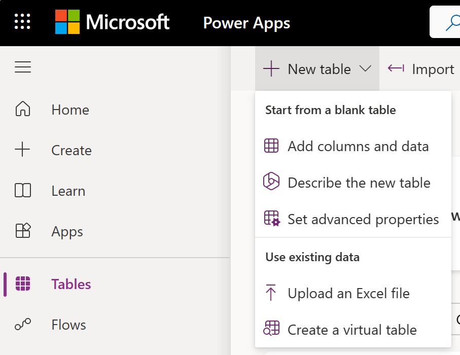

In this unit, you learn how to:

* Create a custom table in Dataverse
* Build prescheduled flows by using a trigger called recurrence

 You build a flow for the Contoso Coffee sales team that automatically pulls new sales opportunities from a Dataverse table daily. 
 ## Create a custom table
Follow these steps to create a new custom table.

1. Sign in to the link text [Power Apps maker portal](https://make.powerapps.com/).

1. In the left navigation pane, select **Tables**, select **New table**, and then select **Add columns and data**.

    

1. Rename the table Opportunity.

1. Add a column in the columns and data pane; select the **+ (New column)** button to add a new column.

1. In the New column pane, enter the following values, and then select **Save**:

    - **Display name**: Opportunity Subject

    - **Data type**: Single line of text (this value is the default)

1. Let's add another column in the columns and data pane; again select the **+ (New column)** button to add a new column.

1. In the New column pane, enter the following values, and then select **Save**:

    - **Display name**: Customer

    - **Data type**: Single line of text (this value is the default)

1. Add a column in the columns and data pane; select the **+ (New column)** button to add a new column.

1. In the New column pane, enter the following values, and then select **Save**:

    - **Display name**: Status

    - **Data type**: Choice

1. Create the choice values: 

    - Under **Choices** you see two entry fields titled **Label** and **Value**. Enter New under the label. Power Apps assigns a value automatically, but you can change it.

    - Select **+ New choice** and make Open the new entry for Label and 2 for Value.

    - Select **+ New choice** and make Closed the new entry for Label and 3 for Value.

    - Select Save.

    
  
1. Add another column by selecting the **+** button again in the columns and data pane.

1. In the New column pane, enter the following values, and then select **Save**:

    - **Display name**: Amount

    - **Data type**: Currency

1. At the bottom of the pane, select **Create**.

## Create a scheduled flow
1. Select **My flows**.
2. Select **New**, and then select Scheduled cloud flow.
    
    The default option is to repeat every 1 minute, however, you can change it to Minute, Week, Day, Hour and Second.
3. Name your flow New Sales Opportunities and under **Run this flow** set the flow to repeat every one week. Select Saturday and Sunday to remove those days from the flow. 
4. Select Create.
5. Select **New step**, to add an action.
6. Select **Microsoft Dataverse** to filter the search results to display only actions and triggers for Microsoft Dataverse.
7. Select **List rows**.
8. From the **Table name** list, select the **Opportunity** table you created.
9. Add the advanced option **Filter rows** with **Status eq ‘New’**.
10. Select **New step**, to add another action.
11. Search for and select **Create HTML table**.
12. In the **From** field, select **Value**. 
13. Select **New step**, to add another action.
14. Search for and select **Send an email (V2)**.
15. In the **To** field, enter your email address for test purposes.
16. In the **Subject** field, enter **Daily Sales Opportunities**.
17. In the **Body** field, select the **Output** from the **Create HTML table**. 
18. **Save** and **Test** your flow.

    