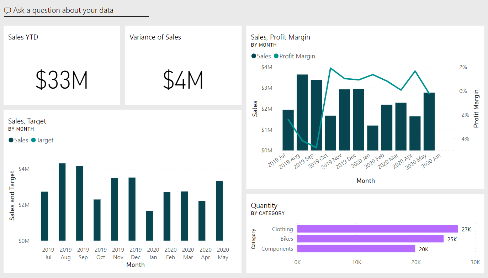
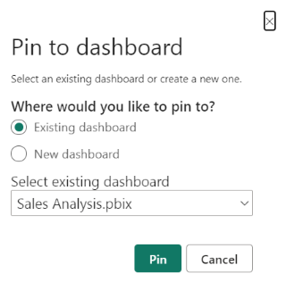
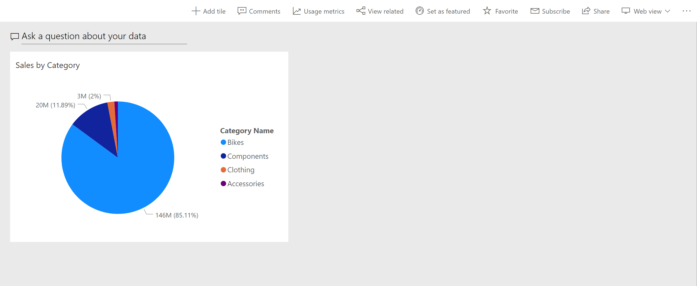
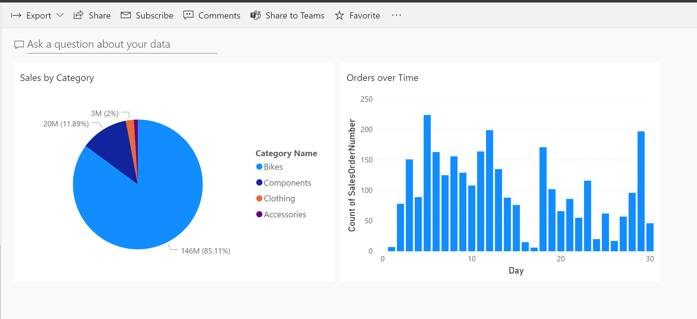

Microsoft Power BI dashboards are different than Power BI reports. Dashboards are made up of visuals from different reports and allow report consumers to create a single page of targeted data insights, with the option to explore more in a report.

Well-built dashboards capture the most important highlights of the story that you're trying to tell.

> [!div class="mx-imgBorder"]
> 

## Dashboards vs. reports

The Power BI dashboard is similar to a dashboard in a car - you want to have the most important information for the consumer to see immediately. For additional insights, consumers can follow through to the corresponding report.

Dashboards are often the next step after building your reports in Power BI Desktop. Consider the following differences when deciding how to create reports and dashboards:

| Dashboards | Reports |
| -------- | -------- |
| Create only in service  | Create in Power BI Desktop (limited in service) |
| Single page  | Multiple pages   |
| Static tiles | Interactive visuals |
| Read-only tiles | Filters pane |

Both dashboards and reports can be refreshed to show the latest data.

## Get started with dashboards

Dashboards are created by *pinning* report visuals, and are then called *tiles* within reports. When you make changes to the visuals in the report, and then republish to Power BI Service, changes are reflected on the dashboard.

First log into the Power BI service and navigate to a workspace with reports. Open a report and in the visual header, select the **Pin Visual** icon. You can choose to pin this visual to a new or existing dashboard.

After pinning your visuals, you can resize and move the visuals to suit your needs.

> [!div class="mx-imgBorder"]
> 

### Pin a tile from a different report

One of biggest benefits of a dashboard is being able to pin a visual that is sourced from a different semantic model. In the following image, we show two separate tiles pinned from different reports.

> [!div class="mx-imgBorder"]
> 

Repeat this process until your dashboard has the data you want to show.

For more information, see [Introduction to dashboard tiles.](/power-bi/create-reports/service-dashboard-tiles?azure-portal=true)
