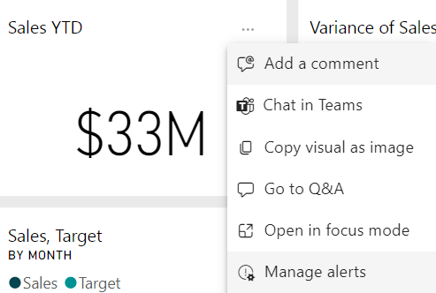
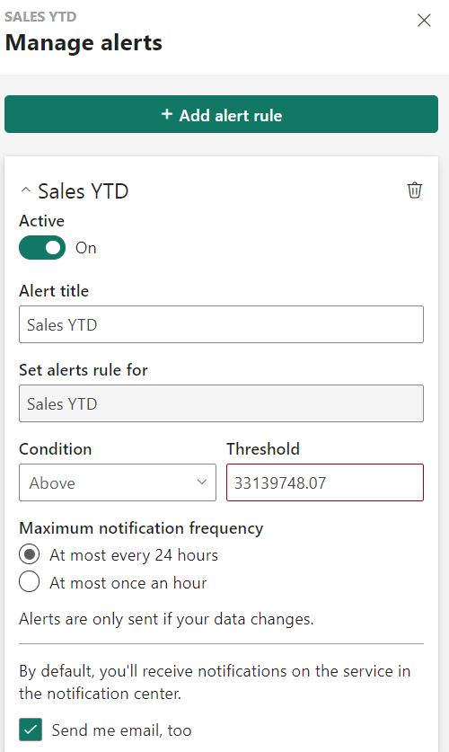

Configuring data alerts is a simple process to complete for a dashboard in Power BI. Data alerts can notify you or a user that a specific data point is above, below, or at a specific threshold that you can set. 

## Configure alerts

These alerts are features that are only available on Power BI service and they're available on such report elements such as KPI visuals, gauges, and cards.

After you have uploaded your reports to Power BI service and have pinned your chosen visuals to a dashboard, select the ellipsis (**...**) in the corner of the tile you want to set an alert for and then select **Manage Alerts**.

> [!div class="mx-imgBorder"]
> 

Select **+ Add Alert Rule**, which will add a new alert. Ensure that the **Active** toggle switch is turned **On**, name the alert, and then set the condition.

Next, you can choose the threshold that you want to create the alert for, which includes options for **Above** or **Below** a specific threshold.

Finally, select how frequently you want alerts. These alerts are sent directly to your Notification Center in Power BI, and you can also configure emails.

> [!div class="mx-imgBorder"]
> 

This feature is available to all consumers to configure as they so choose. You can also enable or disable the alert by using the toggle switch.

For more information, see [Data Alerts in Power BI service](/power-bi/create-reports/service-set-data-alerts?azure-portal=true).
