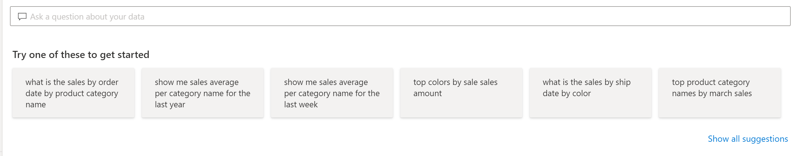
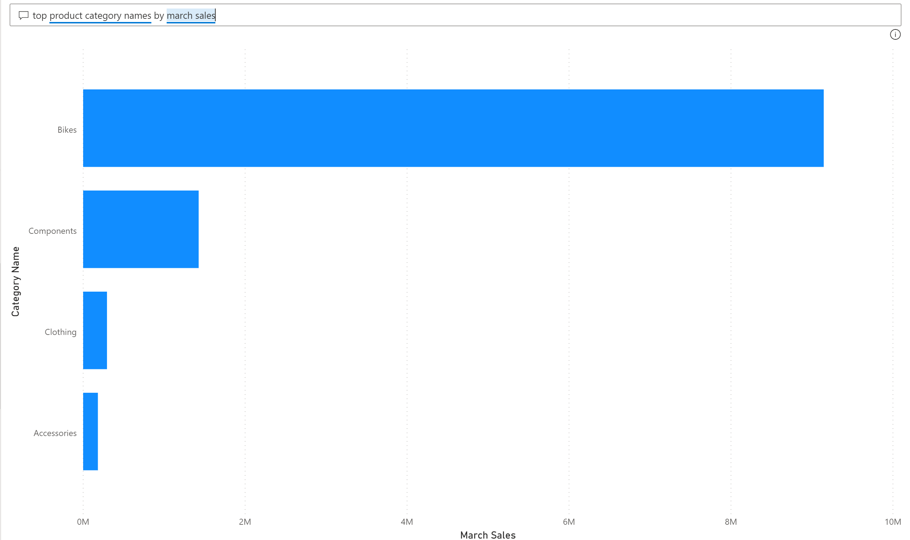

Power BI dashboards are about having a user-friendly experience. When users first interact with data, they often have additional questions and reach out to you. A few questions might be manageable to answer, but this isn't sustainable.

Power BI solves this problem with the Q&A visual. From the dashboard view, users can use the **Ask a question about your data** feature, which increases engagement between users and the dashboard.

## Q&A feature

The Q&A feature is a tool within Power BI Desktop that allows you to ask natural-language questions about the data.

To locate the Q&A feature, go to your dashboard in Power BI service. Along the top ribbon is the **Ask a question about your data** search box. Some prompts are also available to help get you started.

> [!div class="mx-imgBorder"]
> 

The Q&A visual consists of three main elements:

- **Question box:** Use natural language to ask questions about the data. Example: *What were the average sales amount by category?*

- **Pre-populated suggestion tiles:** Questions to help users consider how to phrase their questions. Example, *top product category names by march sales* tile results as a bar chart with category name and March sales.

- **Pin visual:** Pin the visual created with Q&A to a new or existing dashboard.

> [!div class="mx-imgBorder"]
> 

With the Q&A feature, users can interact directly with the visual to ask their data questions, which will increase their interactions with the visual and save time.
