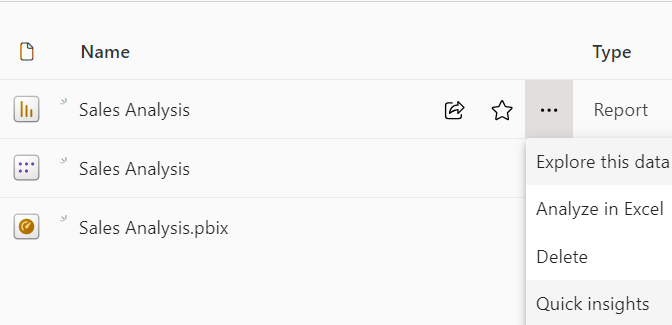
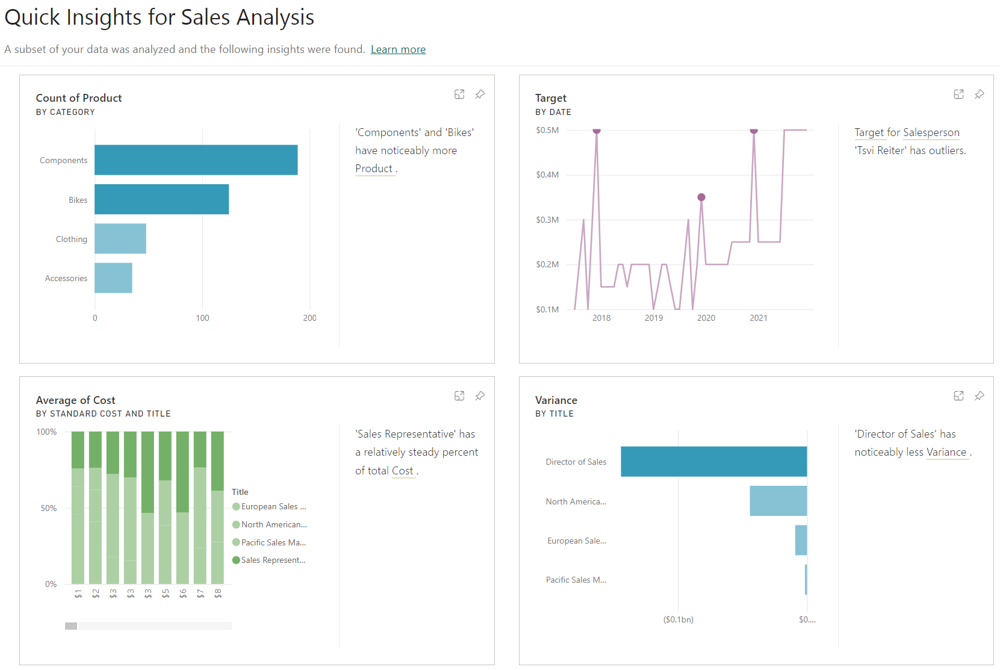
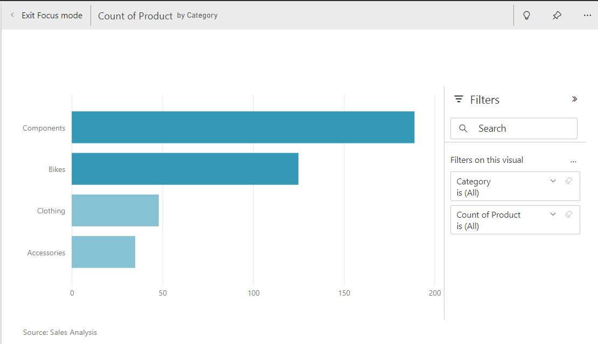

The **Quick insights** feature in Power BI uses machine learning algorithms to go over your entire semantic model and produce insights (results) for you quickly. This feature is a great way to build dashboards when you don't know where to start. It also helps you find insights you might have missed when building your reports. From the insights that Power BI discovers, you can generate appealing, interactive visualizations.

> [!NOTE]
> This feature is available in the Power BI service only. Also, this feature doesn't work with DirectQuery; it only works with data that is imported to Power BI.

## Get quick insights on your semantic model

To get quick insights on your semantic model, open your Power BI service and workspace, locate your report, and select the **... > Quick insights**.

> [!div class="mx-imgBorder"]
> 

Power BI uses various algorithms to search for trends in your semantic model. This process might take a few seconds, but you receive a pop-up message when the insights are ready.

Select **View insights** to open the **Quick Insights** page for the selected semantic model, and then view the insights that Power BI has found for you. The **Quick Insights** page contains up to 32 separate insight cards, and each card has a chart or graph plus a short description.

> [!div class="mx-imgBorder"]
> 

## Interact with the quick insights results

If you see a compelling insight card, you can even pin it to your dashboard.

To take a closer look at a particular insight card on the **Quick Insights** page, select an insight card to open. The insight screen opens in **Focus** mode.

> [!div class="mx-imgBorder"]
> 

You can then perform the following actions:

- Filter the visualization by using the available options in the **Filters** panel.

- Pin the insight card to a dashboard by selecting **Pin visual**.

- Run insights on the card (scoped insights) by selecting **Get insights** in the upper-right corner. The scoped insights allow you to drill into your data.

- Return to the original insights canvas by selecting **Exit Focus mode** in the upper-left corner.
