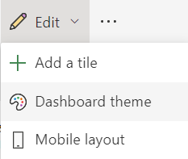
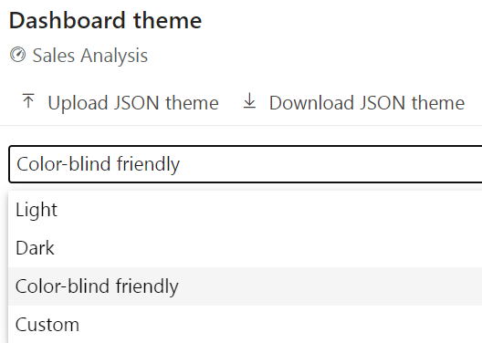
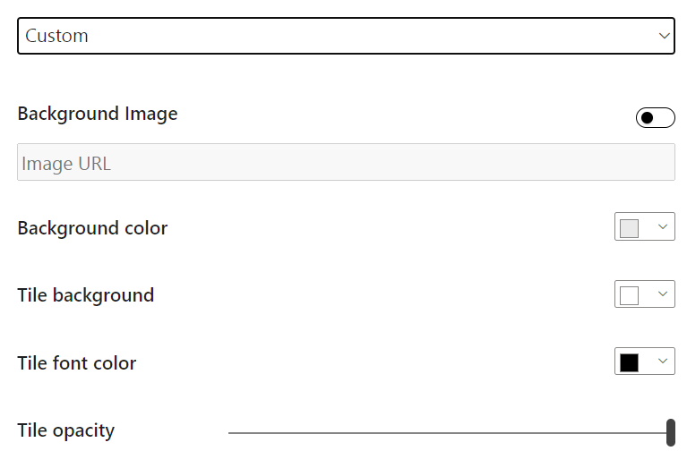

When building dashboards, you can create a cohesive picture by applying the same theme as in your reports. Or apply a specific theme to reports and dashboards so that all report elements or tiles are uniform. 

This consideration is important when you're building multiple dashboards. Power BI provides options to apply a theme directly to a dashboard as well as all visuals of a report.

## Themes in Power BI

Various themes are available for use in Power BI service. Go to a dashboard, select the edit dropdown arrow, and then select **Dashboard theme**.

> [!div class="mx-imgBorder"]
> 

This selection will open a window, where you can choose from various themes, including **Light** (the default theme), **Dark**, **Color-blind friendly**, and **Custom**, where you can create your own theme. You can also upload your own JSON theme or download the current theme.

> [!div class="mx-imgBorder"]
> 

For instance, if you select **Custom**, you can add your own background image, or you can change the background color, tile color, the opacity, or even the font color, as shown in the following figure.

> [!div class="mx-imgBorder"]
> 

Now, you can customize your report to cater specifically to your needs.
