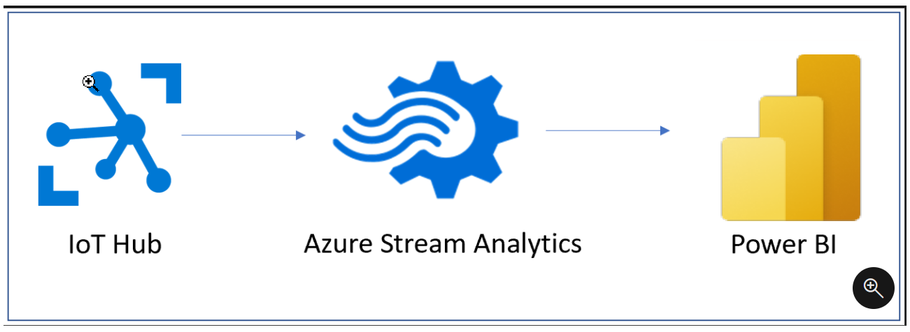
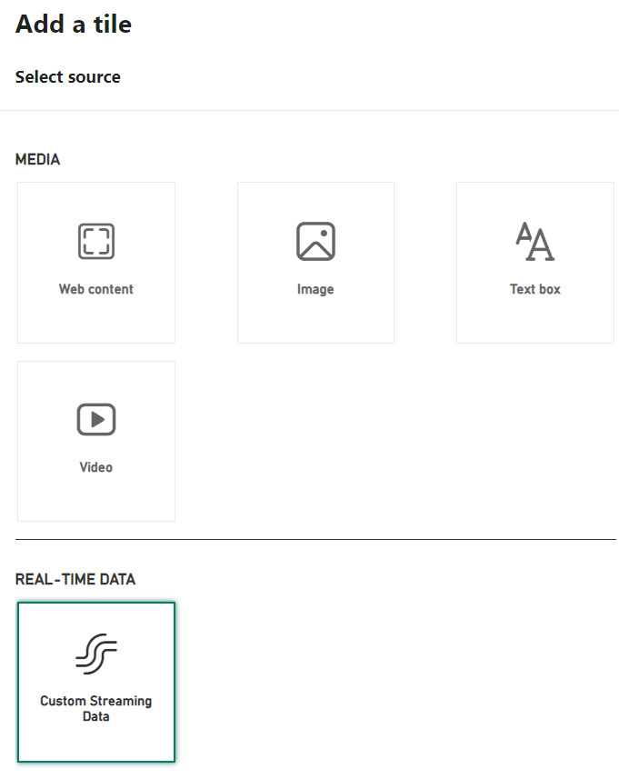
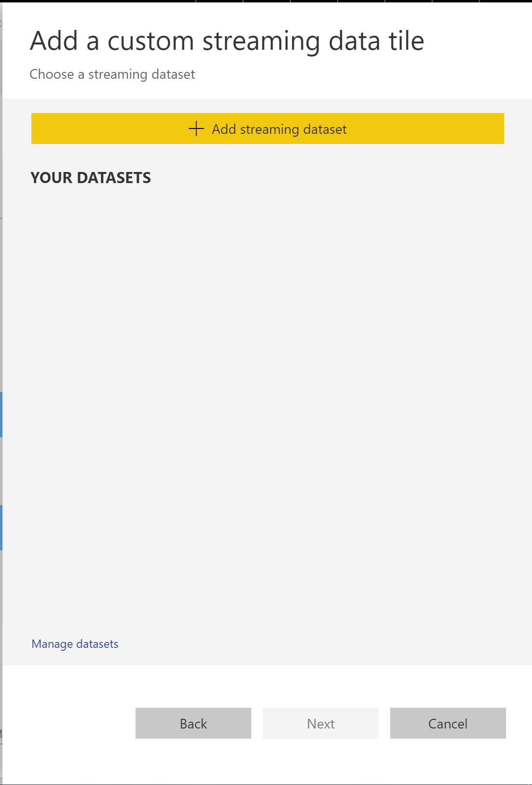

In this data-centric world, it has become increasingly important to be able to view how data changes in real time. Streaming data on dashboards is crucial for telling the story of your data and can greatly benefit your business. With Power BI's real-time streaming semantic models, you can stream data and update dashboards as soon as the data is logged.

## Stream in Power BI

Streaming data can come from various sources, including from social media, factory sensors, service-usage metrics, and other sources that contain a constant stream of data points.

> [!div class="mx-imgBorder"]
> 

Data that comes from a streaming data source is stored in a temporary cache, not a semantic model. This means you can't make changes to the semantic model.

The only way to visualize the data from a streaming data source is to create a tile directly on a dashboard and use a custom streaming data source.

These tiles are optimized because no database exists to pull the data from. These types of tiles have low latency and are best suited for data that doesn't need additional transformations, such as temperature or humidity.

## Visualize real-time data in Power BI

To visualize streaming data, you need to create a new tile directly on an existing or new dashboard.

Select the Edit drop-down arrow and then **Add Tile**. The following window will appear, where you can select **Custom Streaming semantic models** under **Real-Time Data**.

> [!div class="mx-imgBorder"]
> 

Select **Next**, which will redirect you to the following window where you can choose an existing streaming semantic model, or get new streaming semantic models, as shown in the following image.

> [!div class="mx-imgBorder"]
> 

Enter the details for your streaming semantic model and then add a new streaming semantic model tile. Streaming semantic model tiles can be formatted as line charts, stacked bar charts, cards, and gauges, similarly to any other tiles.

For more information, see [Real-time streaming in Power BI](/power-bi/connect-data/service-real-time-streaming?azure-portal=true).
