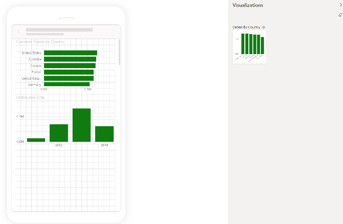
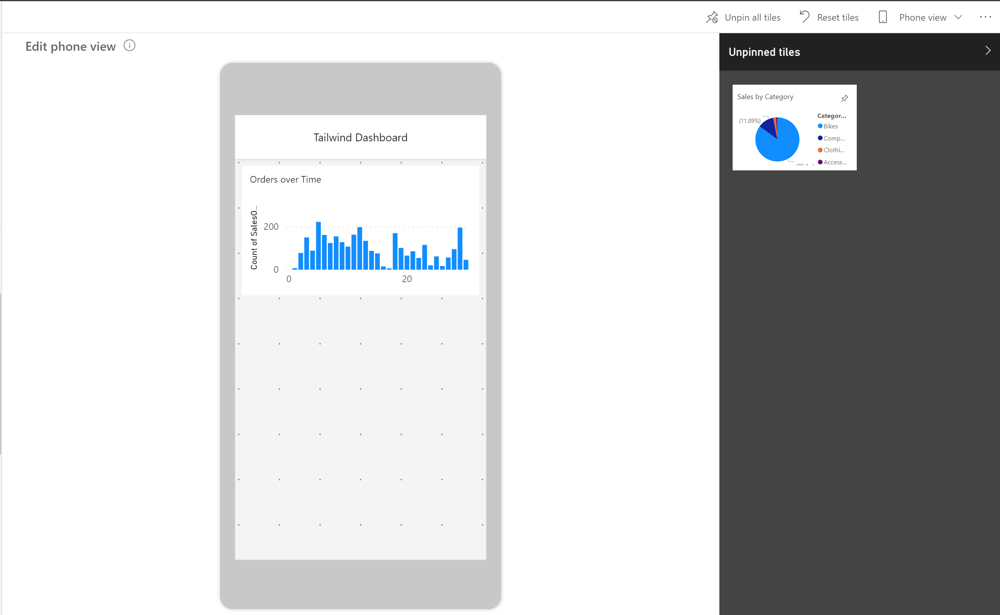

Power BI reports are built in Power BI Desktop and then deployed to Power BI service, where they can be viewed and shared. However, if you're building dashboards for your organization and need reports and dashboards viewable on mobile devices, Power BI offers a mobile layout configuration to meet your needs.

To navigate to mobile view in Power BI Desktop, select **View** on the ribbon and then select **Mobile Layout**, which will redirect you to the mobile view, as shown in the following figure.

> [!div class="mx-imgBorder"]
> 

In the mobile view in Power BI Desktop, you're able to accomplish several tasks. The mobile view shows you how it will look to users in the Power BI Mobile app. You can add visuals, resize them, and change the formatting. Use the grid view to orient your visuals with more ease and overlay visuals on top of each other. This feature can be useful if you want to insert a visual on top of an image.

Alternatively, you can also optimize your dashboards for mobile view in Power BI service. To see a dashboard in mobile view, select the Edit drop down arrow on the home ribbon and select **Mobile layout**. Then you can choose which tiles that you want to see on the mobile view.

> [!div class="mx-imgBorder"]
> 

You can also resize and reorient the tiles and visuals in whichever order you want. This phone view is customizable for each person who uses the dashboard; selecting **Phone view** will allow you to create a new view that you can see on your phone when signing in to Power BI service.

For more information, see [Optimize a dashboard for mobile phones](/power-bi/create-reports/service-create-dashboard-mobile-phone-view?azure-portal=true).
