**Consider** a scenario where you have created a few reports for the Sales team at Tailwind Traders. The issue that you have encountered is determining how to make these reports viewable and shareable. By creating a workspace in Power BI, you can house your reports in one location, make them shareable, collaborate with other teams, and update reports. 

## Create a workspace

Your first task is to create a workspace by following these steps:

1. Go to [Power BI service](https://app.powerbi.com/).

2. Select the **Workspaces** menu from left navigation blade.

3. Select the **Create a workspace** button at the bottom of the resulting panel.

    > [!div class="mx-imgBorder"]
    > [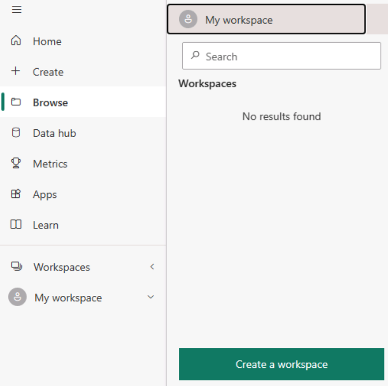](../media/02-create-new-app-5-ss.png#lightbox)

4. In the **Create a workspace** window, enter information in the **Workspace name** and **Description** fields and then upload a **Workspace image**.

    > [!div class="mx-imgBorder"]
    > [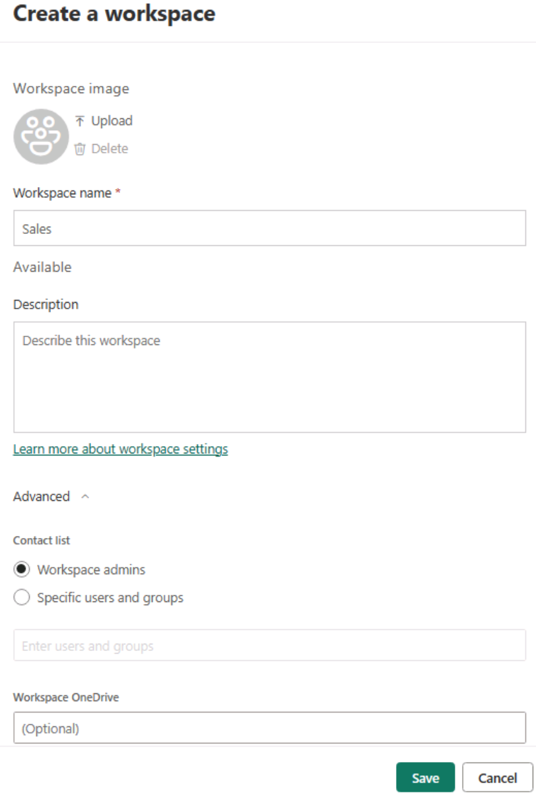](../media/02-create-workspace-1-ssm.png#lightbox)

5. In the **Advanced** drop-down menu, you can create a **Contact list** of users who will receive notifications if issues with the workspace occur.

    By default, these users are the workspace admins, but you can also add specific users. You can also add this workspace to a specific OneDrive and then choose whether this workspace will be a part of a dedicated capacity or not. Dedicated capacities are Power BI Premium features that ensure that your workspace will have its own computational resources as opposed to sharing resources with other users.

6. After you have filled out pertinent fields on the **Create a workspace** window, select **Save**.

You have now created a workspace.

## Assign workspace roles

Now that you've successfully created a workspace, the Sales team wants to collaborate with other teams to build additional dashboards and reports. As the workspace owner, you want to ensure that appropriate access is given to members of the Products team because their team includes stakeholders and developers. Workspace roles allow you to designate who can do what within a workspace.

There are four roles for workspaces, and it's advised that you grant the minimum access necessary to collaborators. For consumers, skip workspace role assignment, and provide access through the app instead in the next section.

The four roles are listed below, in order of most permissive to least, along with select permissions. For full permissions, review the [Roles in workspaces documentation](/power-bi/collaborate-share/service-roles-new-workspaces#workspace-roles).

-   **Admin**
    - Update and delete the workspace
    - Add or remove people, including other admins

-   **Member**
    - Add members or others with lower permissions
    - Publish, unpublish, and change permissions for an app

-   **Contributor**
    - Create, edit, and delete content, such as reports, in the workspace
    - Publish reports to the workspace

-   **Viewer**
    - View and interact with an item
    - Read data that's stored in workspace dataflows

> [!NOTE]
> If the workspace is backed by a Premium capacity, a non-Pro user can view content within the workspace under the **Viewer** role.

To assign these roles to users, go to the workspace that you've created and, in the upper-left corner of the ribbon, select **Access**.

> [!div class="mx-imgBorder"]
> [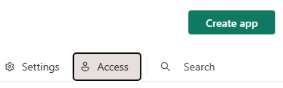](../media/02-workspace-access-3-ss.png#lightbox)

In the resulting **Access** window, you can add email addresses of individual users, mail-enabled security groups, distribution lists, Microsoft 365 groups, and regular security groups, and then assign them to their specific roles. You can also change the user's assigned role at the bottom of the page and delete the user from the workspace by selecting the ellipsis (**...**) next to their name.

> [!div class="mx-imgBorder"]
> [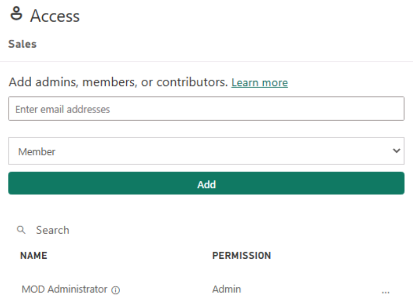](../media/02-workspace-app-7-ss.png#lightbox)

## Create and configure an app

After creating an app workspace and assigning your collaborator-specific roles, you want to add content to your app workspace. Content can be in the form of reports, dashboards, semantic models, dataflows, and so on.

An app is a published, read-only window into your data for mass distribution and viewing. When ready to share apps with your users, you can publish the app. This process requires a Power BI Pro license. Consuming and viewing an app also requires a Pro license, or the workspace must be hosted in a Premium capacity.

You can now publish from Power BI Desktop to your new workspace, and upload saved files or create new items from within the workspace.

> [!div class="mx-imgBorder"]
> [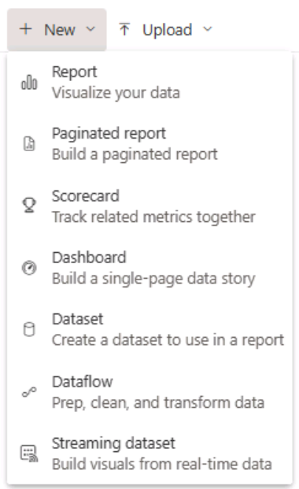](../media/02-create-new-app-ss.png#lightbox)

When you are ready to publish your app with its collection of reports, dashboards, and semantic models, return to the workspace and select **Create app** in the upper-right corner of the ribbon.

> [!div class="mx-imgBorder"]
> [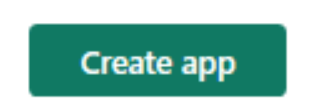](../media/02-update-app-10-ss.png#lightbox)

The **Build your app** experience starts on the Setup page, where you add a name and description for the app. You can also customize the theme color and add a logo if desired.

> [!div class="mx-imgBorder"]
> [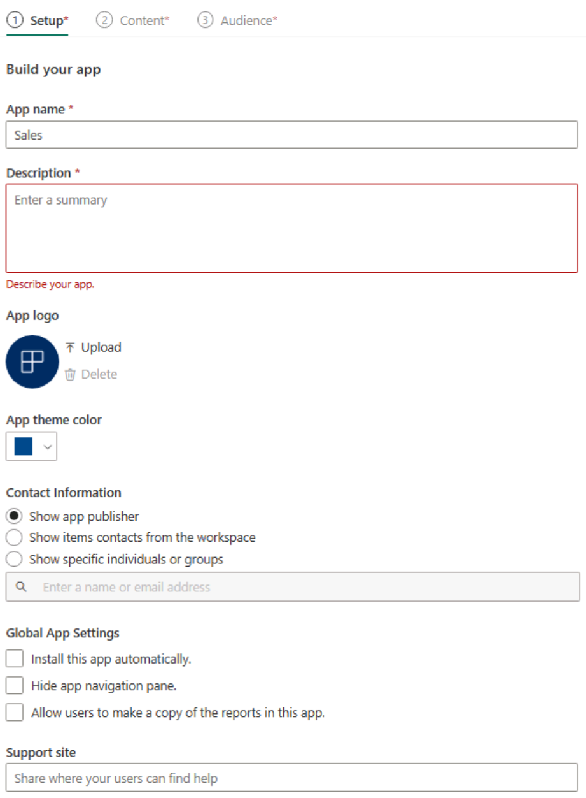](../media/02-workspace-access-3-ssm.png#lightbox)

> [!TIP]
> Use the **Contact Information** and **Support Site** fields to help users contact the appropriate person(s) and how to find help for the app.

Under the **Content** tab, you can choose which content to include and change the viewing order. You can add content in the workspace, new sections for grouping, and external links.

> [!div class="mx-imgBorder"]
> [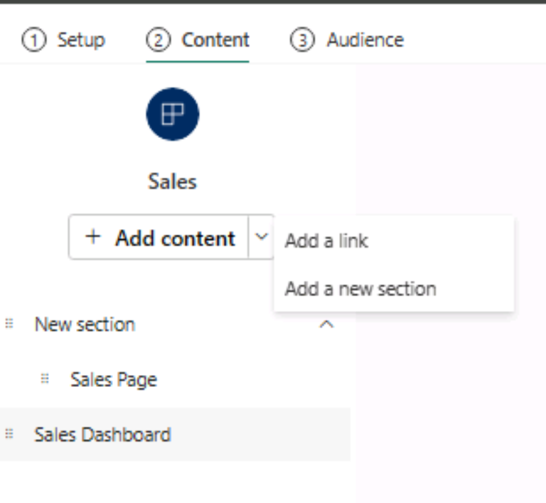](../media/02-publish-app-ss.png#lightbox)

In the **Audience** tab, you're now able to choose one or more audiences with different viewing options.

First, you'll select which reports you want visible to the default audience created. Select what content each audience sees by toggling the eye icon on the right. In the following screenshot, the audience is called "Sales" by default, but you can right-click and rename it.

> [!div class="mx-imgBorder"]
> [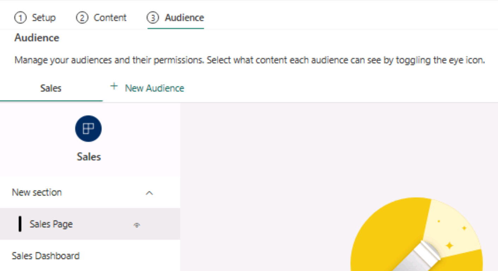](../media/02-included-app-6-ss.png#lightbox)

After selecting the viewable content, you can **Manage Audience Access**. You can **Grant access to** the *Entire organization* or *Specific users or groups*. For Specific users or groups, you can enter any mail-enabled account accessible within your Power BI tenant.

In the **Advanced** section, you can choose to grant additional permissions, individually or neither:

- Allow people to share the semantic models in the app audience
- Allow people to build content with the semantic models in the app audience

Lastly, notice that **Workspace users** are already included in the audience by default. This goes back to the roles we covered earlier.

> [!div class="mx-imgBorder"]
> [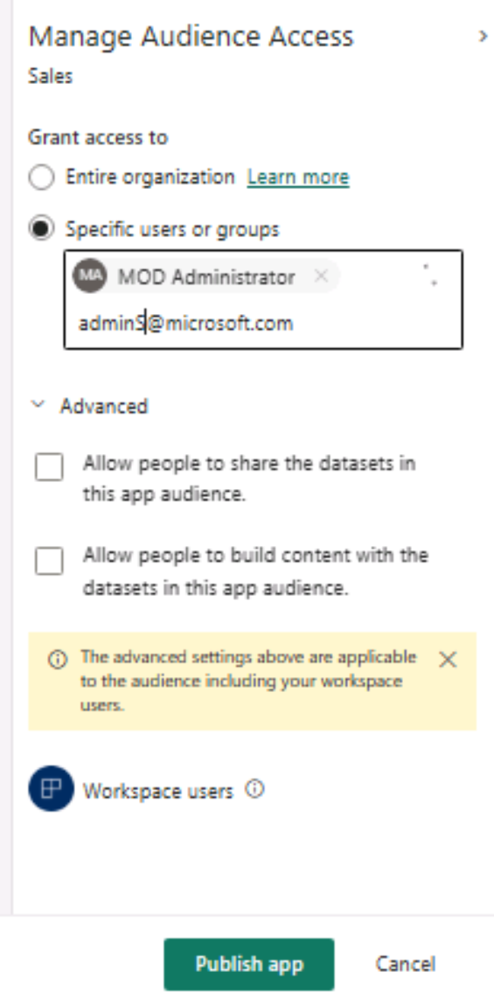](../media/02-included-app-6-ss.png#lightbox)

> [!NOTE]
> **Entire organization** may not be accessible due to settings configured by your Power BI Administrator. Additionally, not all email addresses may be available, such as external accounts.

When you're ready, select **Publish app**. Congratulations, you just published an app! You'll receive a notification with the link to distribute to consumers, and an option to go to the app.

> [!div class="mx-imgBorder"]
> [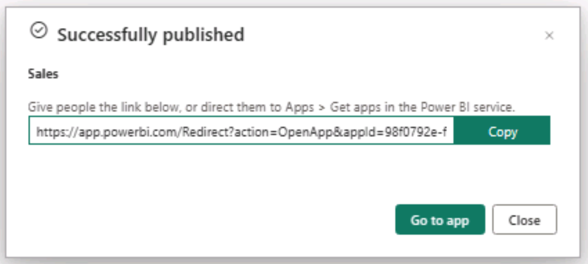](../media/02-publish-app-7-ss.png#lightbox)

> [!NOTE]
> When publishing, there's a notification that it may take 5-10 minutes or longer to reflect changes, depending on your tenant and size of report. It's not possible to guarantee changes will be reflected in 10 minutes or less.

## Update workspaces

After publishing your app, you realize that you want to make updates within your workspace.

Don't worry, it's as easy as publishing your app. From the workspace, the **Create app** button will now say **Update app**. Select Update app, then move to the appropriate section and make your changes. When ready to save your changes, select the **Update app** button in the bottom where **Publish App** was before.

> [!div class="mx-imgBorder"]
> [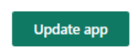](../media/02-publish-app-9-ss.png#lightbox)

For more information, see [Publish an app in Power BI](/power-bi/collaborate-share/service-create-distribute-apps/?azure-portal=true).
