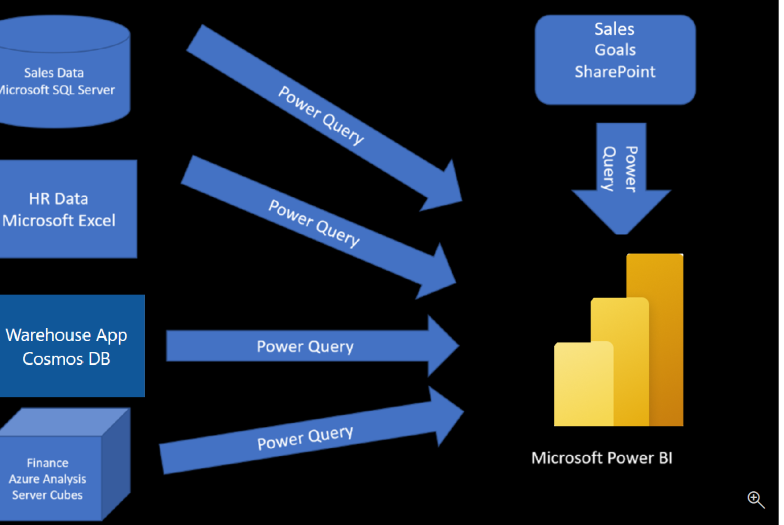

Like most of us, you work for a company where you're required to build Microsoft Power BI reports. The data resides in several different databases and files. These data repositories are different from each other, some are in Microsoft SQL Server, some are in Microsoft Excel, but all the data is related.

> [!VIDEO https://www.microsoft.com/videoplayer/embed/RWFSPW]

> [!NOTE]
> The module sections prior to the lab are purely informational. You will be given the opportunity to work with real data during the lab.

In this module’s scenario, you work for Tailwind Traders. You’ve been tasked by senior leadership to create a suite of reports that are dependent on data in several different locations. The database that tracks sales transactions is in SQL Server, a relational database that contains what items each customer bought and when. It also tracks which employee made the sale, along with the employee name and employee ID. However, that database doesn’t contain the employee’s hire date, their title, or who their manager is. For that information, you need to access files that Human Resources keeps in Excel. You've been consistently requesting that they use an SQL database, but they haven't yet had the chance to implement it.

When an item ships, the shipment is recorded in the warehousing application, which is new to the company. The developers chose to store data in Cosmos DB, as a set of JSON documents.

Tailwind Traders has an application that helps with financial projections, so that they can predict what their sales will be in future months and years, based on past trends. Those projections are stored in Microsoft Azure Analysis Services. Here’s a view of the many data sources you're asked to combine data from.

> [!div class="mx-imgBorder"]
> 

Before you can create reports, you must first extract data from the various data sources. Interacting with SQL Server is different from Excel, so you should learn the nuances of both systems. After gaining understanding of the systems, you can use Power Query to help you clean the data, such as renaming columns, replacing values, removing errors, and combining query results. Power Query is also available in Excel. After the data has been cleaned and organized, you're ready to build reports in Power BI. Finally, you'll publish your combined semantic model and reports to Power BI service. From there, other people can use your semantic model and build their own reports or they can use the reports you’ve already built. Additionally, if someone else built a semantic model you'd like to use, you can build reports from that too!

This module will focus on the first step of getting the data from the different data sources and importing it into Power BI by using Power Query.

By the end of this module, you’ll be able to:

- Identify and connect to a data source
- Get data from a relational database, such as Microsoft SQL Server
- Get data from a file, such as Microsoft Excel
- Get data from applications
- Get data from Azure Analysis Services
- Select a storage mode
- Fix performance issues
- Resolve data import errors
