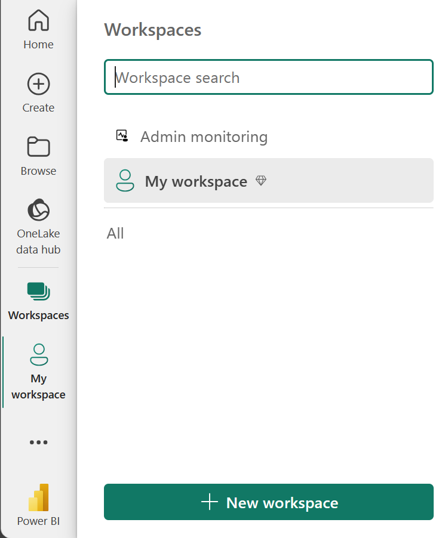
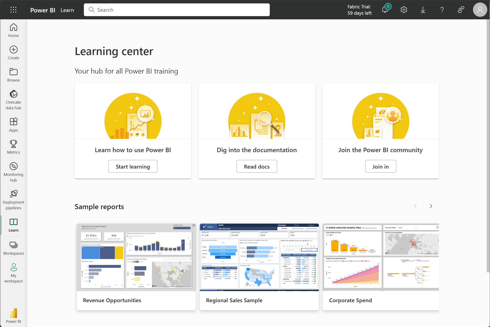
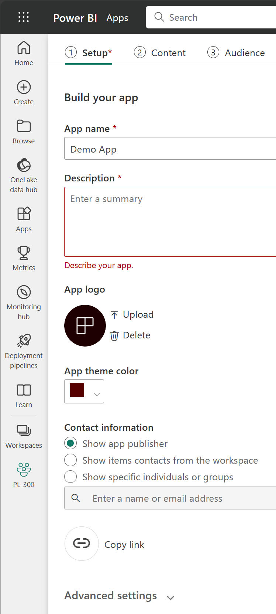
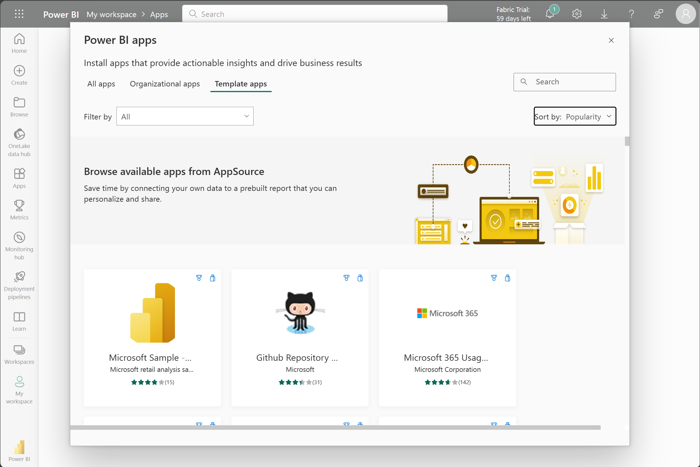
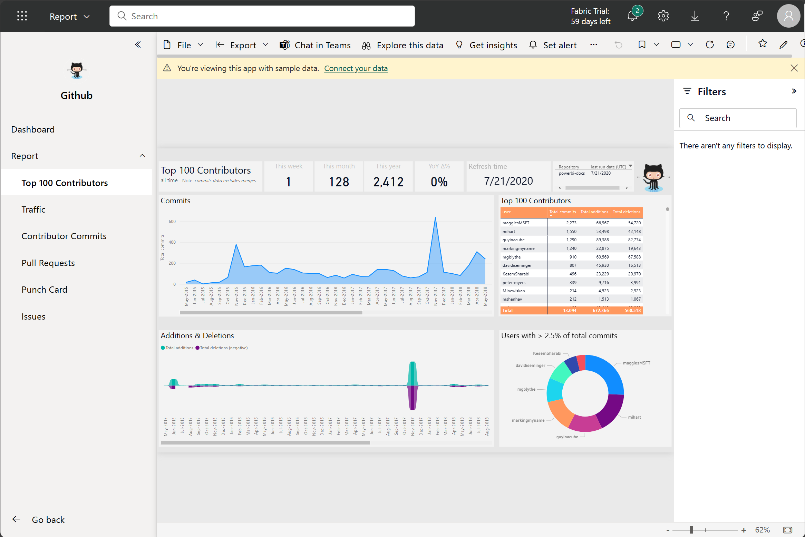
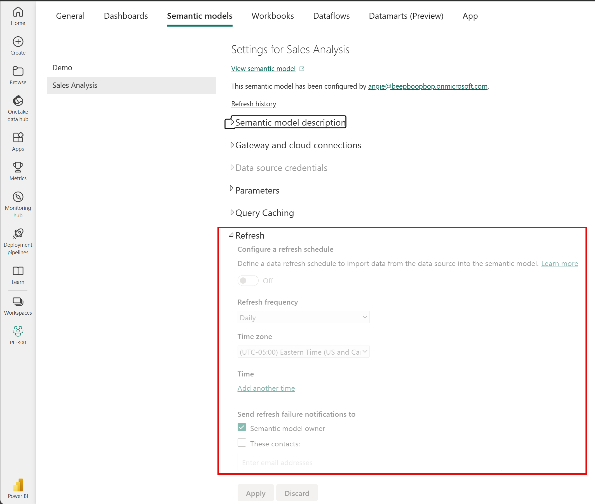

Now that you understand how to create a report, let's explore the Power BI service. The Power BI service provides a simple and interactive user experience to take your data analytics to the next level.

## Organize items with workspaces

**Workspaces** are the foundation of the Power BI service. When publishing any report, you must choose a workspace. By default, every user has access to *My workspace*, which is ideal only for testing. When you want to share content with others, **always** create and use a shared workspace.

## Explore sample reports

If you haven't created a report yet, Power BI offers several sample reports for you to explore. These reports load to My workspace so you can explore privately. You can access sample reports in the **Learn** section of the navigation pane.

## Distribute content

In a workspace, you can create an **app**, which provides consumers a simplified interface to access reports and dashboards. In the app configuration, you set up the app, select the content to include (limited to the current workspace), and choose your audience.

Once you create an app, you must update the app after each change to items in the workspace. The requirement to update the app allows you to control what version of the content is visible to your audience.

Apps are the ideal sharing solution within any organization. While you can grant access to the workspace, workspace permissions may grant users access to more content than desired. Sharing individual items also presents a problem if you make changes you don't want consumers to see yet.

## Explore template apps

Now that you understand what an app is, let's look at **template apps**. Template apps allow you to find an existing app that suits your needs and then you connect your data. These apps can be a great way to quickly share insights with minimal effort.

> [!TIP]
> To access template apps, select the Apps icon from the left navigation pane > Get apps > Template apps.

In the following screenshot, we've installed the GitHub template app and have expanded the report. We can see different report pages, including *Top 100 Contributors* and *Pull Requests*. If your organization is using GitHub, using this template app can easily support your needs without starting from the beginning.

## Refresh a semantic model

In order to support your ever-changing data, you can configure scheduled refreshes of your semantic models in the Power BI service. On-demand refreshes are also available.

> [!TIP]
> For more information about all refresh schedules, see the [Refresh data documentation.](/power-bi/connect-data/refresh-data#configure-scheduled-refresh)
