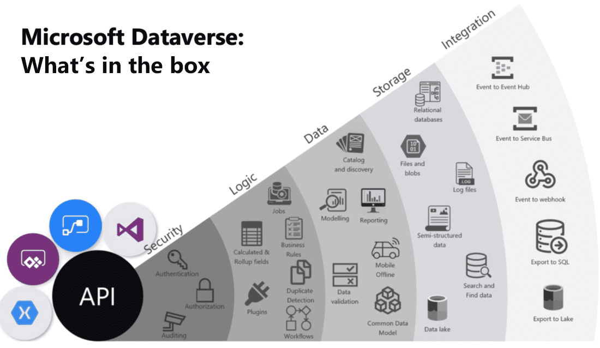

Microsoft Dataverse is a cloud-based solution that easily structures various data and business logic to support interconnected applications and processes in a secure and compliant manner. Managed and maintained by Microsoft, Dataverse is available globally but deployed geographically to comply with your potential data residency. It isn't designed for stand-alone use on your servers, so you need an internet connection to access and use it.

Dataverse is different from traditional databases in that it is more than just tables. It incorporates security, logic, data, and storage into a central point. It's designed to be your central data repository for business data, and you might even be using it already. Behind the scenes, it powers many Microsoft Dynamics 365 solutions such as Field Service, Marketing, Customer Service, and Sales. It's also available as part of Power Apps and Power Automate with native connectivity built right in. The AI Builder and Portals features of Microsoft Power Platform also utilize Dataverse. 

The image shows a visualization that brings together the many offerings of Microsoft Dataverse.

Here's a brief explanation of each category of features.

- **Security**: Dataverse handles authentication with Microsoft Entra ID to allow for conditional access and multi-factor authentication. It supports authorization down to the row and column level and provides rich auditing capabilities.

- **Logic**: Dataverse allows you to easily apply business logic at the data level. Regardless of how a user interacts with the data, the same rules apply. These rules could be related to duplicate detection, business rules, workflows, or more.

- **Data**: Dataverse offers you the control to shape your data, allowing you to discover, model, validate, and report on your data. This control ensures your data looks the way you want regardless of how it is used.

- **Storage**: Dataverse stores your physical data in the Azure cloud. This cloud-based storage removes the burden of worrying about where your data lives or how it scales. These concerns are all handled for you.

- **Integration**: Dataverse connects in different ways to support your business needs. APIs, webhooks, eventing, and data exports give you flexibility to get data in and out.

As you can see, Microsoft Dataverse is a powerful cloud-based solution for storing and working with your business data. In the following sections, you look at Microsoft Dataverse from the lens of data storage for Microsoft Power Platform, where you start your journey. Keep in mind the other rich capabilities discussed which you can explore further as your usage increases.

To get started, Microsoft Dataverse lets you create one or many cloud-based instances of a standardized database. The database includes predefined tables and columns that store data commonly found across nearly all organizations and businesses. You can customize and extend what's stored by adding new columns or tables. The ease of setting up a Microsoft Dataverse database and standardized data model under it simplifies your ability to concentrate your efforts on building solutions without worrying about infrastructure, storage, and data integration. With your data stored in Microsoft Dataverse, there are many ways to access it. You can work with the data natively with tools such as Power Apps or Power Automate. Any business solution can connect to Dataverse using connectors APIs. With the power of features such as role-based security and business rules you can trust your data is safe no matter how it is accessed.

**Scalability**

A Dataverse database supports large data sets and complex data models. Tables can hold millions of items, and you can extend the storage in each instance of a Microsoft Dataverse database to four terabytes per instance. The amount of data that is available in your instance of Microsoft Dataverse is based upon the number and type of licenses that are associated with it. Data storage is pooled between all licensed users, so you can allocate storage as needed for each solution that you build. Incremental storage can be purchased if you need more storage than what is offered within standard licensing.

**Microsoft Dataverse structure and benefits**

The structure of a Microsoft Dataverse database is based upon the definitions and schema in the Common Data Model. The key benefit of using the Common Data Model as the basis of a Microsoft Dataverse database is that it simplifies the integration of solutions that use a Common Data Model schema. The standard tables of the solution are the same. You can take advantage of a rich ecosystem of solutions that vendors have built from using the Common Data Model. Best of all, there is practically no limit to how far you can extend a Microsoft Dataverse database.

 

**Describe tables, columns, and relationships**

A table is a logical structure containing rows and columns that represents a set of data. In the screenshot, you see the standard account table and various elements that can be managed as part of it. 

:::image type="content" source="../media/identify-foundational-components-of-the-microsoft-power-platform-05.png" alt-text="Screenshot of an Account table.":::

## **Types of tables**

The three types of tables are:

- **Standard** - Several standard tables, also known as out-of-box tables, are included with a Dataverse environment. Account, business unit, contact, task, and user tables are examples of standard tables in Dataverse. Most of the standard tables included with Dataverse can be customized. 

- **Managed** - Tables that are not customizable and have been imported into the environment as part of a managed solution.

- **Custom** - Custom tables are unmanaged tables that are either imported from an unmanaged solution or are new tables created directly in the Dataverse environment. 

## **Columns**

Columns store a discrete piece of information within a row in a table. You might think of them as a column in Excel. Columns have data types, meaning that you can store data of a certain type in a column that matches that data type. For example, if you have a solution that requires dates, such as capturing the date of an event or when something occurred, then you store the date in a column with the type Date. Similarly, if you want to store a number, then you store the number in a column with the type of Number.

The number of columns within a table varies from a few columns to a hundred or more. Every database in Microsoft Dataverse starts with a standard set of tables, and each standard table has a standard set of columns.

 

**Understand relationships**

To make an efficient and scalable solution for most of the solutions that you build, you'll need to split up data into different containers (tables). Trying to store everything in a single container would likely be inefficient and difficult to understand.

The following example helps illustrate this concept.

Imagine that you need to create a system to manage sales orders. You'll need a product list along with the inventory on hand, the cost of the item, and the selling price. You also need a master list of customers with their addresses and credit ratings. Finally, you will need to manage sales invoices as well to store invoice data. The invoice should include information such as date, invoice number, salesperson, customer information including address and credit rating, and a line item for each item on the invoice. Line items should include a reference to the product that you sold and be able to provide the proper cost and price for each product and decrease the quantity on hand based upon the quantity that you sold in that line item.

Creating a single table to support the functionality in the above example would be inefficient. A better way to approach this business scenario is to create the following four tables:

- Customers

- Products

- Invoices

- Line items

Creating a table for each of these items and relating them to one another will allow you to build an efficient solution that can scale, while maintaining high performance. Splitting the data into multiple tables also means that you will not have to store repetitive data or support huge rows with large amounts of blank data. Additionally, reporting will be much easier if you split the data into separate tables.

Tables that relate to one another have a relational connection. Relationships between tables exist in many forms, but the two most common are one-to-many and many-to-many, both of which are supported by Microsoft Dataverse. To learn more about the different relationship types, see: [Table relationships. ](/power-apps/maker/data-platform/create-edit-entity-relationships) 

 

**Business logic in Microsoft Dataverse**

Many organizations have business logic that impacts how they work with data. For example, an organization who is using Dataverse to store customer information might want to make a field such as and Identification number field required based on the type of customer they are. In Microsoft Dataverse, you build this logic using business rules. Business rules allow you to apply and maintain business logic at the data layer instead of the app layer. Basically, when you create business rules in Microsoft Dataverse, those rules are in effect regardless of where users interact with the data.

For example, business rules can be used in canvas and model-driven apps to set or clear values in one or many columns in a table. They can also be used to validate stored data or show error messages. Model-driven apps can use business rules to show or hide columns, enable, or disable columns, as well as create recommendations based on business intelligence.

Business rules give you a powerful way to enforce rules, set values, or validate data regardless of the form that is used to input data. Additionally, business rules are effective in helping to increase the accuracy of data, simplify application development, and streamline the forms presented to end users.

Below is an example of a simple, yet powerful use of business rules. The business rule is configured to change the field **Credit Limit VP Approver** to be a required field if the Credit Limit is set to greater than `$1,000,000`. If the credit limit is less than `$1,000,000` then the field is optional.

:::image type="content" source="../media/identify-foundational-components-of-the-microsoft-power-platform-06.png" alt-text="Screenshot of a business rule in Power Apps.":::

By applying this business rule at the data level instead of the app level, you have better control of your data. This can ensure your business logic is followed whether it is being accessed directly from Power Apps, Power Automate, or even via an API. The rule is tied to the data, not the app.

To learn more about using Business rules in Dataverse, see: [Create a business rule for a table.](/power-apps/maker/data-platform/data-platform-create-business-rule)

**Working with dataflows**

Dataflows are self-service, cloud-based, data preparation technology. Dataflows are used to ingest, transform, and load data into Microsoft Dataverse environments, Power BI workspaces, or your organization's Azure Data Lake Storage account. Dataflows are authored by using Power Query, a unified data connectivity and preparation experience already featured in many Microsoft products, including Excel and Power BI. Customers can trigger dataflows to run either on demand or automatically on a schedule, data is always kept up to date. 

Because a dataflow stores the resulting entities in cloud-based storage, other services can interact with the data produced by dataflows.

:::image type="content" source="../media/identify-foundational-components-of-the-microsoft-power-platform-07.png" alt-text="Illustration of a dataflow.":::

For example, Power BI, Power Apps, Power Automate, Power Virtual Agents, and Dynamics 365 applications can get the data produced by the dataflow by connecting to Dataverse, a Power Platform dataflow connector, or directly through the lake, depending on the destination configured at dataflow creation time.

The following list highlights some of the benefits of using dataflows:

- A dataflow decouples the data transformation layer from the modeling and visualization layer in a Power BI solution.

- The data transformation code can reside in a central location, a dataflow, rather than be spread out among multiple artifacts.

- A dataflow creator only needs Power Query skills. In an environment with multiple creators, the dataflow creator can be part of a team that together builds the entire BI solution or operational application.

- A dataflow is product agnostic. It's not a component of Power BI only, as you can get its data in other tools and services.

- Dataflows take advantage of Power Query, a powerful, graphical, self-service data transformation experience.

- Dataflows run entirely in the cloud. No additional infrastructure is required.

- You have multiple options for starting to work with dataflows, using licenses for Power Apps, Power BI, and Customer Insights.

- Although dataflows are capable of advanced transformations, they are designed for self-service scenarios and require no IT or developer background.