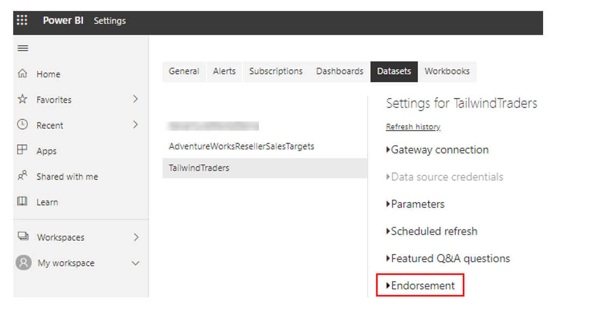
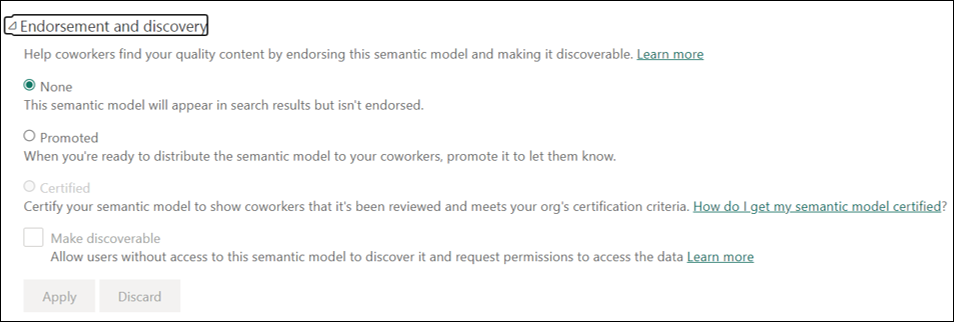
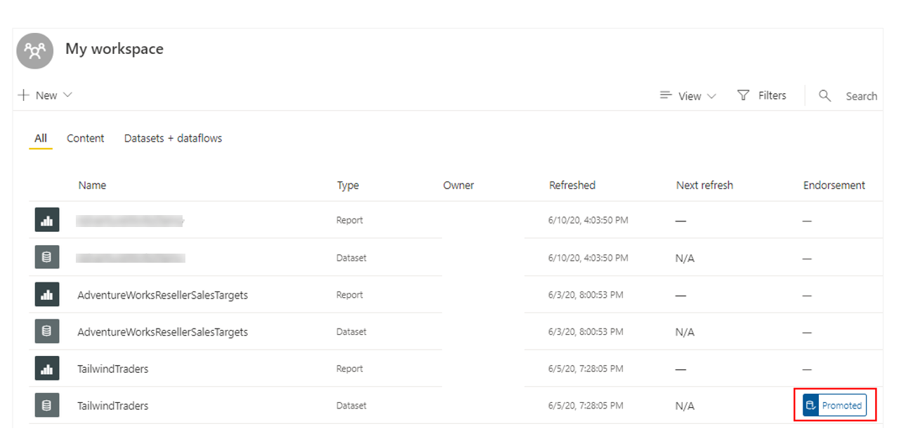
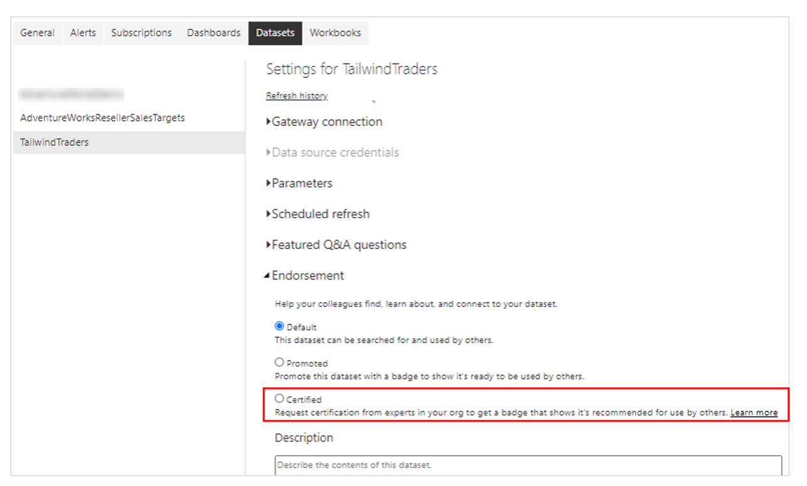

Business intelligence involves collaboration, and sharing semantic models across workspaces is a powerful way to collaborate within your organization. However, if your organization has many different semantic models that can be accessed by many users, you might want to take measures to manage those semantic models. For instance, you might want to direct your users to the most up-to-date and highest-quality semantic models in your workspaces, or you might want to restrict the reuse of semantic models across your workspaces.

To ensure that your organization has consistent data for making decisions and a healthy data culture, it's important to create and share optimized semantic models and then endorse those semantic models as the *one source of truth*. Report creators can then reuse those endorsed semantic models to build accurate, standardized reports.

Power BI provides two ways to endorse your semantic models:

- **Promotion** - Promote your semantic models when they're ready for broad usage.

- **Certification** - Request certification for a promoted semantic model. Certification can be a highly selective process, so only the truly reliable and authoritative semantic models are used across the organization.

In this example, you and the other teams are using a workspace in Power BI service to organize all your reports and dashboards. However, you begin to receive emails from confused users who expected to see a sales report and are now looking at a product report instead. You need to make some changes to direct your users to the semantic models that they should be accessing, and you can accomplish this task with the endorsing capability in Power BI.

In this example, the certification type of endorsement is best suited for the Sales team because it will require users to have special access before they can view the Sales dashboards. By implementing the certification, you'll lead your users to the most appropriate reports and dashboards, avoiding the inevitable confusion that might arise with building and sharing a diversity of reports.

Though you'll soon learn how to certify the semantic model, you'll first learn how to promote a semantic model, in case you prefer to use that method.

## Promote a semantic model

To promote content, you must have write permissions on the workspace where the content you want to promote is located.

To promote a semantic model, go to the workspace in Power BI service, and then open the settings page for the semantic model that you want to promote. In this example, you want to promote the Tailwind Traders semantic model.

Select the **Endorsement** setting.

> [!div class="mx-imgBorder"]
> 

In the **Endorsement** settings, select the **Promoted** option, and then select **Apply**.

> [!div class="mx-imgBorder"]
> 

When you return to your workspace, a badge in the **Endorsement** column for that semantic model will appear, indicating that it's ready for viewing by all of your users.

> [!div class="mx-imgBorder"]
> 

## Certify a semantic model

Content certification is a big responsibility, and only authorized users can certify content. Other users can request content certification.

To request certification for a semantic model, you  start the same way as you did to promote the semantic model in **Endorsement** section. If it is greyed out, your admins will provide details in a link titled, *"How do I get my semantic model certified?"* in the **Certified** section.

> [!div class="mx-imgBorder"]
> 

For more information, see [Promote your semantic model](/power-bi/service-datasets-promote/?azure-portal=true) or [Certify semantic models](/power-bi/service-datasets-certify/?azure-portal=true).

