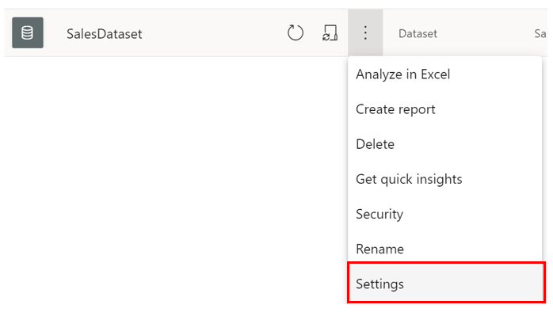

With the **Query Caching** feature, you can use the local caching services of Power BI to process query results. Instead of relying on the semantic model to calculate queries, you use cloud resources on your Premium capacities in the Power BI service to load your report. Query caching ensures constant performance instead of overloading the semantic model resources. 

Building on the scenario, you notice that some of your semantic models are causing the reports to load more slowly than before, an issue that is starting to annoy your users. The Sales team wants to know how they can improve performance and make these reports load faster. You decide to use **Query Caching** to solve this problem.

## Query caching 

**Query Caching** is a local caching feature that maintains results on a user and report basis. Query caching reduces load time and increases query speed, especially for semantic models that aren't refreshed often and are accessed frequently. This service is only available to users with Power BI Premium or Power BI Embedded. 

Query caching results are user-specific, and apply specific page of a report only. Several benefits to using query caching include:  

-   Improvement of the performance of reports, dashboards, and dashboard tiles. 

-   It respects bookmarks and default filters.

-   Cached query results are specific to the user. 

-   All security labels are followed.   

-   It reduces the load on your dedicated capacity. 

To access and configure query caching, follow these steps:

1. Go to a semantic model in your workspace and open its **Settings** page. In this example, you enable query caching for **SalesModel**.  

   > [!div class="mx-imgBorder"]
   > 

2. Select the **semantic models** tab and expand the **Query Caching** options, as shown in the following image.  

   > [!div class="mx-imgBorder"]
   > 

3. On the **Query Caching** page, choose one of the available options. The default option is that query caching is turned off; however, you can also select **Off**, which turns off query caching for the specific semantic model in question. If you select **On**, query caching is turned on for this specific semantic model only. For this example, you'll select **On** for your semantic model because you want to apply query caching to your specific semantic model.  

> [!NOTE]
> Switching from **On** to **Off** clears all previously saved query results. When turning off query caching (either through the default or the **Off** option), a small delay occurs in query loading because the report queries are running against the semantic model and it does not have saved queries to fall back on.

> [!WARNING]
> If many semantic models have query caching enabled, and a refresh occurs, a reduction in performance might occur because a large number of queries are being processed at once.  

For more information, see [Query Caching in Power BI](/power-bi/connect-data/power-bi-query-caching/?azure-portal=true).

