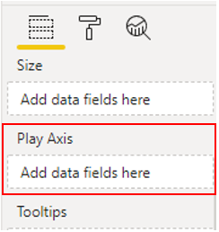
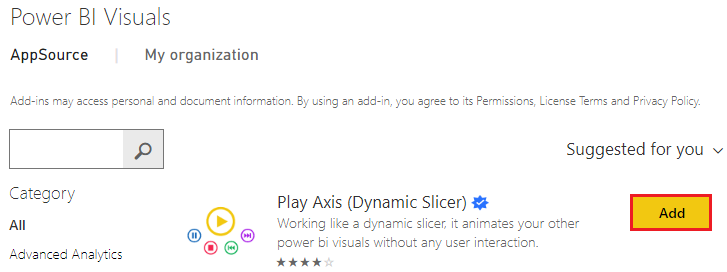
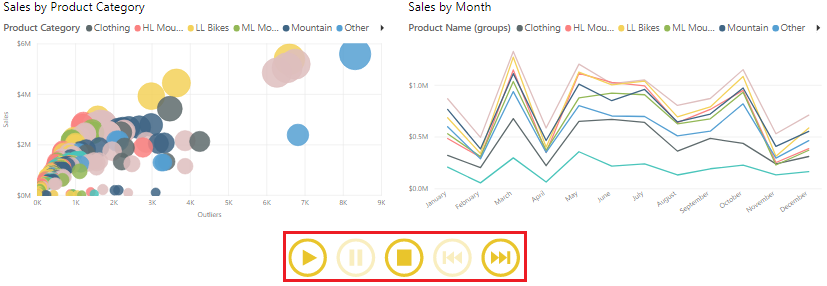
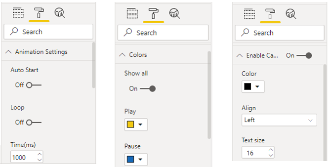
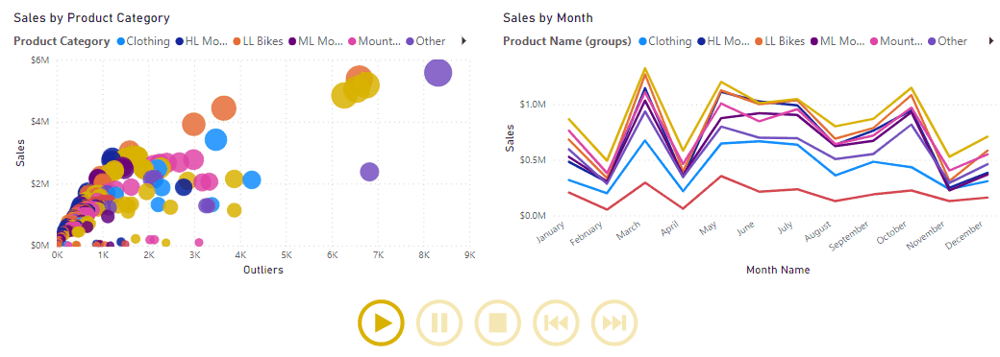

In 2004, Hans Rosling presented a Ted Talk titled, "The best stats you've ever seen." In that talk, Hans showed a video that allowed him to analyze data over time by playing an animated chart. The chart progressed, year-by-year, where viewers could watch how the longevity and family size moved over time for the entire world. This presentation initiated tremendous interest in the power of data visualization, particularly as it related to time series analysis.

Time series analysis involves analyzing a series of data in time order to identify meaningful information and trends and make predictions. The result of time series analysis is the best data that you can use for forecasting activities.

Time series analysis often involves the use of visuals such as Gantt charts, project planning, and stock movement semantic models. In Power BI, you can use visuals to view how your data is progressing over time, which in turn allows you to make observations, such as if any major events disrupted your data.

To conduct a time series analysis in Power BI, you need to use a visualization type that is suitable for displaying trends and changes over time, such as a line chart, area chart, or scatter chart. You can also import a time series custom visual into Power BI Desktop from Microsoft AppSource. The following example uses a standard scatter chart.

In addition to the range of time series custom visuals, Microsoft AppSource has an animation custom visual called **Play Axis** that works like a dynamic slicer and is a compelling way to display time trends and patterns in your data without user interaction. This visual is similar to the one that Hans Rosling used in his original presentation and is used alongside the scatter chart in the following example.

> [!NOTE]
> Some organizations prefer not to use custom visuals for security or other reasons. Before you import custom visuals, check with your organization to see if they are allowed or not. If they are not allowed, you can instead use the **Play Axis** visual that is available for scatter chart visualizations within Power BI Desktop because it has similar functionality.

> [!div class="mx-imgBorder"]
> 

In this example, you are developing a Sales report. The Sales team wants to study the quarterly sales trends and identify which models sell better, depending on the time of the season. You decide to use two visuals, a scatter chart and line chart, for the purpose of time series analysis, and then enhance those visuals with animation so the Sales team can see how the sales data changes over time.

You start by adding your visuals to the report page to show the sales data.

> [!div class="mx-imgBorder"]
> 

Next, you will import the animation custom visual to use with the visuals. In the **Visualizations** pane, select the **Get more visuals** icon and then select **Get more visuals**. On the **Power BI Visuals** window that displays, search for **play axis**, and then select the **Add** button for the **Play Axis (Dynamic Slicer)** visual.

> [!div class="mx-imgBorder"]
> 

A message will display, stating that the visual was successfully imported. When you return to Power BI Desktop, you'll see the new **Play Axis** icon in the **Visualizations** pane. Select the page, and then select the **Play Axis** icon to add that visual to the page.

With the new visual selected, select the field (**Quarter**) that you want to use as the slicer in the **Play Axis** animation. Animation controls become available on the visual.

> [!div class="mx-imgBorder"]
> 

You can now resize and reposition the new visual and customize its formatting so that it's consistent with the other visuals on the page. Specific formatting options that you might want to use include:

- In the **Animation Settings** section, you can control the play functionality of the **Play Axis** visual, such as making the animation automatically start, continue looping, and then change the speed at which the animation occurs.

- In the **Colors** section, you can change the appearance of the **Play Axis** visual by adjusting its overall color, or selecting the **Show all** option, and then changing the color of each control button.

- The **Enable Caption On** section allows you to turn on/off the text that is displayed next to the visual or adjust the formatting of it.

> [!div class="mx-imgBorder"]
> 

When you have set up the **Play Axis** visual to meet your requirements, you are ready to use it with your other visuals. Select the **Play** button and then watch how the data in each visual on the page evolves over the time. You can use the control buttons to pause the animation, restart it, and so on.

> [!div class="mx-imgBorder"]
> 
