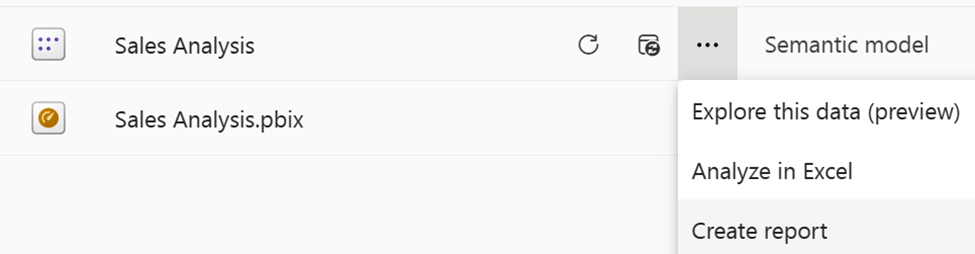
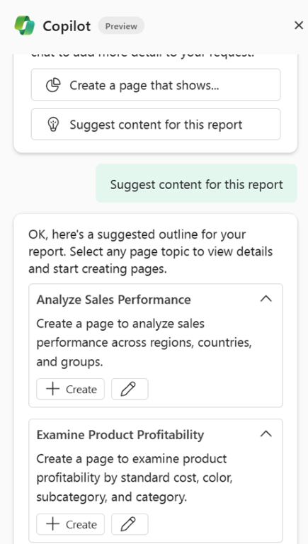
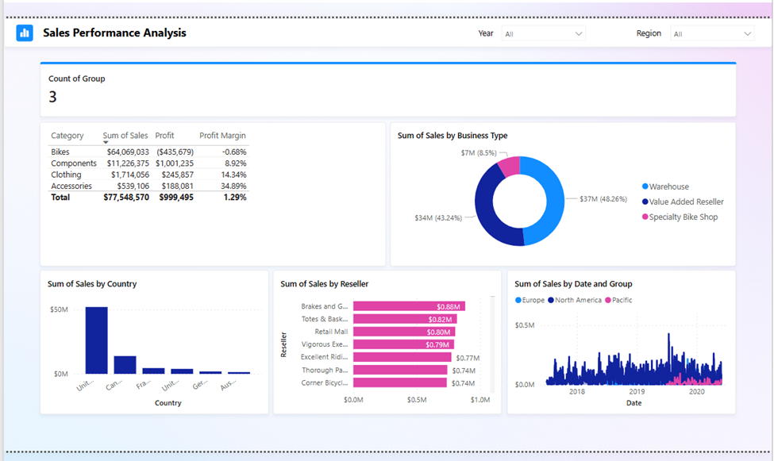
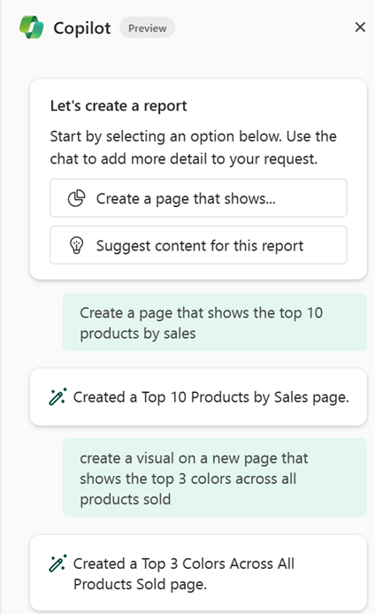
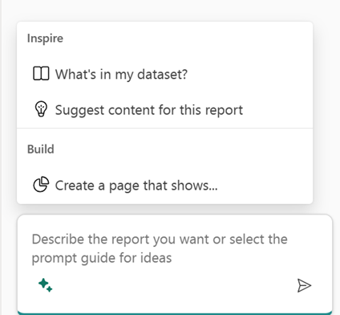

Now that you understand the requirements for a well-prepared semantic model, let's explore the different ways to create report content with Power BI Copilot.

> [!NOTE]
> The screenshots and suggestions in your environment may may differ from those that were generated at the time this unit was written.
>
> For our examples, we published a semantic model to the Power BI service, based on the AdventureWorks database.

## Suggest content with Copilot

To access Copilot, you need to select a semantic model within a Power BI service workspace. Then you can create a new report, and access Copilot from the ribbon.

> [!TIP]
> If you don't see Copilot, your admins may not have enabled it, or you may not have selected a semantic model.

In the Copilot pane, you can select *Suggest content for this report* to generate the:

- Report outline.
- Suggested page topics.
- Visuals for page topics.
- Summary of the semantic model.
- Summary of the current page.

For our semantic model, we see several different possibilities offered, such as:

- Analyze sales performance across regions and groups.
- Examine product profitability by standard cost, color, subcategory, and category.

## Create pages with custom prompts

You can also *Create a report that shows…* where you provide a prompt of your own choosing. Using this option grants you more flexibility; however, you’ll need to better understand how to write prompts that apply to your semantic model and aren't too complex.

You can also write your own prompts without selecting one of the suggestions although there may be limitations to what Copilot can create based on your prompt. For example, if you ask for a single visual or a specific visual type, Copilot still creates a full page with multiple visuals. Some ideas for our model are:

- Create a page that shows the top 10 products by sales.
- Create a visual on a new page that shows the top 3 colors across all products sold.

In the Copilot pane chat field, you can select the stars icon, which opens the *Inspire* dialog where you can see other options like, *What’s in my semantic model?*

> [!TIP]
> For additional guidance, see [Write Copilot prompts that produce results in Power BI](/power-bi/create-reports/copilot-prompts-report-pages).

### Final considerations

When using Copilot, you should consider it to be your first draft, which requires your review before finalizing. While some visuals may be ready to go, you may want to change colors, labels, or only keep select visuals.
