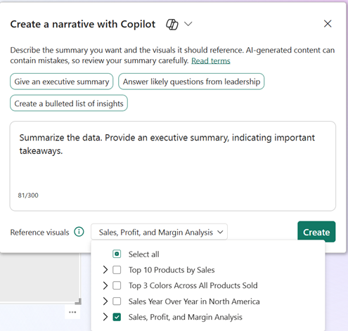

Summaries are often desirable in reports to provide context to the report consumers. You often highlight certain aspects of your report or condense to a higher-level summary for page or narrative summaries. Due to the repetitive nature of the task, Copilot is an excellent time-saver after you configure your semantic model.

## Create a narrative summary

You can create a narrative summary with Copilot in Power BI service, which can summarize the entire report, specific pages, or even specific visuals. You can then modify the summary to the level of detail and tone you choose.

To create the narrative summary, you first need to select the narrative visual, and then choose the *Create with Copilot* option. Since the visual only uses contents from the report canvas, it’s valuable to wait until your report is complete before creating the summary. The options include:

- **Give an executive summary**
- **Answer likely questions from leadership**
- **Create a bulleted list of insights**

## Create a page summary

The quick page summary is another valuable option that provides a written description of the page. Use the Power BI service to create a page summary either in the *Reading mode* (used by consumers) or in the *Edit mode* (used by developers).

When you create a page summary in Reading mode, the report is read-only and therefore you’re not able to pin or preserve the summary. However, your users can continue to interact with Copilot and ask follow-up questions based on the summary.

When creating a page summary in the Edit mode, you can create a visual that contains the page summary. Copilot generates a summary in the Copilot pane, with footnotes showing which visual it used to create each bullet point. Hover over each footnote to see which visual accounts for each bullet point.
