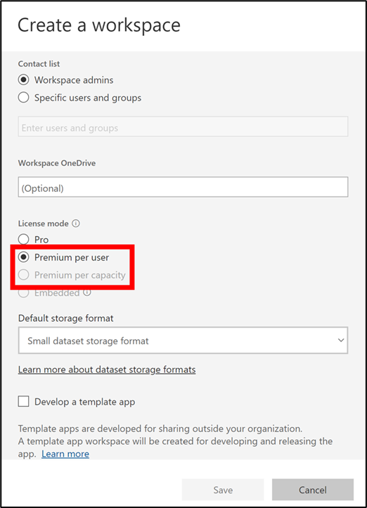
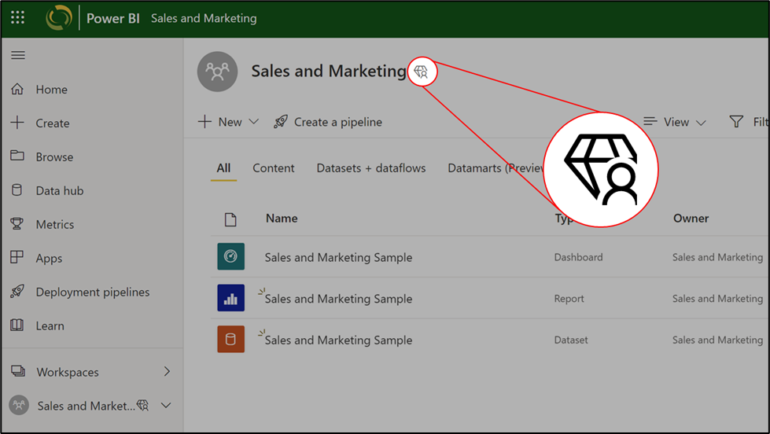
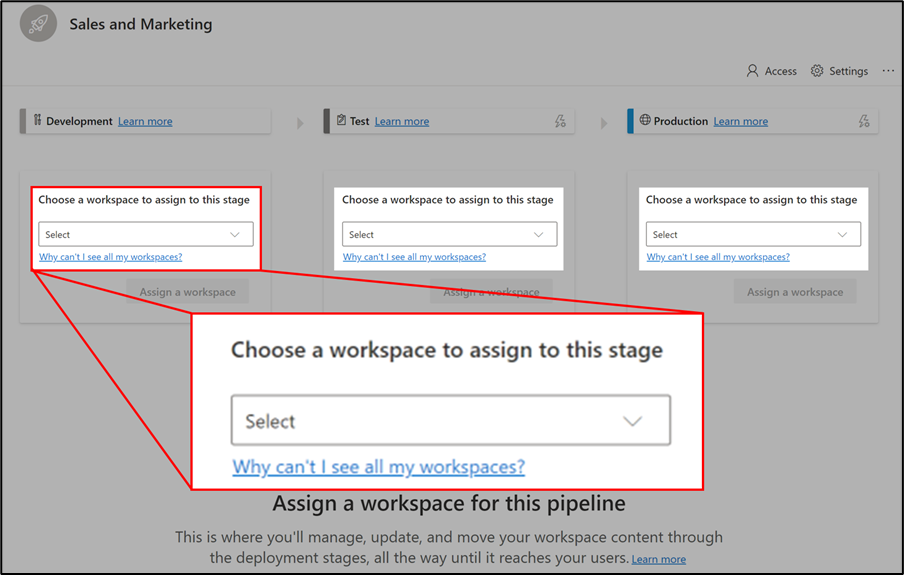
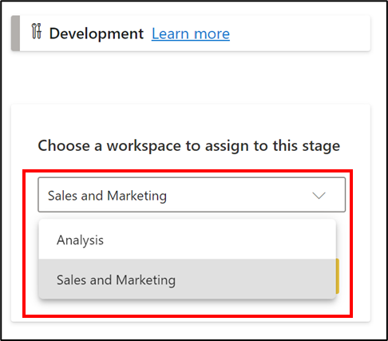
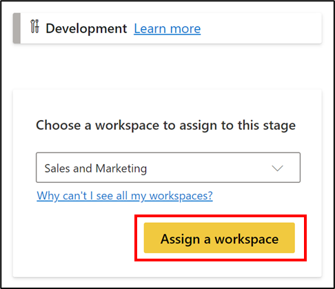

After creating a pipeline, you need to add the content you want to manage to the pipeline. Adding content to the pipeline is done by assigning a workspace with the content (reports, paginated reports, dashboards, datasets, and dataflows) to the pipeline stage. You can assign a workspace to any stage, however, for this instruction we will start with assigning the workspace to the Development stage, and from there deploy some or all of the workspace items to Test and Production.

> [!NOTE]
> Not only can you assign a workspace to any stage, you can assign different workspaces to different stages, although there is a limitation of one workspace per stage.

## Create a Premium workspace

Ensure you have a Premium workspace created already to ensure this workspace can be used to create a pipeline. Choosing one of the premium license modes will enable this.
 
> [!div class="mx-imgBorder"]
> 

Once created, these workspaces are denoted by the diamond icon appearing on them.

> [!div class="mx-imgBorder"]
> 

## Assign a workspace to a stage

To assign a workspace to a pipeline stage, follow these steps:
1. Open the pipeline.  

    > [!div class="mx-imgBorder"]
    > 

2. In the stage to which you want to assign a workspace, expand the dropdown titled **Choose a workspace to assign to this stage**. Again, it is most common to start with the Development stage.  

    > [!div class="mx-imgBorder"]
    > 

> [!NOTE]
> To assign a workspace to a pipeline, the pipeline stage you want to assign the workspace to has to be empty. 

3.	From the dropdown menu, select the workspace you want to assign to this stage.

    > [!div class="mx-imgBorder"]
    > 

> [!NOTE]
> On the drop-down list, the user will only see premium capacity workspaces 1) that are not assigned to any other pipeline, 2) where the user is their admin, and 3) where the user is a member of their adjacent stages.

4. Select **Assign a workspace**.
  
    > [!div class="mx-imgBorder"]
    > 

