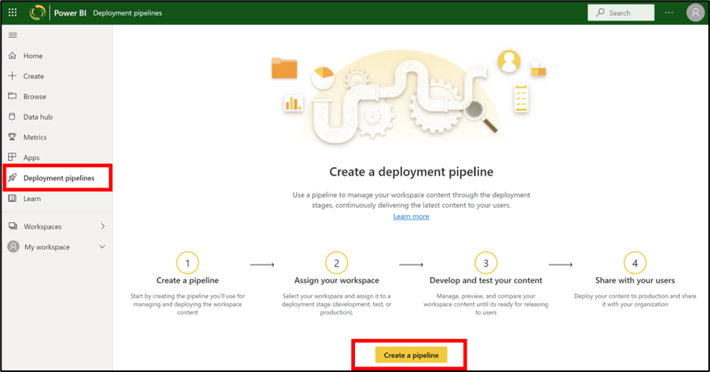
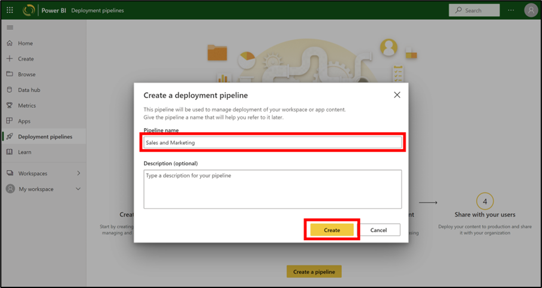
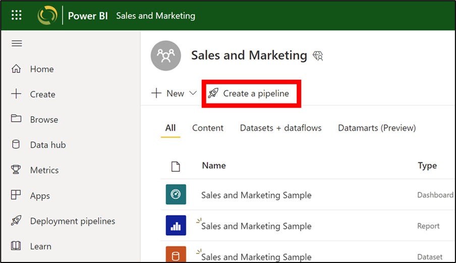

Provided you meet the prerequisites, a deployment pipeline can be created using two different methods: 
- From the **Deployment pipelines** tab (on the left navigation panel)
- From a workspace

> [!NOTE]
> If you don’t have the Deployment pipelines tab in the left navigation panel, or a button for creating Deployment pipelines in your workspace, it’s most likely that you don’t meet the prerequisites.  

After the pipeline is created, you can share it with other users or delete it. When you share a pipeline with others, the users you share the pipeline with will be given access to the pipeline. Pipeline access enables users to view, share, edit, and delete the pipeline.

## Create a pipeline from the Deployment pipelines tab

Follow these steps to create your first pipeline from the **Deployment pipelines** tab:
1. Go to the navigation panel on the left side, select **Deployment pipelines** and then select **Create pipeline**.
  
    > [!div class="mx-imgBorder"]
    > 

2. A dialog box will appear. Enter the pipeline name. The description section is optional, but may be helpful, log purpose and other notes.
  
    > [!div class="mx-imgBorder"]
    > 

Once you have selected **Create**, a new dialog box will appear asking you to assign a workspace to a pipeline stage. We’ll cover that in our next unit.

## Create a pipeline from a workspace
You can create a pipeline from an existing workspace.
1. From the workspace, select **Create a pipeline**.
  
    > [!div class="mx-imgBorder"]
    > 

2. In the **Create a deployment pipeline** dialog box (See step #2 in the section **Create a pipeline from the Deployment pipelines tab** above), enter a name and description for the pipeline, and select **Create**. 

In both cases, once a pipeline is created, it will navigate to a page where you can assign a workspace. We’ll look at that in more detail in the next unit.
