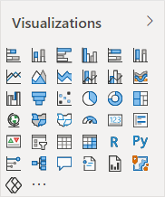
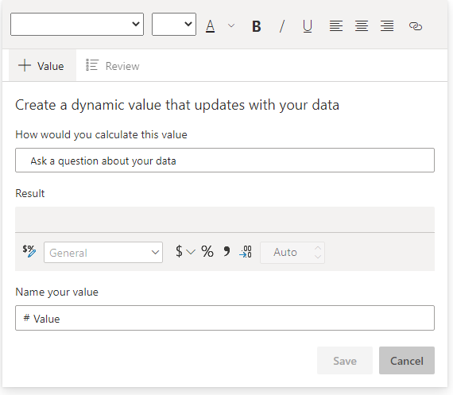

Report objects are laid out on each report page and include:

- **Visuals** - Visualizations of semantic model data.

- **Elements** - Provide visual interest but don't use semantic model data.

All report objects have some properties in common, which can be set in various sections of the **Format** options. Commonly applied settings include general properties (location, size, and alt text), title, background, border, and shadow.

> [!div class="mx-imgBorder"]
> 

## Visuals

Visuals are visualizations of semantic model data. Power BI includes over 30 *core visuals*, which are built in and available to all reports. You can access the core visuals in the first section of the **Visualizations** pane.

> [!div class="mx-imgBorder"]
> 

> [!TIP]
> To learn what a visual icon in the **Fields** pane represents, hover the cursor over it to reveal the visual type in a tooltip.

You can also extend the core visuals with *custom visuals*. Custom visuals are sourced from Microsoft AppSource (an app store for business applications such as Microsoft Office 365, Microsoft Dynamics 365, Power BI, or separate Microsoft Azure web apps) or uploaded as a .pbviz file.

You can use the following general methodology to add and configure a visual:

1. Select the visual type in the **Visualizations** pane and then position and size it on the page.

2. Map semantic model fields to populate the visual. Each visual has one or more *wells*. The number and type of wells differ between visuals. Some visuals, like the slicer, have a single well, but others have many more.

3. Optionally, apply visual-level filters.

4. Modify field mappings, possibly renaming fields, modifying summarization behavior (or restricting summarization), or enabling the **Show items with no data** option.

5. Optionally, modify the sort field and the sort direction (in ascending or descending order).

6. Optionally, apply format options to produce the desired result and style.

7. Optionally (and when supported), use the **Analytics** options to overlay supporting data, like minimum or maximum lines, or Artificial Intelligence (AI) results like anomaly detection and forecasts.

> [!NOTE]
> Steps 2-4 define the analytic query, which is concerned with filtering, grouping, and summarizing data.

To gain a better understanding of this general methodology, watch the following video, which demonstrates how to configure a report visual.

> [!VIDEO https://www.microsoft.com/videoplayer/embed/RWO1bQ]

This module doesn't intend to describe each visual in detail. In the next unit, visuals are grouped into visualization requirements together with guidance on when to and when not to use them.

> [!TIP]
> For a complete list and explanation of the core visuals, see [Visualization types in Power BI](/power-bi/consumer/end-user-visual-type/?azure-portal=true).

Additionally, this module doesn't intend to describe each visual format or analytic option.

> [!TIP]
> A great way to learn how to format a Power BI visual is by experimentation. The **Format** options include a search box that you can use to help narrow down and locate a particular setting. To learn what a setting does, configure it and then observe the result. If it doesn't produce the expected result, press the **Ctrl+Z** keyboard shortcut to revert to the original setting.

## Elements

Elements provide visual interest but don't use semantic model data (with one exception, which is described later).

> [!div class="mx-imgBorder"]
> 

The four types of elements are:

- **Text box -** Add rich text, such as the title, to the report page. You can selectively apply font type and font size and then set the color, styling (bold, italics, or underline), and paragraph alignment (right, center, or left). You can insert hyperlinks, too.

- **Buttons -** Add buttons so that report consumers can interact with the report as they would an app. Buttons can perform different actions, such as return to the previous page, navigate to a specific page, drill through to a page, select a bookmark, open Q&A, or open a web URL in the default web browser.

- **Shapes -** Add a shape to the report as decoration or to behave like a button to perform an action. Almost any conceivable shape is possible, from basic shapes to arrows and even hearts. Shapes can include text and can be formatted and styled in many different ways.

- **Image -** Upload an image, such as your company logo, to the report page. Supported image types include BMP, JPEG, GIF, TIFF, and PNG. Similar to the **Shapes** element, images can behave like buttons to perform an action.

The text box deserves a special mention because it's capable of embedding *dynamic values* that are sourced from the report semantic model into paragraphs of text. When the page is filtered, dynamic values are filtered. Technically, the text box isn't a visual. However, in this instance, it behaves like one. It's also available as the *smart narrative* visual, which automatically summarizes data by using text descriptions and insights.

> [!div class="mx-imgBorder"]
> 

At design time, you can start with a text box, or you can add the smart narrative visual from the **Visualizations** pane. However you start, the end result will be the same. Then, you can add a dynamic value by using Q&A to ask a question. Additionally, you can format the values.
